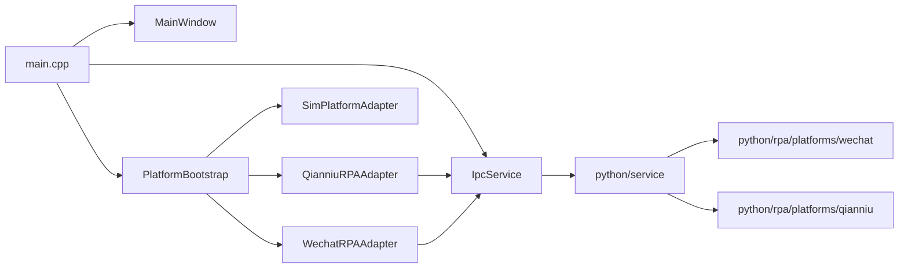

# C++客户端旧链路盘点与解耦差距

## 1. 目的

本文用于在接入更多 C++ 客户端改造之前，先把当前仓库里仍然存在的旧目录、旧入口、旧工具、旧链路，以及与目标解耦架构的差距盘点清楚。

本文不直接做代码改动，只提供一份后续收口的基线清单。

对照文档：

- [`C++客户端与Python服务端解耦架构方案.md`](./C++客户端与Python服务端解耦架构方案.md)

## 2. 目标边界

按解耦方案，目标应该收敛为：

- `C++` 负责 UI、聚合展示、本地缓存、连接状态、命令入口。
- `Python` 负责平台自动化、消息采集、会话切换、发送控制、历史同步、事件推送和服务端数据库。
- 客户端不直接把共享数据库当成平台消息主真相源。
- 客户端不再保留旧的 RPA 进程管理、旧工作台、旧控制台、旧 SQLite inbox 桥。

也就是说，后续判断“是不是旧链路”的标准不是它代码新不新，而是它是否还让 `C++` 承担了不该承担的自动化或真相源职责。

## 3. 当前主路径

当前仓库里已经比较接近目标架构的主路径是：

当前已经收口到位的部分：

- 客户端默认入口只剩 `src/main.cpp`
- 默认平台注册已收敛为模拟平台、微信 sidecar 适配器和千牛 sidecar 适配器
- `PlatformBootstrap` 只注册 adapter，不再在初始化阶段自动 `connectPlatform()` 或 `startListening()`
- Python 服务端连接入口已收口到 `src/ui/pythonserviceconnectiondialog.*`
- 微信平台主链路已从旧共享表 / 旧工作台转到 `IpcService + WechatRPAAdapter + python/service/rpa_bridge.py`
- 千牛主链路已从旧共享 SQLite inbox 桥转到 `IpcService + QianniuRPAAdapter + python/rpa/platforms/qianniu`
- 平台主命名已统一为 `wechat` / `qianniu`，旧平台别名和旧协议字段已退出
- C++ 通过 `IpcService::fetchPlatformStatuses()` 拉取 `/api/platforms`，聚合工作台按服务在线、平台注册、平台监听分别展示状态
- Python `RpaBridge` 初始化只注册微信/千牛 adapter 和桥接通道；微信/千牛 observer 均在收到 `connect` 后启动，在 `disconnect` 后停止

## 4. 已经下线或基本退出主路径的旧模块

以下内容在当前工作树中已经删除，或者不再是默认主路径：

- `src/services/rpa/`
- `src/services/wechat/`
- `src/ui/rpamanagedialog.*`
- `src/ui/rpaprocesscontroller.*`
- `src/ui/rpa_console_window.*`
- `src/ui/wechatworkbenchdialog.*`

这说明：

- 旧的“C++ 负责启动/停止 Python RPA 进程”的模式已经明显收掉
- 旧的“微信独立工作台”已经退出主路径
- 旧的“RPA 管理窗 + 控制台窗”已经不再是当前 UI 主体

但这不代表整个仓库已经与解耦方案对齐，下面这些残留仍然值得优先关注。

## 5. 仍然存在的旧目录 / 旧入口 / 旧工具 / 旧链路

### 5.1 千牛旧 DB inbox 桥已切出主路径：`QianniuRPAAdapter`

相关文件：

- `src/services/platforms/qianniurp_adapter.h`
- `src/services/platforms/qianniurp_adapter.cpp`

当前状态：

- 已改为通过 `IpcService` 连接 Python sidecar，命令走 WebSocket，事件也从 sidecar 事件桥进入 C++
- 默认平台初始化已注册 `QianniuRPAAdapter`
- C++ / Python 主路径的平台名统一为 `qianniu`
- 客户端侧低频 `scan_unread_and_fetch` 补偿扫描已删除，消息进入主链路只依赖 sidecar 事件桥

判断：

- 旧的“Python 写共享 SQLite inbox，C++ 轮询读表”主路径已经退出
- 千牛已开始向“Python sidecar + IPC/WS”路线对齐
- 当前剩下的主要问题不再是共享表、客户端补偿扫描或平台命名兼容，而是 sidecar 能力是否稳定产出持续事件

额外注意：

- 这一步只是把旧 DB 桥和客户端主动补偿扫描切掉，不代表千牛已经完全达到成熟的持续 observer 形态
- 后续若 sidecar 事件供给不稳定，应优先补 Python 侧 observer/health 能力，而不是把扫描逻辑再拉回 C++

### 5.2 微信 sidecar 主链路里的补偿扫描已删除

相关文件：

- `src/services/platforms/wechatrp_adapter.h`
- `src/services/platforms/wechatrp_adapter.cpp`

当前状态：

- 微信主路径已经是 `IpcService` + WebSocket 命令/事件桥
- 客户端主动定时 `scan_unread_and_fetch` 已删除
- 现在客户端只负责 `connect`、接收 sidecar 事件以及发 `send_message`

判断：

- 微信主路径进一步贴近“Python 负责采集和推送，C++ 负责展示和命令”
- 剩下真正要收口的不再是客户端补偿扫描，而是服务端事件覆盖率与客户端本地缓存职责

### 5.3 `MessageRouter + DAO` 仍承担较强真相源职责

相关文件：

- `src/core/messagerouter.cpp`
- `src/data/database.cpp`
- `src/data/conversationdao.*`
- `src/data/messagedao.*`
- `src/data/wechatmessagedao.*`

当前状态：

- 平台事件进入 C++ 后，仍然由 `MessageRouter` 直接落到客户端本地数据库
- 会话、消息、草稿、状态恢复都主要围绕客户端 SQLite 展开
- 本轮已把 `MessageRouter` 中直接写 SQL 的会话名更新收回 `ConversationDao`
- `Database::open()` 的默认日志说明已改成“客户端本地缓存库”，不再强调 Python RPA 默认与此路径对齐
- `conversations` / `messages` 已补充 `cache_scope`、`cache_origin`
- 平台观测消息已通过 `ConversationDao::upsertObservedCacheConversation()` / `MessageDao::createObservedCacheMessage()` 显式按缓存写入
- UI / 应用服务读取会话与消息时，已改走 `listCachedConversations()` / `listCachedMessages()` 语义入口
- 草稿和最近会话游标已通过 `cachedDraft*` / `lastSelectedCachedConversationId()` 等入口显式标注为客户端 UI 状态缓存
- 本地发送 pending / sent / failed 状态已通过 `createOutboundCacheMessage()`、`latestPendingOutboundCache*()`、`updateOutboundCacheDeliveryState()` 标注为出站缓存状态
- 会话列表分栏、自动回复候选判断、AI 最近入站快照已通过 `lastCached*` / `latestCached*` 入口显式读取本地历史缓存
- `ConversationManager` / `AggregateChatForm` 的 UI 恢复主入口已从 `reloadFromDatabase()` 切到 `reloadFromLocalCache()`，旧命名仅作为兼容包装
- Python 服务端已提供 `/api/cache/snapshot` 只读快照接口，C++ 已通过 `IpcService::fetchCacheSnapshot()` 在 sidecar 可用后触发拉取探测
- C++ 已能解析服务端 snapshot，并通过 `upsertSnapshotCacheConversation()` / `upsertSnapshotCacheMessage()` 非破坏性写回本地缓存
- snapshot 回灌已支持按平台保存 cursor；全量平台快照会清理缺失的 `server_snapshot_cache` 会话和消息，增量快照按 cursor 只回灌变化项
- snapshot 默认读取 Python 服务端事实库路径，不再通过 Qt AppData 自动命中 C++ 本地缓存库
- Python 服务端已在 `RpaEventStore` 前增加事实库写入：`conversation_observed` / `message_observed` 会先 upsert 到服务端库，再进入事件队列推送给 C++
- `send_message` 到达 Python 服务端时会先记录 pending 出站消息，`message_sent` / `send_failed` 再按 `client_message_id` 更新 sent/failed
- Python 服务端已新增 `rpa_events` 持久事件日志和 `/api/rpa/replay`，断线或服务重启后可按 cursor 重放已持久化的平台事件
- C++ 已新增 `/api/rpa/replay` 消费入口，sidecar 可用后按平台先 dispatch replay 事件，再拉 snapshot/backfill 重建本地缓存
- 千牛 sidecar 已补上轻量持续 observer，connect 后会循环复用未读扫描与消息抓取链路

判断：

- 这是当前与解耦方案差距最大的边界问题之一
- 方案里强调“Python 服务端数据库是唯一真相源，C++ 只保留缓存和游标”
- 当前读写路径、UI 状态、本地发送状态、本地历史读取和服务端 snapshot 回灌都已经开始按缓存/游标语义收口；Python 服务端也已接管平台观测事件与基础发送状态写库，微信/千牛均具备持续 observer 路径，C++ 已开始消费 replay + snapshot/backfill

### 5.4 `IpcService` 仍保留 RPA 命名壳

相关文件：

- `src/ipc/ipcservice.h`
- `src/ipc/ipcservice.cpp`
- `src/ipc/ipctypes.h`
- `src/ipc/ipctypes.cpp`

当前状态：

- 命令桥已可用，事件桥也已接通
- 但命名仍沿用 `RpaCommand`、`rpaEventReceived`、`yy-ai-customer-service-rpa-events`
- `buildRpaCommandPayload()` 已收口为主发 `command`、`platform`
- `AiSuggestionRequest` / `RpaCommandRequest` 内部字段已从 `platformType` 收口为 `platform`
- `performJsonGet()` / `performJsonPost()` 仍保留为通用旧 HTTP 能力
- `QSettings` 里也保留了 `rpa/serviceEndpoint` 到 `pythonService/endpoint` 的兼容迁移

判断：

- 旧平台字段和旧平台别名已经退出
- 剩余问题主要是类型、信号和 WebSocket 服务名仍使用 `Rpa*` 命名，容易把“Python sidecar 平台桥”继续理解成旧 RPA 控制链

### 5.5 文档、入口说明和 UI 文案仍残留旧语义

相关文件：

- `README.md`
- `docs/docs-new/design/工程骨架与模块边界.md`
- `src/ui/robotassistantwidget.cpp`
- `src/ui/mainwindow.cpp`

当前状态：

- `README.md` 仍引用不存在的 `src/services/wechat/`、`test/`、旧 `docs/` 路径
- `工程骨架与模块边界.md` 仍写着 `src/services/rpa/`、`rpa_inbox_messages`、托管 Python sidecar 启停等旧结构
- `RobotAssistantWidget` 的系统提示仍写着“RPA 启动/停止与管理、控制台日志查看”
- 主界面资源名仍有 `start_or_stop_rpa_icon.svg`

判断：

- 这些不一定影响运行，但会明显误导后续开发和盘点
- 如果不先记录，后续清理时很容易遗漏

## 6. 与目标架构的主要未对齐点

### 6.1 数据真相源未对齐

目标：

- Python 服务端数据库是唯一真相源
- C++ 只保留缓存、游标和界面恢复所需状态

现状：

- C++ 仍通过 DAO 持久化会话、消息、草稿、最近会话和发送状态，但这些入口已基本改成客户端本地缓存语义
- 本地库已通过 `cache_scope` / `cache_origin` 标记来源，平台观测、服务端 snapshot、人工出站 pending 等路径已经区分缓存来源
- Python 服务端事实库已记录平台观测事件、基础发送状态和 `rpa_events` 持久事件日志，并提供 snapshot / replay 给 C++ 回灌
- UI 恢复主入口已改为 `reloadFromLocalCache()`，重启或重连时通过 replay + snapshot/backfill 重建客户端缓存

影响：

- 客户端本地库已经降级为缓存/展示层，但仍需要继续证明 replay/backfill 可以覆盖长期运行、分页耗尽、服务重启和历史缺口
- 当前 snapshot 清理范围只覆盖 `server_snapshot_cache`，不会清理本地 pending、草稿、游标和非 snapshot 来源缓存；这是正确保护，但也意味着真相源边界还需要继续靠协议和游标策略约束

### 6.2 千牛 sidecar 事件能力仍需验证

目标：

- 千牛应像微信一样收敛为 Python sidecar + IPC/WS

现状：

- Python 侧千牛 sidecar 已具备统一命令入口
- C++ 侧 `QianniuRPAAdapter` 已切换为 sidecar 命令/事件桥
- 当前千牛侧剩余问题变成：sidecar 持续事件能力仍需继续验证，平台名主路径已统一为 `qianniu`

影响：

- 旧共享 SQLite 桥不再是主风险
- 接下来更需要关注的是：千牛是否能稳定提供持续事件流、健康状态和必要的事件补偿/重放能力

### 6.3 微信尚未完全变成纯服务端驱动

目标：

- Python 负责采集和推送
- C++ 主要负责展示和命令入口

现状：

- 微信事件桥已通
- 客户端补偿扫描已删除
- 当前风险转为：sidecar 是否能稳定、完整地把会话/消息事件持续回灌给 C++

影响：

- 客户端主动扫描已退出，但服务端事件覆盖率如果不足，会直接影响会话和消息进入 UI
- 下一步需要在 Python sidecar 侧补 observer / health / replay，而不是回退到 C++ 扫描

### 6.4 协议与命名仍有少量旧 RPA 痕迹

目标：

- 统一把系统理解为“C++ 客户端 <-> Python 服务端”

现状：

- 许多核心类型和信号仍用 `Rpa*` 命名
- 平台主命名已统一为 `wechat` / `qianniu`
- `IpcService` 不再输出旧平台字段
- UI 资源和帮助文案仍带旧 RPA 管理语义

影响：

- 新架构已经开始成形，但表层语义仍停留在旧阶段
- 后续盘点时容易把兼容层误认为主路径

## 7. 现存目录 / 入口 / 工具 / 旧物清单

### 7.1 运行时仍在主程序里的核心目录

- `src/core/`
- `src/data/`
- `src/ipc/`
- `src/services/platforms/`
- `src/ui/`
- `src/utils/`

### 7.2 重点旧链路文件

- `src/services/platforms/qianniurp_adapter.h`
- `src/services/platforms/qianniurp_adapter.cpp`
- `src/services/platforms/wechatrp_adapter.h`
- `src/services/platforms/wechatrp_adapter.cpp`
- `src/core/messagerouter.cpp`
- `src/data/database.cpp`
- `src/ipc/ipcservice.cpp`
- `src/ipc/ipctypes.h`

说明：

- 平台适配器文件已经是新主路径的一部分，不再表示旧 DB 桥或客户端补偿扫描仍存在。
- 这里继续列出它们，是因为类名、命名壳和 sidecar 事件能力仍是后续架构收口时需要关注的边界。

### 7.3 旧说明 / 旧入口 / 旧工具痕迹

- `README.md`
- `docs/docs-new/design/工程骨架与模块边界.md`
- `src/ui/robotassistantwidget.cpp`
- `src/ui/mainwindow.cpp`
- `resources/start_or_stop_rpa_icon.svg`

## 8. 后续收口优先级

### P0：继续收口数据真相源

- `src/core/messagerouter.cpp`
- `src/data/database.cpp`
- `src/data/conversationdao.*`
- `src/data/messagedao.*`

当前状态：

- `qianniurp_adapter.*` 已从共享 SQLite inbox 轮询切到 sidecar 命令/事件桥，并已注册到默认平台启动流程
- `messagerouter.*` 已把 `conversation_observed` / `message_observed` 的本地落库入口收口到 DAO 的缓存写入接口，不再直接把平台观测数据当普通主持久化写入
- `database.cpp` 已把默认语义从“与 Python RPA 共库”收口为“客户端本地缓存库”，并为 `conversations/messages` 补上 `cache_scope/cache_origin`
- `conversationdao.*` / `messagedao.*` 已开始显式区分 `platform_observed_cache`、`manual_outbound_cache` 等本地缓存来源
- `ConversationManager` / `ConversationAppService` 已通过缓存读取入口读取会话和消息
- 草稿、最近会话游标已通过缓存语义入口服务 UI 恢复
- `MessageRouter` 的本地发送 pending、回执匹配和 sent/failed 更新已通过出站缓存语义入口处理
- 会话列表分栏、千牛自动回复候选判断、AI 聚合最近入站快照已通过本地历史缓存语义入口读取
- UI 恢复主调用已使用 `reloadFromLocalCache()`，不再以 `reloadFromDatabase()` 作为主路径命名
- Python sidecar 已提供缓存快照接口，C++ 已具备拉取快照的触发入口
- C++ 已开始把服务端 snapshot upsert 回本地缓存，重复拉取不会按 `platform_msg_id` / `client_message_id` 追加重复消息
- snapshot 回灌已按平台保存 cursor；全量平台快照会清理上一轮 `server_snapshot_cache` 中缺失的项
- snapshot 来源已从 C++ AppData 本地库解耦为 Python 服务端事实库，可通过 `AI_CUSTOMER_SERVICE_SERVER_DB` 指定
- Python 服务端已把平台观测会话/消息事件、发送 pending 与 sent/failed 基础状态写入服务端事实库
- Python 服务端已提供 `/api/rpa/replay`，可从 `rpa_events` 持久事件日志按 cursor 重放事件
- C++ 已消费 `/api/rpa/replay`，并用独立 `rpa_replay_cursor/*` 保存平台 replay 游标
- 千牛 sidecar 已补上持续 observer loop，减少命令式补扫依赖
- `WechatRPAAdapter` / `QianniuRPAAdapter` 的客户端主动补偿扫描已删除
- 客户端与 Python sidecar 的平台命名主路径已统一为 `wechat` / `qianniu`
- `IpcService` 已去掉旧平台字段输出语义，旧平台名输入兼容也已退出

剩余 P0 重点：

- replay/backfill 仍处于基础能力阶段，长期运行策略、游标分页耗尽和更完整历史 backfill 还需要继续打磨
- 当前清理范围仍限定在 `server_snapshot_cache`，不会删除本地 pending、草稿、游标和非 snapshot 来源缓存

原因：  

- 它们直接影响“谁是消息真相源”和“客户端本地库能不能真正降级为缓存”

### P1：收口 sidecar 事件能力与命名壳

- `src/services/platforms/wechatrp_adapter.cpp`
- `src/services/platforms/qianniurp_adapter.cpp`
- `src/ipc/ipcservice.cpp`
- `src/ipc/ipctypes.h`

当前状态：

- `Ipc::PlatformCommandRequest` / `PlatformCommandResponse` 已成为 C++ IPC 主类型，旧 `RpaCommand*` 保留为兼容别名
- `IpcService::sendPlatformCommandViaWebSocket()`、`fetchPlatformReplay()`、`dispatchPlatformReplayEvents()` 已成为主调用入口
- `platformEventReceived` / `platformEventBridgeStateChanged` 已成为平台事件主信号，旧 `rpaEvent*` 信号继续双发兼容
- `WechatRPAAdapter` / `QianniuRPAAdapter` 已切到 platform 语义的 IPC 方法和信号
- Python 服务端已提供 `/api/platform/health|events|replay|command` 主语义路径，旧 `/api/rpa/*` 保留兼容
- C++ `fetchPlatformReplay()` 已切到 `/api/platform/replay`
- `PlatformBootstrap` 已从“注册后自动 `connectPlatform()` + `startListening()`”调整为“只注册 adapter”
- 聚合工作台左侧已留出微信/千牛平台监听选择入口，用户勾选后才发送 `connect`，也可对选中平台发送 `disconnect`
- `WechatRPAAdapter` / `QianniuRPAAdapter` 只有在 Python `connect` 命令成功后才标记为监听中
- Python 服务端已提供 `/api/platforms` 返回平台列表、注册状态和监听状态
- C++ `IpcService::fetchPlatformStatuses()` 已接入平台状态查询，聚合工作台可区分“Python 服务未连接 / 暂无已注册平台 / 未监听平台 / 监听中”
- 微信/千牛消息方向合同已收口为 Python 输出统一 `sender_role` / `direction`，C++ adapter 优先信任 `sender_role=customer|agent|system`，只保留 `direction=inbound|outbound|system|in|out` 的少量兼容兜底

目标交互模型：

- 客户端启动后只连接 Python 服务，不默认对微信/千牛发 `connect`
- Python 服务只保持 bridge、HTTP、WebSocket 和平台注册能力可用，不主动监听平台窗口
- UI 显示可用平台列表，例如微信、千牛
- 用户勾选一个或多个平台并确认后，C++ 才对选中平台发送 `connect`
- Python 对收到 `connect` 的平台启动 observer，并通过事件桥推送对应平台通知
- 用户可单独停止某个平台监听，C++ 对该平台发送 `disconnect`
- “Python 服务在线”“平台已注册”“平台已监听”需要在 UI 和状态模型中明确区分

原因：

- 这些地方已经偏向新架构，但文件名、Python bridge 模块名和部分兼容包装仍保留 `Rpa*` 命名壳，需要继续小步收口，避免一次性破坏外部接口
- 当前默认平台启动流程已经收口为只注册 adapter；后续重点是继续把 UI 状态、接口说明和命名壳稳定到 `platform / sidecar` 语义，避免旧 `Rpa*` 兼容层被误认为主路径

### P2：最后清理文档、命名和入口说明

- `README.md`
- `docs/docs-new/design/工程骨架与模块边界.md`
- `docs/docs-new/navigation/README.md`
- `src/ui/robotassistantwidget.cpp`
- `src/ui/mainwindow.cpp`

原因：

- 这些内容更多影响理解成本和后续维护，不是主链路风险最高的部分

## 9. 文档 / 入口 / UI 文案中的旧描述范围

当前建议明确纳入后续清理范围的内容：

### 9.1 README

- 不存在的目录说明
- 旧 `docs/` 路径引用
- 与当前 sidecar 架构不一致的入口描述

### 9.2 设计文档

- `工程骨架与模块边界.md` 中对 `src/services/rpa/`、`rpa_inbox_messages`、托管 sidecar 启停的旧描述
- 其他仍把“旧 RPA 管理窗 / 旧工作台 / 旧 DB 桥”当成现状的文档

### 9.3 UI 文案

- “RPA 启动/停止与管理”
- “控制台日志查看”
- 任何仍暗示客户端托管 Python RPA 进程的描述

## 10. 本轮结论

当前阶段已经不再只是“盘点旧链路”，而是完成了多轮 P0 收口：

- 当前仓库已经从旧 RPA 进程管理模式走到了 `IpcService + Python sidecar + 平台适配器` 的新主路径
- 旧共享 SQLite 桥、客户端主动补偿扫描、旧平台别名和旧协议字段已经退出主路径
- `MessageRouter + DAO` 已从“普通本地持久化”开始收口为“客户端本地缓存/展示层”
- Python sidecar 已提供 snapshot 回灌接口，C++ 已能按平台拉取、写回本地缓存、记录 cursor，并在全量快照范围内清理 `server_snapshot_cache` 缺失项
- Python sidecar 已开始在服务端事实库记录平台观测事件与基础发送状态，C++ 本地库进一步退到缓存/展示层
- Python sidecar 已提供服务端事件 replay 骨架，C++ 已开始消费 replay；历史重建继续由 snapshot/backfill 承担
- 微信/千牛 sidecar 都已有持续 observer 路径，后续重点从“有没有”转为“长期运行是否稳、分页/游标是否完整、backfill 策略是否覆盖历史缺口”
- P1 已开始推进：C++ IPC 主类型、主方法、主信号和 Python HTTP 主路径已从 `Rpa*` 包装切到 `Platform*` / `/api/platform/*` 语义，旧命名暂作兼容壳保留

后续如果继续推进 C++ 侧收口，建议按下面顺序：

1. 补足 replay 分页耗尽、失败重试和长期运行恢复策略，避免客户端重新承担扫描职责
2. 继续完善 Python 服务端更完整的历史 backfill 策略，逐步缩小 C++ 本地非 snapshot 缓存的兜底范围
3. 继续把文件名、类名、HTTP 路径说明和 Python bridge 命名从 `Rpa*` 收口到 sidecar / platform bridge 语义
4. 最后统一 README、工程骨架文档、UI 帮助文案和资源命名，移除旧 RPA 管理/控制台表述
