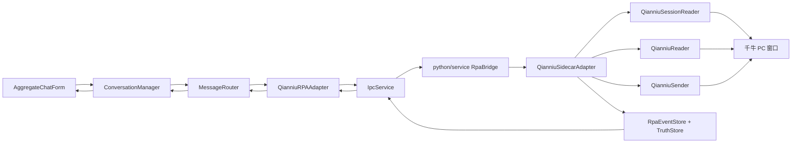

# 千牛平台监听发送链路与耗时分析

## 1. 范围

本文按当前仓库实现梳理千牛链路：

- 客户端开始监听千牛后，Python 如何检测未读会话并把消息推入聚合界面。
- 聚合界面发送消息后，消息如何进入 C++ pending 缓存、通过 Python sidecar，最终写入千牛输入框并按回车发送。
- 对整条链路做静态耗时分析，区分“代码中明确存在的等待/超时”和“需要联调实测的耗时”。

本文不是实测报告。当前代码尚未对千牛读写链路做完整分段 timing 日志，因此这里的耗时结论主要来自固定等待、超时配置、同步调用边界和可能的高耗时操作。

## 2. 总体链路



核心边界：

- C++ 不再主动执行千牛未读扫描，只负责 UI、缓存、命令入口和事件消费。
- Python 千牛 sidecar 在收到 `connect` 后启动 observer，observer 负责未读检测、会话切换、消息读取和事件输出。
- Python 事件先进入 `RpaEventStore`，同步写服务端事实库，再通过事件 WebSocket 推给 C++。
- C++ 收到事件后写本地缓存并刷新聚合界面。本地库是客户端缓存，不是平台事实源。

## 3. 开始监听千牛

入口：

- `AggregateChatForm::onStartPlatformListeningClicked()`
- `ConversationManager::startPlatformListening("qianniu")`
- `QianniuRPAAdapter::startListening()`
- `IpcService::sendPlatformCommandViaWebSocket(connect)`
- `RpaBridge.command()`
- `QianniuSidecarAdapter._connect()`

流程：

1. 聚合界面读取用户勾选的平台，选中千牛后调用 `ConversationManager::startPlatformListening("qianniu")`。
2. `ConversationManager` 找到 `MessageRouter` 里注册的 `QianniuRPAAdapter`，调用 `startListening()`。
3. `QianniuRPAAdapter` 先确保 Python 服务可用，再通过命令 WebSocket 发送：

   ```json
   {
     "command": "connect",
     "platform": "qianniu",
     "parameters": {
       "mode": "listen",
       "emit_initial_snapshot": false
     }
   }
   ```

4. Python `RpaBridge` 按 `platform=qianniu` 路由到 `QianniuSidecarAdapter`。
5. `QianniuSidecarAdapter._connect()` 设置 `_connected=True`，执行 `_probe()`，写一条 `account_health_changed` 事件，然后启动后台 `qianniu-observer` 线程。
6. C++ 只有在 Python `connect` 命令成功返回后，才把千牛 adapter 标记为 connected/listening。

耗时边界：

| 阶段 | 当前代码边界 | 说明 |
| --- | --- | --- |
| 查询平台状态 | `fetchPlatformStatuses(3000)` | UI 刷新平台注册/监听状态，HTTP GET 最长 3s。 |
| connect 命令 | `sendPlatformCommandViaWebSocket(..., 3000)` | C++ 等命令 WebSocket 连接和响应，最长 3s。 |
| Python `_probe()` | 未分段计时 | 会找千牛进程、窗口、聊天根节点、消息区、输入框和发送按钮，是 connect 期间主要不确定耗时。 |
| observer 启动 | 线程启动后立即返回 | `_start_observer()` 只启动线程，不等待第一轮扫描完成。 |

## 4. 未读会话检测到消息进入聚合界面

入口：

- `QianniuSidecarAdapter._observer_loop()`
- `QianniuSidecarAdapter._scan_unread_and_fetch()`
- `QianniuSessionReader.read_visible_sessions(detect_unread=True)`
- `QianniuSessionReader.select_session()`
- `QianniuReader.read_visible_messages_debug()`
- `RpaEventStore.append()`
- `IpcService::platformEventReceived`
- `QianniuRPAAdapter::handleRpaEvent()`
- `MessageRouter::onConversationObserved()` / `onIncomingMessage()`
- `AggregateChatForm::onUnifiedMessageReceived()`

流程：

1. observer 每轮在 `uia_guard("qianniu_observer")` 下调用 `_scan_unread_and_fetch()`。
2. `_scan_unread_and_fetch()` 读取可见会话列表，开启 `detect_unread=True`。
3. `QianniuSessionReader` 先定位当前千牛聊天窗口，再找接待列表或聊天列表根节点，遍历控件树提取会话标题。
4. 未读判断使用视觉检测：对每个会话行的局部区域截图，统计红色像素占比，超过阈值则认为未读。
5. 当前实现每轮只处理第一个未读会话。
6. 选中目标会话：
   - 优先按会话行矩形执行鼠标点击。
   - 失败后尝试 UIA `SelectionItem` / `Invoke`。
7. 会话切换成功后输出 `conversation_observed`。
8. 读取当前可见消息：
   - 优先读取 `message_display` 控件树文本。
   - 如果无文本，尝试在显示区域按点采样 accessible 控件。
   - 再尝试 `message_web` 控件树、点采样或 copy。
9. 每条消息转换成 `message_observed`，包含 `platform_msg_id`、`direction`、`sender_role`、`content` 等字段。
10. 每个事件进入 `RpaEventStore.append()`：分配 `seq/cursor`，同步写 `PythonServiceTruthStore`，再广播给事件 WebSocket。
11. C++ `IpcService` 收到 `rpa_event` 后发出 `platformEventReceived`。
12. `QianniuRPAAdapter` 过滤 `platform=qianniu`，按 `conversation_observed` / `message_observed` 转成 C++ 会话和消息模型。
13. `MessageRouter` 写入本地缓存：
    - 会话走 `ConversationDao::upsertObservedCacheConversation()`。
    - 消息走 `MessageDao::createObservedCacheMessage()`。
14. `ConversationManager` 发出 `unifiedConversationUpdated` / `unifiedMessageReceived`。
15. `AggregateChatForm` 刷新会话列表和当前消息列表，新消息进入聚合界面。

入站耗时分析：

| 阶段 | 已知等待/上限 | 主要耗时来源 |
| --- | --- | --- |
| observer 空闲轮询 | 1.5s | 如果消息刚好在上一轮扫描后出现，最坏要等到下一轮轮询。 |
| 有未读后的下一轮 | 0.3s | 当前轮处理到消息后，下一轮等待 0.3s；多个未读会话会串行分轮处理。 |
| 异常后恢复 | 3.0s | observer tick 异常后 sleep 3s。 |
| 会话列表扫描 | 未分段计时 | 遍历最多约 1500 个控件，并对可见会话逐项截图判断红点。会话越多越慢。 |
| 未读截图判断 | 未分段计时 | `ImageGrab.grab()` 对每个会话行局部截图，通常是未读检测的高耗时点之一。 |
| 会话切换 | 约 0.2s 到 0.32s 固定等待 | UIA 选择后 sleep 0.2s；矩形点击有 0.03s + 0.04s + 0.25s 等待。 |
| 消息读取 | 未分段计时 | 最多遍历 20000 个消息区域控件；fallback 点采样也可能较慢。 |
| 事件写事实库 | 未分段计时 | 每个事件 append 时同步打开/写 SQLite。1 个会话 + N 条消息会触发 N+1 次事件写入。 |
| 事件推送到 C++ | 通常毫秒级；断线时 1s 重连节奏 | `_EventPushClient` 连接失败后每 1s 重试，连接 timeout 为 3s。 |
| C++ 缓存写入/UI 刷新 | 未分段计时 | 每条消息落本地缓存后发 Qt 信号刷新 UI；大量消息会产生多次刷新。 |

端到端入站粗略模型：

```text
新未读可见到 UI 的时间
= observer 等待(0~1.5s)
+ 会话列表扫描/红点检测
+ 会话切换(约0.2~0.32s)
+ 消息读取
+ Python 事件写库
+ WebSocket 推送
+ C++ 事件处理/本地缓存写入/UI 刷新
```

当前最大的不确定项是：会话列表扫描、红点截图判断、消息区域读取、事件逐条写库。代码里还没有这些阶段的千牛专用 timing 日志。

## 5. 聚合界面发送到千牛输入框

入口：

- `AggregateChatForm::onSendClicked()`
- `ConversationManager::sendMessage()`
- `MessageRouter::sendMessage()`
- `QianniuRPAAdapter::sendMessage()`
- `IpcService::sendPlatformCommandViaWebSocket(send_message)`
- `RpaBridge.command()`
- `QianniuSidecarAdapter._send_message()`
- `QianniuSender.send_text()`

流程：

1. 用户在聚合界面当前会话输入内容，点击发送或按快捷键。
2. `AggregateChatForm` 清空输入框，清理草稿，把文本交给 `ConversationManager::sendMessage()`。
3. `MessageRouter::sendMessage()` 查本地会话，找到 `platform=qianniu` 的 adapter。
4. C++ 先创建一条本地出站缓存消息：
   - `direction=outbound`
   - `status=pending`
   - `sourceType=manual_confirmed`
   - `client_message_id=UUID`
5. pending 消息立即通过信号进入聚合界面，所以用户会先看到“已发起/待确认”的本地消息。
6. `QianniuRPAAdapter::sendMessage()` 通过命令 WebSocket 发送 `send_message`：

   ```json
   {
     "command": "send_message",
     "platform": "qianniu",
     "parameters": {
       "conversation_key": "...",
       "display_name": "...",
       "text": "...",
       "client_message_id": "...",
       "confirm_token": "manual_confirmed_by_agent"
     }
   }
   ```

7. Python `RpaBridge` 在 `formal` 模式会拒绝 `send_message`；在 `debug` 模式继续执行，并先把出站 pending 写入服务端事实库。
8. `QianniuSidecarAdapter._send_message()` 校验 `confirm_token`，调用 `QianniuSender.send_text(dry_run=False)`。
9. `QianniuSender` 定位当前聊天根节点和输入框：
   - 优先复用 `QianniuSessionReader.last_chat_root` 和 cached input field。
   - 复用失败时重新查找当前千牛聊天窗口。
10. 写入输入框：
    - 优先 `ValuePattern.SetValue(text)`。
    - 失败后回退剪贴板粘贴：设置剪贴板、聚焦输入框、模拟 Ctrl+V。
11. 发送：
    - 写入成功后固定等待 0.15s。
    - 聚焦输入框，模拟 Enter。
12. Python 输出 `send_result_observed` 和 `message_sent` 事件。
13. C++ 收到 `message_sent` 后，`MessageRouter::onMessageSent()` 用 `client_message_id` 匹配本地 pending，更新为 sent，并通知 UI。
14. 如果 Python 事件桥不在线，`QianniuRPAAdapter` 会在命令成功后用 300ms fallback emit `messageSent()`，避免 UI 永远停在 pending。

出站耗时分析：

| 阶段 | 已知等待/上限 | 主要耗时来源 |
| --- | --- | --- |
| UI 到 pending 显示 | 未分段计时，通常很短 | 本地 SQLite 写 pending + Qt 信号刷新。 |
| adapter 并发保护 | 200ms/次 | 如果上一条命令未结束，`QianniuRPAAdapter` 延迟 200ms 重试。 |
| C++ 等 Python send 响应 | 4s | `sendPlatformCommandViaWebSocket(..., 4000)`。超过则 C++ 判失败。 |
| Python formal 模式拦截 | 很短 | formal 下直接返回 `send_disabled_in_formal_mode`。 |
| 服务端 pending 写入 | 未分段计时 | `RpaBridge` 先写服务端事实库。 |
| 查找聊天根/输入框 | 未分段计时 | 复用 `last_chat_root/cached_input_field` 时较快；失效后需要重新找窗口和控件。 |
| ValuePattern 输入 | 未分段计时 | 成功时无固定等待，是最快路径。 |
| 剪贴板输入 fallback | 约 0.20s 固定等待 | 0.08s 聚焦后等待 + 0.12s 粘贴后等待，不含剪贴板和 UI 响应时间。 |
| 发送前等待 | 0.15s | 写入文本后固定等待。 |
| Enter 按键 | 0.04s | key down/up 中间固定等待。 |
| send 回执事件进入 UI | 通常毫秒级；断线时可能走 300ms fallback | 事件桥在线则走 `message_sent`；不在线则 C++ adapter fallback。 |

最快出站路径模型：

```text
UI 点击到千牛发送
= 本地 pending 写入/UI 刷新
+ WebSocket command 往返
+ 服务端 pending 写入
+ 输入框定位/复用
+ ValuePattern.SetValue
+ 0.15s 发送前等待
+ 0.04s Enter
+ Python 响应/事件回推
```

剪贴板 fallback 路径会额外增加约 0.20s 固定等待，还会受到系统剪贴板和焦点切换影响。

## 6. 当前已有日志点与分析方法

C++ 已有日志：

- `[AggregateChatForm] platform replay backfill`
- `[AggregateChatForm] cache snapshot backfill`
- `[AggregateChatForm] cache snapshot applied`
- `[AggregateChatForm] send click timing`
- `[AggregateChatForm] unified message UI timing`
- `[AggregateChatForm] inbound message UI timing`
- `[AggregateChatForm] outbound message UI timing`
- `[ConversationManager] platform listening requested`
- `[QianniuRPAAdapter] startListening with WebSocket command/event bridge`
- `[QianniuRPAAdapter] realtime event received`
- `[QianniuRPAAdapter] event timing`
- `[QianniuRPAAdapter] sendMessage timing`
- `[MessageRouter] conversation observed cached`
- `[MessageRouter] incoming message normalized`
- `[MessageRouter] send timing`
- `[MessageRouter] send confirm timing`
- `[IpcService] platform command WebSocket send/response`
- `[IpcService] platform event dispatch timing`
- `[IpcService] event WebSocket parse timing`
- `[IpcService] platform replay fetched/dispatched`

Python 已有日志：

- `qianniu command start/done`
- `qianniu observer started/stopped`
- `qianniu observer tick failed`
- `qianniu observer timing`
- `qianniu scan_unread_timing`
- `qianniu session_scan_timing`
- `qianniu visual_unread_timing`
- `qianniu select_session_timing`
- `qianniu read_messages_timing`
- `qianniu parse_messages_timing`
- `qianniu sender_timing`
- `qianniu input_text_timing`
- `qianniu send_message timing`
- `rpa_event_store timing`

千牛 Python timing 日志会额外写入：

- `python/rpa/logs/qianniu/qianniu_timing.log`
- 单文件最大 5MB，保留 10 个滚动文件
- 文件 handler 只接收消息中包含 `timing` 的记录，不混入普通运行日志

日志分析建议：

1. 入站先按 `request_id=observer-...` 聚合 Python 日志，看 `session_scan_timing`、`scan_unread_timing`、`read_messages_timing`、`rpa_event_store timing` 哪段最大。
2. 再按 `event_id` / `platform_msg_id` 查 C++ 日志，看 `IpcService -> QianniuRPAAdapter -> MessageRouter -> AggregateChatForm` 的尾段耗时。
3. 出站按 `client_message_id` 串联 `AggregateChatForm send click timing`、`MessageRouter send timing`、`QianniuRPAAdapter sendMessage timing`、`qianniu send_message timing`、`sender_timing`、`MessageRouter send confirm timing`。
4. 如果 Python 侧 `rpa_event_store timing.persist_ms` 明显偏大，瓶颈在服务端事实库写入。
5. 如果 C++ 侧 `MessageRouter createMessageElapsedMs/updateConversationElapsedMs` 偏大，瓶颈在客户端缓存写入。
6. 如果 `AggregateChatForm ... UI timing` 偏大，瓶颈在模型刷新、气泡追加或会话列表重绘。

辅助脚本：

```powershell
python python/service/analyze_qianniu_timing.py
python python/service/analyze_qianniu_timing.py python/rpa/logs/qianniu --trace-limit 20
```

脚本默认读取 `python/rpa/logs/qianniu`。它会按 timing marker 聚合 `*_ms` / `elapsedMs` 字段，输出每类日志的 avg/max/min 和最慢样本，并按 `request_id`、`event_id`、`client_message_id`、`platform_msg_id` 建立 trace 索引，便于串入站或出站链路。

仍需补齐：

- 目前 C++ 端虽然已经输出 `client_message_id`、`event_id`、`platform_msg_id`，但还没有统一 trace 对象。
- 当前脚本是离线文本分析器，后续可以升级为结构化 JSON 日志或实时诊断面板。

## 7. 已补齐的耗时埋点

本轮已先不改业务逻辑，只补日志。关键字段是 `request_id` / `event_id` / `client_message_id`。

### 7.1 入站 observer

在 `QianniuSidecarAdapter._observer_loop()` 和 `_scan_unread_and_fetch()` 已增加：

- `observer_tick_total_ms`
- `read_visible_sessions_ms`
- `visual_unread_total_ms`
- `unread_count`
- `select_session_ms`
- `read_visible_messages_ms`
- `emit_events_ms`
- `event_count`

### 7.2 会话列表与未读检测

在 `QianniuSessionReader.read_visible_sessions()` / `with_visual_unread()` 已增加：

- `find_current_chat_ms`
- `find_session_list_root_ms`
- `extract_session_items_ms`
- `session_count`
- `visual_unread_per_item_ms` 或聚合的 `visual_unread_total_ms`

### 7.3 消息读取

在 `QianniuReader.read_visible_messages_debug()` 已增加：

- `read_visible_texts_ms`
- `source`
- `raw_text_count`
- `parse_messages_ms`
- `message_count`

### 7.4 发送

在 `QianniuSidecarAdapter._send_message()` 和 `QianniuSender.send_text()` 已增加：

- `send_total_ms`
- `find_chat_ms`
- `resolve_input_ms`
- `input_method`
- `input_text_ms`
- `press_enter_ms`
- `result_method`
- `client_message_id`

### 7.5 C++ 端到端

在 C++ 侧已补：

- 发送：`client_message_id` 从 `onSendClicked()`、`MessageRouter::sendMessage()`、`QianniuRPAAdapter::sendMessage()`、`message_sent` 回执全链路贯穿。
- 入站：`event_id/platform_msg_id` 从 `IpcService::handleEventSocketPayload()`、`QianniuRPAAdapter::handleRpaEvent()`、`MessageRouter::onIncomingMessage()` 到 `AggregateChatForm::onUnifiedMessageReceived()` 贯穿。

## 8. 当前瓶颈判断

优先关注这些点：

1. 未读检测逐会话截图：会话越多，`ImageGrab.grab()` 次数越多，入站延迟会线性上涨。
2. 每轮只处理一个未读会话：多个未读会话会被 observer 分多轮处理，每轮之间至少 0.3s，空闲情况下最多再等 1.5s。
3. 消息读取遍历上限大：`read_visible_texts()` 最多遍历 20000 个控件，遇到复杂 UIA 树会明显变慢。
4. 事件逐条同步写 SQLite：1 个会话 + N 条消息会产生多次事实库写入，再进入 C++ 本地缓存写入。
5. 发送依赖当前聊天窗口：`QianniuSender` 使用当前聊天根节点，若当前窗口不是目标会话，发送链路目前没有独立的“发送前强制切换到目标会话”步骤，依赖 observer 最近切换或用户当前选择状态。
6. 发送超时较短：C++ 等 `send_message` 响应最长 4s；窗口查找、输入 fallback、UI 卡顿叠加后可能触发超时。

## 9. 优化顺序建议

1. 先补千牛 Python 侧分段 timing 日志，拿到真实耗时分布。
2. 把未读检测改为批量截图或减少逐行 `ImageGrab.grab()`，优先降低空闲扫描成本。
3. `_scan_unread_and_fetch()` 支持一轮处理多个未读会话，或至少限制每轮扫描的重复成本。
4. `RpaEventStore` 支持批量 persist，减少每条消息单独打开/写库。
5. 发送前增加目标会话确认/切换，避免当前聊天窗口和 C++ 当前会话不一致。
6. C++ 发送命令 timeout 可按实测调整，或者把“Python 已接收命令”和“平台最终 sent/failed”拆成两阶段回执。
