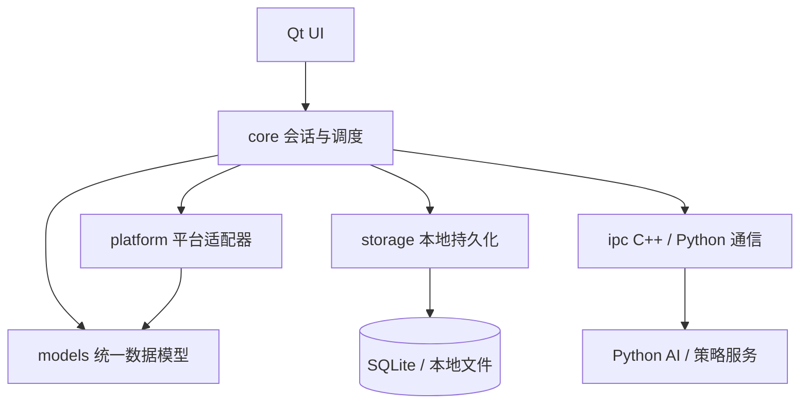

# 工程骨架与模块边界

## 1. 目标

本文件定义 MVP 阶段的工程结构和模块边界，确保：

- C++ / Qt 客户端只负责桌面体验和核心调度
- Python 只负责 AI、策略和辅助处理
- 平台接入通过适配器隔离
- UI 不直接依赖具体平台实现
- 本地存储、日志、IPC 和适配器边界清晰

## 2. 总体结构

建议采用“客户端主壳 + 平台适配层 + Python 辅助服务 + 本地存储”的结构。



## 3. 目录结构

当前项目实际结构：

```text
src/
  core/           # 会话管理、消息路由、状态流转
  data/           # SQLite 持久化、DAO 层
  ipc/            # C++ 与 Python 通信层
  models/         # 统一数据模型
  services/
    ai/           # AI 服务封装
    app/          # 应用层编排
    platforms/    # 平台适配器
    rpa/          # RPA 服务层（进程管理、状态）
  ui/             # Qt UI 层
  utils/          # 工具类

python/
  service/        # Python AI sidecar 服务
  rpa/            # Python RPA 平台适配实现
    core/         # Win32、截图、OCR、去重、布局解析等通用基础设施
    db/           # RPA inbox 与连接管理
    platforms/    # qianniu / wechat / pdd 平台适配器
    common/       # 旧兼容入口，逐步收敛为 wrapper
    readers/      # 旧 reader 入口，保留兼容
    writers/      # 旧 writer 入口，保留兼容
    config/       # 平台配置
```

### 3.1 `src/models/`

职责：

- 定义统一数据模型
- 维护枚举、DTO、事件结构
- 不包含 UI 逻辑和平台采集逻辑

实现文件：`unifiedmodels.h/cpp`

包含内容：

- `Models::Conversation`
- `Models::Message`
- `Models::PlatformAccount`
- `Models::ConversationEvent`
- `Models::SendMessageCommand`
- `Models::AISuggestion`
- 枚举类型：`PlatformType`、`SourceType`、`VerificationStatus` 等
- 枚举与字符串转换函数

### 3.2 `src/core/`

职责：

- 会话管理
- 消息分发与路由
- 状态流转
- 事件去重
- 平台状态协调
- AI 建议与用户操作的衔接

核心类：

| 类名 | 文件 | 职责 |
|------|------|------|
| `ConversationManager` | `conversationmanager.h/cpp` | 会话生命周期管理、状态流转 |
| `MessageRouter` | `messagerouter.h/cpp` | 消息分发、去重、统一模型信号 |
| `AuthManager` | `authmanager.h/cpp` | 登录认证管理 |
| `PlatformBootstrap` | `platformbootstrap.h/cpp` | 平台适配器初始化 |

旧模型兼容：

- `types.h/cpp` 保留旧 `PlatformMessage`、`ConversationInfo`、`MessageRecord`
- `LegacyModelCompat` 命名空间提供旧到新模型转换

### 3.3 `src/services/platforms/`

职责：

- 定义平台适配器接口
- 实现模拟平台适配器
- 实现真实平台适配器
- 封装平台差异和采集策略

核心接口与实现：

| 文件 | 说明 |
|------|------|
| `iplatformadapter.h/cpp` | 适配器基类接口 |
| `simplatformadapter.h/cpp` | 模拟平台适配器 |
| `wechatrp_adapter.h/cpp` | 微信 RPA 适配器 |
| `qianniurp_adapter.h/cpp` | 千牛 RPA 适配器 |
| `pddrp_adapter.h/cpp` | 拼多多 RPA 适配器 |

适配器接口：

```cpp
class IPlatformAdapter : public QObject {
    virtual QString platformName() const = 0;
    virtual void connectPlatform() = 0;
    virtual void disconnectPlatform() = 0;
    virtual void startListening() = 0;
    virtual void stopListening() = 0;
    virtual void sendMessage(const QString& conversationId, const QString& text) = 0;
    virtual bool isConnected() const = 0;
signals:
    void incomingMessage(const PlatformMessage& msg);
    void messageSent(const QString& conversationId, const QString& text);
    void sendFailed(const QString& conversationId, const QString& reason);
};
```

适配器不直接操作 UI，不直接持久化，不直接生成业务视图。

### 3.4 `src/ipc/`

职责：

- C++ 与 Python 通信
- AI 请求发送与响应接收
- 健康检查
- 超时和错误处理
- 请求 ID 关联

核心文件：

| 文件 | 说明 |
|------|------|
| `ipctypes.h/cpp` | IPC 请求/响应类型定义 |
| `ipcservice.h/cpp` | IPC 服务单例（HTTP 通信） |

关键类型：

- `Ipc::AiSuggestionRequest/Response` - AI 建议请求响应
- `Ipc::RpaCommandRequest/Response` - RPA 命令请求响应
- `Ipc::HealthCheckRequest/Response` - 健康检查

通信协议：

- 当前使用本地 HTTP（`http://127.0.0.1:8765`）
- Python sidecar 端点：
  - `GET /api/health` - 健康检查
  - `POST /api/ai/suggestion` - AI 建议

`IpcService` 支持：

- 托管 Python sidecar 进程的启停
- 自动健康探测和重连
- 请求超时（默认 30 秒）和取消

### 3.5 `src/data/`

职责：

- 本地 SQLite 持久化
- 草稿保存
- 最近会话保存
- 消息缓存
- 账号和适配器状态缓存

核心文件：

| 文件 | 说明 |
|------|------|
| `database.h/cpp` | 数据库连接和表结构初始化 |
| `conversationdao.h/cpp` | 会话数据访问、草稿、最近会话 |
| `messagedao.h/cpp` | 消息数据访问 |
| `messagesendeventdao.h/cpp` | 发送事件记录 |
| `userdao.h/cpp` | 用户数据访问 |
| `aiassistantdao.h/cpp` | AI 助手配置 |

数据库表：

- `conversations` - 会话信息
- `messages` - 消息记录
- `conversation_drafts` - 会话草稿
- `app_state` - 应用状态（如最近选择会话）
- `rpa_inbox_messages` - RPA 入站消息

### 3.6 `src/ui/`

职责：

- 主窗口
- 会话列表
- 消息列表
- 输入区
- AI 建议区
- 状态提示区

核心文件：

| 文件 | 说明 |
|------|------|
| `mainwindow.h/cpp` | 主窗口 |
| `aggregatechatform.h/cpp` | 聚合工作台（核心交互界面） |
| `conversationlistmodel.h/cpp` | 会话列表数据模型 |
| `messagelistmodel.h/cpp` | 消息列表数据模型 |
| `loginwindow.h/cpp` | 登录窗口 |
| `rpaprocesscontroller.h/cpp` | RPA 进程控制代理 |

UI 架构：

- 使用 Qt Model/View 模式
- `ConversationListModel` + `QListView` + delegate
- `MessageListModel` + `QListView` + delegate
- UI 层只消费统一模型信号，不直接了解平台采集细节

### 3.7 `src/services/rpa/`

职责：

- RPA 进程生命周期管理
- 平台状态聚合
- 日志收集
- 与 UI 的进程控制解耦

核心文件：

| 文件 | 说明 |
|------|------|
| `rpatypes.h/cpp` | RPA 类型定义（`PlatformId`、`ProcessState`） |
| `rpaprocessmanager.h/cpp` | Python RPA 进程管理 |
| `rpaservice.h/cpp` | RPA 服务单例 |

`RpaService` 信号：

- `platformStateChanged(platformId, newState)`
- `platformLogAppended(platformId, text)`
- `platformError(platformId, error)`

## 4. 模块边界

### 4.1 UI 层边界

UI 负责：

- 展示数据
- 接收用户操作
- 发出选择、发送、切换、刷新等交互事件

UI 不负责：

- 平台采集
- 状态判断
- 数据去重
- 持久化
- AI 请求编排

### 4.2 Core 层边界

Core 负责：

- 接收平台事件
- 更新统一模型
- 驱动状态机
- 触发本地存储更新
- 向 UI 通知变化
- 向 Python 触发 AI 请求

Core 不直接依赖任何具体平台客户端 API。

### 4.3 Platform 层边界

Platform 负责：

- 采集可见会话和消息
- 提供平台可用状态
- 返回草稿准备结果
- 上报健康状态

Platform 不直接操作 UI 和存储层。

### 4.4 IPC 层边界

IPC 负责：

- 协议打包
- 请求与响应
- 超时和错误处理
- 请求 ID 关联

IPC 不做 AI 逻辑，也不做平台逻辑。

### 4.5 Storage 层边界

Storage 负责：

- 数据落盘
- 查询本地缓存
- 保存草稿和最近状态

Storage 不直接参与平台适配和 UI 渲染。

## 5. 关键流程边界

### 5.1 新消息流程

```text
Platform Adapter -> Core -> Storage -> UI
```

步骤：

1. 适配器上报消息事件
2. Core 做去重和状态更新
3. Storage 持久化
4. UI 刷新会话列表和消息区

### 5.2 AI 建议流程

```text
UI / Core -> IPC -> Python -> IPC -> UI / Core
```

步骤：

1. 用户触发 AI 建议
2. Core 组装上下文
3. IPC 调用 Python
4. Python 返回候选建议
5. UI 展示并允许编辑

### 5.3 人工确认发送流程

```text
UI -> Core -> Platform Adapter / RPA Adapter -> Core -> Storage -> UI
```

步骤：

1. 客服确认发送
2. Core 生成发送命令
3. Platform / RPA Adapter 默认执行草稿准备或复制到剪贴板
4. 返回结果
5. 更新状态并落盘

MVP 默认边界：

- `prepareReplyDraft()` 只表示草稿已准备，不代表已经发送。
- 真实发送能力不是默认路径，只有在人工确认、确认凭证、窗口/账号/会话/文本二次校验和审计记录完整后才允许启用。
- 发送结果无法确认时必须进入 `unknown` 或失败降级，不允许重复盲发。

## 6. 平台适配器接口

MVP 的适配器接口建议保持极简：

```text
start()
stop()
healthCheck()
fetchVisibleConversations()
fetchVisibleMessages()
prepareReplyDraft()
```

### 6.1 模拟适配器

用途：

- 先跑通主流程
- 验证 UI、Core、Storage 和 IPC

### 6.2 真实 PoC 适配器

用途：

- 验证拼多多或其他单平台可见内容采集链路
- 验证降级与恢复

### 6.3 不在 MVP 内的适配器能力

- 插件热加载
- 多平台并行接入管理
- 高级自动回复
- 自动批量发送
- 无确认凭证的真实发送

## 7. Python 服务边界

### 7.1 AI Sidecar 服务 (`python/service/`)

当前实现使用标准库 `http.server`，端口 `8765`。

核心文件：

| 文件 | 说明 |
|------|------|
| `server.py` | HTTP 服务主入口 |
| `ai_suggestion.py` | AI 建议生成逻辑 |

API 接口：

| 方法 | 路径 | 说明 |
|------|------|------|
| GET | `/api/health` | 健康检查 |
| POST | `/api/ai/suggestion` | AI 建议 |

启动方式：

```bash
python -m service.server --host 127.0.0.1 --port 8765
```

或由 C++ `IpcService` 托管启动。

### 7.2 RPA 服务 (`python/rpa/`)

职责：

- 平台窗口或浏览器上下文识别
- 可见会话和消息采集
- 截图、OCR、UIA、DOM/CDP 等观测能力封装
- 草稿回填、复制到剪贴板和发送结果观测
- 运行游标、去重状态和 RPA inbox 维护

核心结构：

- `core/` - 通用基础设施，如输入模拟、截图、Win32 窗口、OCR、窗口锁、增量去重、布局解析
- `db/` - RPA 数据库连接和 inbox DAO，避免平台代码直接散落数据库细节
- `platforms/base.py` - Python 侧平台适配器基类
- `platforms/qianniu/` - 千牛平台 reader、writer、窗口、会话和解析能力
- `platforms/wechat/` - 微信平台 reader、writer、UIA、截图和 OCR 能力
- `platforms/pdd/` - 拼多多 PoC 适配器，当前可复用截图 OCR，后续可替换为 DOM/CDP
- `common/`、`readers/`、`writers/` - 旧路径兼容入口，后续只保留 wrapper

启动方式：

```bash
python -m rpa.main --platform qianniu
```

### 7.3 边界原则

- Python 不是主业务状态中心
- Python 不直接驱动 UI
- AI 只返回建议，不返回发送命令
- RPA 只做采集和草稿回填，发送由人工确认
- Python RPA 只输出统一事件、健康状态和受控命令结果，真正进入工作台的消息由 C++ 统一模型落盘和分发
- 平台特有字段进入 `metadata`，不进入 UI 专用判断

## 8. 本地存储边界

本地存储只保存 MVP 必要数据：

- 最近会话
- 最近消息
- 草稿
- 账号状态
- 适配器状态
- AI 建议摘要

不在 MVP 中做复杂数据仓库、远端同步和大规模全文检索。

## 9. 错误与降级边界

### 9.1 降级原则

- 优先停用自动化能力
- 优先保留草稿和历史可见数据
- 优先让客服回到原平台人工处理

### 9.2 失败处理

- 适配器失败不应崩溃主进程
- 失败状态必须可见
- 失败日志必须可追踪

## 10. MVP 里程碑建议

当前 M0-M4 主链路已经基本完成：

1. `models` 和 `core` 已建立统一模型、状态机和兼容层
2. `ui` 已用模拟平台跑通会话列表、消息区、输入区和发送状态
3. `ipc` 已接入 Python AI sidecar，并支持托管启动和健康检查
4. `storage` 已加入最近会话、消息、草稿和应用状态缓存
5. `platform` 已接入模拟适配器，并建立 RPA 服务层和 Python 平台适配目录

下一步 M5 建议：

1. 只选一个真实平台 PoC，优先拼多多 Web，备选千牛 PC
2. 先验证平台健康检查、可见消息采集和统一事件输出
3. 将采集结果转换为 `Models::Conversation` / `Models::Message` 并进入 C++ 工作台
4. 复用 Python AI 建议链路生成回复草稿
5. 默认只做草稿回填或复制到剪贴板，最终发送由人工确认
6. 补齐失败降级、`unknown` 状态和验收清单

## 11. 结论

MVP 阶段最重要的不是把所有能力都实现，而是把职责边界切清楚。只要 `models`、`core`、`platform`、`ipc`、`storage`、`ui` 六层边界清晰，后续新增平台、增强 AI 或扩展自动化都会容易很多。

