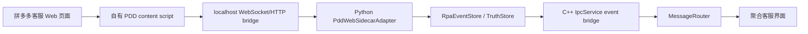

# 拼多多平台接入功能级复刻方案

> 记录时间：2026-06-26
>
> 背景：类似产品已拆出拼多多 Web DOM 注入链路；当前项目已有 `pdd_web` 统一模型和部分 UI 展示，但尚未接入真实拼多多平台 adapter。

## 1. 结论

拼多多适合作为下一阶段真实平台 PoC。建议做“功能级复刻”，不要复用类似产品代码：

- 借鉴其链路形态：浏览器页面脚本读取 DOM、识别消息、通过本地桥上报事件。
- 不复制其 `pdd.js` 实现、混淆代码、命令协议和资源文件。
- 在当前项目中按现有 `Python service -> C++ IpcService -> MessageRouter -> 聚合 UI` 主路径接入。

首版目标不是自动发送，而是稳定完成：

1. 浏览器页面可用性检测。
2. 当前店铺/客服信息识别。
3. 会话列表和当前会话读取。
4. 入站消息转统一 `conversation_observed` / `message_observed` 事件。
5. AI 生成草稿后只回填或复制，不默认点击发送。

## 2. 当前项目已有基础

已存在：

| 模块 | 现状 |
|---|---|
| 统一模型 | `PlatformType::PddWeb` 映射为 `pdd_web` |
| 聚合 UI | 已有拼多多图标、颜色和平台过滤入口 |
| 测试 | `test_message_router.cpp` 已用 `pdd_web` 做过路由测试 |
| 窗口树 | 主窗口可识别标题/进程中的拼多多窗口 |
| Python service | 已有多 adapter 路由、事件存储、WebSocket 命令桥 |

缺口：

| 缺口 | 说明 |
|---|---|
| Python adapter | `RpaBridge` 当前只注册微信、千牛、QQ |
| C++ adapter | `PlatformBootstrap` 当前只注册模拟、千牛、QQ、微信 |
| 页面 agent | 当前没有自己的拼多多 content script / 浏览器页面桥 |
| 平台 ID 收口 | UI 窗口树使用 `pinduoduo`，聚合和模型使用 `pdd_web` |
| 数据扩展表 | 现阶段可以先走统一主表，后续再补 `pdd_messages` / `pdd_conversations` |

## 3. 平台 ID 约定

建议统一：

| 场景 | ID |
|---|---|
| 统一模型、Python adapter、C++ adapter、事件、数据库 | `pdd_web` |
| UI 展示名 | `拼多多` |
| 兼容旧窗口树/进程匹配别名 | `pinduoduo` 只作为 alias，不进入主事件模型 |

所有事件应输出：

```json
{
  "platform": "pdd_web",
  "account_id": "local_pdd_web"
}
```

## 4. 推荐架构

拼多多是 Web 平台，不建议走 UIA/OCR。建议新增自有浏览器页面 agent：



页面 agent 职责：

- 只读取当前页面 DOM。
- 上报结构化观察结果。
- 接收 `prepare_reply_draft` 命令时回填输入框，但首版不点击发送。

Python `PddWebSidecarAdapter` 职责：

- 管理页面 agent 在线状态。
- 将页面 agent 上报转成统一事件。
- 做去重、会话 key 生成、健康状态、replay/persist。
- 对 C++ 暴露与微信/千牛一致的命令：`connect`、`disconnect`、`health_check`、`fetch_visible_conversations`、`fetch_visible_messages`、`prepare_reply_draft`。

C++ `PddWebAdapter` 职责：

- 和 `WechatRPAAdapter` 一样通过 `IpcService::sendPlatformCommandViaWebSocket()` 发命令。
- 监听 `platformEventReceived`，过滤 `platform == "pdd_web"`。
- 把 `conversation_observed` / `message_observed` 转成 `ConversationInfo` / `PlatformMessage`。

## 5. DOM 选择器基线

基于类似产品静态拆解，首版可验证这些选择器，但实现要自己写：

| 用途 | 选择器/特征 |
|---|---|
| 店铺/客服昵称 | `.nickname`、`.LoginUserInfo-mainTitle-text` |
| 最新消息粗读 | `.msg-list li:last-child` |
| 消息列表 | `div[id*="cs-common-message-list-item"]` |
| 客服侧标记 | `.cs-item`、`.kwaishop-cs-LayoutDefaultWrapper__isMine` |
| 文本消息 | `.kwaishop-cs-BizTextCard` |
| 图片消息 | `.image-msg img` |
| 商品卡片 | `.good-card`、`.good-card .good-id`、`.good-card .good-name` |
| 订单卡片 | `.order-card`、`.kwaishop-cs-BizOrderCard` |
| 线索卡片 | `.buyer-item`、`.kwaishop-cs-bizBuyerFromCard` |
| 系统通知 | `.msg-system` |
| 会话列表 | `.SessionListGroupItem` |
| 未读标记 | `.SessionBaseCard-unread-rot` |
| 当前会话名 | `.LoginUserInfo-mainTitle-text` |
| 输入框 | `#replyTextarea`、必要时验证 `#replyText` |
| 发送按钮 | `.reply-footer .send-btn` |

注意：这些是验证起点，不是稳定契约。首版代码必须输出 `selector_missing`、`unknown_layout` 等降级状态。

## 6. 入站事件模型

页面 agent 内部可以先产出：

```json
{
  "conversation": {
    "display_name": "买家昵称",
    "unread": true
  },
  "message": {
    "sender_role": "customer",
    "direction": "inbound",
    "message_type": "text",
    "content": "用户消息",
    "time_text": "12:30",
    "raw": {
      "selector": "div[id*='cs-common-message-list-item']",
      "html_text": "..."
    }
  }
}
```

Python adapter 转成：

```json
{
  "event_type": "message_observed",
  "platform": "pdd_web",
  "account_id": "local_pdd_web",
  "conversation_key": "pdd_web:local_pdd_web:买家昵称",
  "platform_msg_id": "sha1(...)",
  "payload": {
    "content": "用户消息",
    "content_type": "text",
    "direction": "inbound",
    "sender_role": "customer",
    "confidence": "dom_exact",
    "raw": {}
  }
}
```

消息类型建议：

| DOM 类型 | `content_type` | `content` |
|---|---|---|
| 普通文本 | `text` | 文本内容 |
| 图片 | `image` | 图片 URL 或空文本，URL 放 `raw.asset_url` |
| 商品卡片 | `product` | 可见商品名/ID |
| 订单卡片 | `order` | 可见订单文本 |
| 线索卡片 | `lead` | 可见线索文本 |
| 系统通知 | `notice` | 通知文本，`sender_role=system` |
| 未识别 | `unknown` | 可见文本，原始信息放 `raw` |

不要在内部模型里依赖 `[图片]`、`[商品]`、`[订单]` 前缀；这些可以作为兼容展示或出站命令语法，不作为事实模型。

## 7. 出站策略

首版只做：

| 命令 | 行为 |
|---|---|
| `prepare_reply_draft` | 定位输入框、写入草稿、派发 `InputEvent` |
| `send_message` | 默认拒绝或转为 `prepare_reply_draft`，返回 `manual_confirmation_required` |

原因：

- 类似产品会自动点击 `.reply-footer .send-btn`，但当前项目定位是 AI 建议优先。
- 拼多多 Web 输入框依赖前端框架监听 `input` 事件，不能只改 DOM value。
- 发送前必须校验当前会话名，避免页面切换或焦点漂移导致误发。

草稿回填流程：

1. 校验当前会话名等于目标 `display_name`。
2. 定位 `#replyTextarea`，失败再试 `#replyText`。
3. 设置 value / textContent。
4. 派发 `InputEvent("input", { bubbles: true })`。
5. 返回 `draft_prepared`，不点击发送按钮。

后续确认要自动发送时，再新增显式参数：

```json
{
  "confirm_token": "manual_confirmed_by_agent",
  "allow_send_click": true
}
```

## 8. 实施步骤

### P0：文档和边界

1. 确认平台 ID 统一为 `pdd_web`。
2. 明确不复制类似产品 `pdd.js`，只借鉴选择器和行为观察。
3. 写清楚首版只采集和草稿回填，不自动发送。

### P1：Python 服务注册空 adapter

新增：

```text
python/rpa/platforms/pdd_web/
  __init__.py
  adapter.py
  parser.py
```

`adapter.py` 先支持：

- `connect`
- `disconnect`
- `health_check`
- `fetch_visible_conversations`
- `fetch_visible_messages`
- `prepare_reply_draft`

没有页面 agent 连接时返回 `degraded: page_agent_offline`。

### P2：页面 agent

新增自有浏览器 content script，建议先放到独立目录，例如：

```text
browser_agents/pdd_web/
  manifest.json
  content.js
```

职责：

- 匹配 `https://*.pinduoduo.com/*`。
- 连接本地 `ws://127.0.0.1:<port>/pdd_web/page_agent`。
- 周期扫描 DOM 或用 `MutationObserver` 触发扫描。
- 上报 `page_ready`、`shop_info`、`conversation_snapshot`、`message_snapshot`。

当前实施状态：

- 已新增 `browser_agents/pdd_web/manifest.json`。
- 已新增 `browser_agents/pdd_web/content.js`。
- content script 会连接 `ws://127.0.0.1:8771/pdd_web/page_agent`。
- 已实现 `page_ready`、`shop_info`、`conversation_snapshot`、`message_snapshot` 上报。
- 已实现 `prepare_reply_draft` 命令处理：校验当前会话、写入 `#replyTextarea` / `#replyText`、派发 `InputEvent`，不点击发送。

### P3：事件转换

Python adapter 将 page agent 上报转换为：

- `account_health_changed`
- `conversation_observed`
- `message_observed`

去重建议：

```text
sha1(platform + account_id + conversation_key + time_text + sender_role + content_type + content/raw_url)
```

当前实施状态：

- `PddWebSidecarAdapter` 已启动本地 page-agent WebSocket bridge。
- 已支持 `page_ready` / `shop_info` 更新健康状态。
- 已支持 `conversation_snapshot` 转 `conversation_observed`。
- 已支持 `message_snapshot` 转 `message_observed`。
- 已按 `platform_msg_id` 做基础去重。

### P4：C++ adapter

新增：

```text
src/services/platforms/pddweb_adapter.h
src/services/platforms/pddweb_adapter.cpp
```

行为对齐 `WechatRPAAdapter`：

- `platformName() == "pdd_web"`
- `startListening()` 下发 `connect`
- `stopListening()` 下发 `disconnect`
- `sendMessage()` 首版下发 `prepare_reply_draft`，不下发真实 `send_message`
- `handleRpaEvent()` 过滤 `platform == "pdd_web"`

更新：

- `src/core/platformbootstrap.cpp`
- `CMakeLists.txt`

### P5：UI 和数据一致性

1. 聚合平台过滤继续使用 `pdd_web`。
2. 窗口树里的 `pinduoduo` 作为展示/识别 alias，点击进入聚合时映射到 `pdd_web`。
3. 如果后续建扩展表，使用 `pdd_conversations` / `pdd_messages`，但首版可先走统一主表。

### P6：测试

单测优先覆盖：

- Python parser：文本、图片、商品、订单、线索、系统通知。
- Python adapter：page agent 离线、事件转换、去重。
- C++ adapter：事件过滤、`PlatformMessage` 映射、草稿命令参数。
- MessageRouter：`pdd_web` 入站消息能进入统一会话。

## 9. 验收清单

真实页面 PoC 最小验收：

1. 页面 agent 能连接 Python service，`/api/platforms` 显示 `pdd_web` registered。
2. 打开拼多多客服页面后，健康状态从 `degraded` 变为 `online`。
3. 当前会话能生成 `conversation_observed`。
4. 客户发送普通文本后，聚合 UI 出现 `pdd_web` 会话和消息。
5. 图片/商品/订单/线索至少能以 `content_type` 和 `raw` 形式入库。
6. AI 回复生成后，只能回填草稿或复制到剪贴板，不自动发送。
7. 页面结构变化时输出明确错误，不静默卡死。

## 10. 风险

| 风险 | 应对 |
|---|---|
| 拼多多 DOM class 变化 | parser 多选择器兜底，输出 selector version |
| 页面登录态/权限不足 | health 返回 `login_required` / `permission_required` |
| 多店铺/多标签页 | page agent 注册时带 `tab_id`、`shop_name`，Python adapter 维护 active session |
| 重复消息 | 平台消息 ID 使用多字段 hash，并保留 raw 供排查 |
| 自动发送误发 | 首版禁用真实发送，只允许草稿 |
| 浏览器扩展安装成本 | PoC 先手动安装开发版，产品化再做安装引导 |

## 11. 当前主链路接入进度

截至本轮，`pdd_web` 已进入主链路验证阶段：

1. Python service 启动 `PddWebSidecarAdapter`，默认监听 `ws://127.0.0.1:8771/pdd_web/page_agent`。
2. 浏览器 content script 只监听拼多多客服页 `https://mms.pinduoduo.com/chat-merchant/*`，不监听商家后台首页。
3. 页面上报 `conversation_snapshot` / `message_snapshot` 后，Python adapter 会转为统一 `conversation_observed` / `message_observed` 事件，并写入统一 `conversations` / `messages` 表。
4. `/api/conversations/list?platform=pdd_web`、`/api/conversations/messages?platform=pdd_web&conversation_key=...`、`/api/cache/snapshot?platform=pdd_web` 已可读取 PDD 会话和消息。
5. C++ `PddWebAdapter` 已注册到 `PlatformBootstrap`，聚合接待发送文本时下发 `prepare_reply_draft`，并带 `select_conversation_before_draft=true`，由浏览器侧先切换目标会话再写入草稿。
6. PDD Web 仍保持安全策略：`allow_send_click=false`，只回填草稿，不自动点击发送。

### 11.1 PDD 监听策略优化

当前主链路采用“未读优先、切换后采集”的策略：

1. Python 服务启动和 browser page-agent 连接本身不触发消息入库；只有客户端点击“开始监听拼多多”后，Python adapter 才向 content script 下发 `configure_observation enabled=true`。
2. 监听开启后，content script 常规循环只扫描左侧会话列表的未读标记，不读取当前聊天区，也不推送普通 `message_snapshot`。
3. 检测到未读会话后，content script 使用已验证可行的 DOM click 链路切换到该会话。
4. 会话切换完成后，才读取当前聊天区 DOM，并以 `message_snapshot source=unread_switch` 上报消息。
5. Python adapter 只接受 `source=unread_switch` 的 PDD `message_snapshot`；没有该来源的聊天区快照会被忽略，防止旧版脚本或异常路径把当前聊天区历史消息推入聚合界面。
6. 停止监听时，Python adapter 下发 `configure_observation enabled=false`，浏览器侧停止未读检测和自动切换。

本轮验证项：

```powershell
python -B -m unittest tests.test_pdd_web_adapter tests.test_rpa_bridge_platform_routing tests.test_service_server_platform_routes
C:\Users\Wulihong0137\.cache\codex-runtimes\codex-primary-runtime\dependencies\node\bin\node.exe --check browser_agents\pdd_web\content.js
```

真实浏览器联调建议：

```powershell
python -B -m service.server --mode debug
```

然后重新加载 `browser_agents/pdd_web` 扩展，打开拼多多客服页，观察：

```powershell
Invoke-RestMethod "http://127.0.0.1:8765/api/platform/health?platform=pdd_web"
Invoke-RestMethod "http://127.0.0.1:8765/api/conversations/list?platform=pdd_web"
Invoke-RestMethod "http://127.0.0.1:8765/api/platform/events?platform=pdd_web&limit=20"
```
