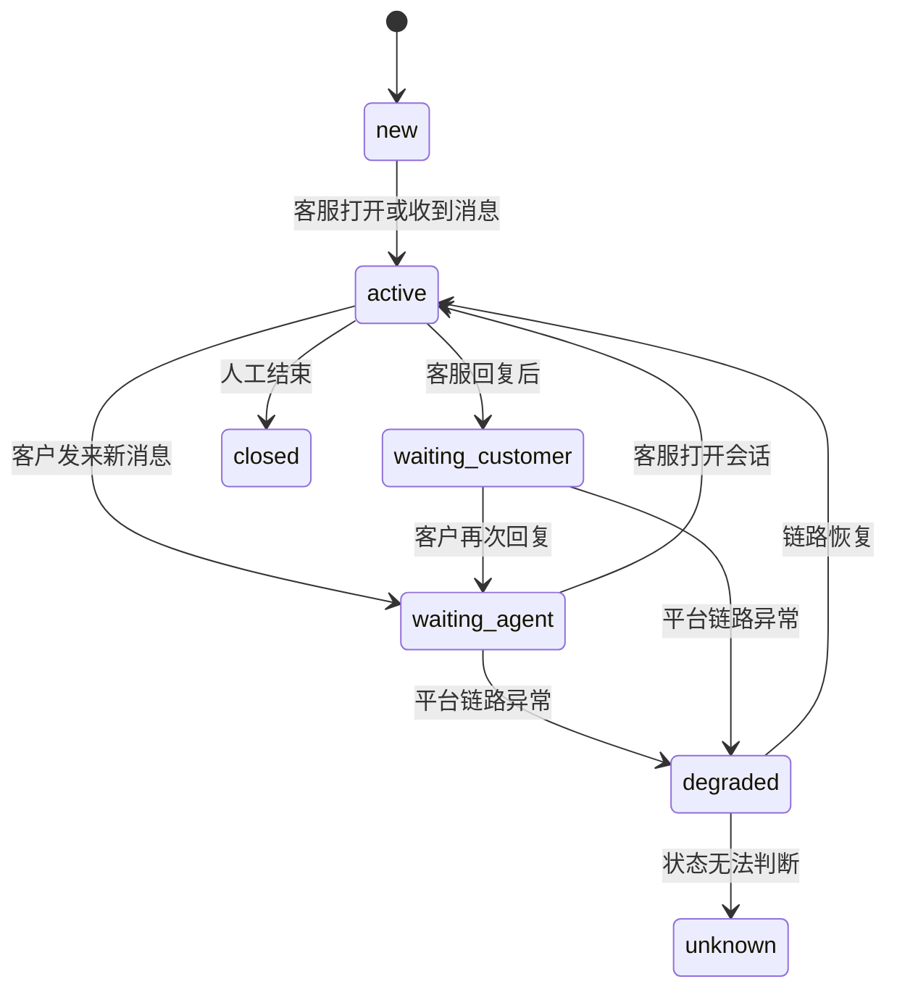
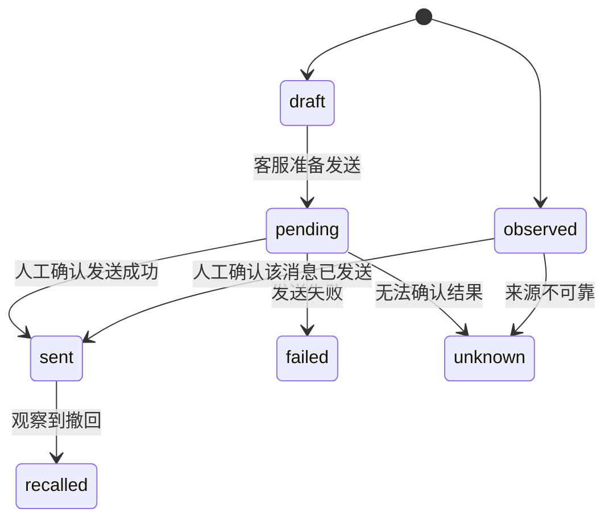
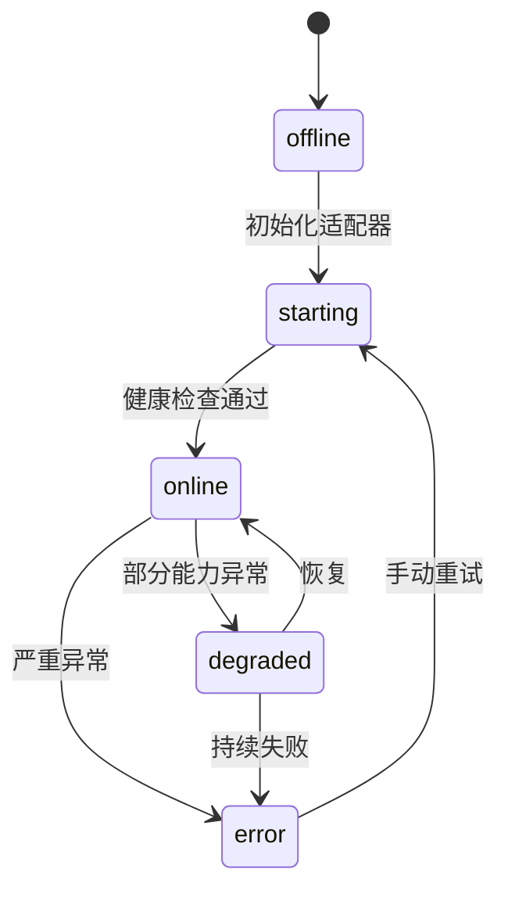

# 统一数据模型与状态机

## 1. 设计目标

本文件定义 MVP 阶段需要统一的核心数据模型和状态机，作为 C++ / Qt 客户端、Python 服务、平台适配器、本地存储之间的共同语言。

MVP 阶段不追求覆盖所有平台能力，重点解决：

- 会话如何统一展示
- 消息如何统一存储和渲染
- 非官方采集的数据如何标记可信度
- AI 建议如何进入人工确认流程
- 发送状态不确定时如何表达
- 平台异常时如何降级

## 2. 设计原则

- 主模型保持稳定，平台差异进入 `metadata`
- UI 只依赖统一模型，不直接依赖微信、千牛、拼多多等平台字段
- 数据来源必须可追踪
- 低可信度数据不能伪装成权威消息
- AI 只生成建议，不直接改变发送状态
- 状态机必须允许 `unknown`，因为非官方接入无法保证所有状态准确

## 3. 枚举定义

> **编码说明**：文档中枚举值使用 `snake_case` 便于阅读；C++ 代码中使用 `PascalCase`（如 `Mock`、`PddWeb`）。两者语义一一对应。

### 3.1 PlatformType

| 文档值 | C++ 枚举 | 含义 |
|---|---|---|
| `mock` | `Mock` | 本地模拟平台 |
| `pdd_web` | `PddWeb` | 拼多多商家后台 Web |
| `qianniu` | `QianniuPc` | 千牛 PC 客户端 |
| `wechat` | `WechatPc` | 个人微信 PC 客户端 |
| `generic_web` | `GenericWeb` | 通用 Web 平台 |
| `generic_pc` | `GenericPc` | 通用 PC 客户端 |
| `unknown` | `Unknown` | 未知平台 |

### 3.2 ConversationStatus

| 文档值 | C++ 枚举 | 含义 |
|---|---|---|
| `new` | `New` | 新会话 |
| `active` | `Active` | 正在处理 |
| `waiting_customer` | `WaitingCustomer` | 等客户回复 |
| `waiting_agent` | `WaitingAgent` | 待客服回复 |
| `closed` | `Closed` | 已结束 |
| `degraded` | `Degraded` | 平台链路降级 |
| `unknown` | `Unknown` | 状态不确定 |

### 3.3 MessageDirection

| 文档值 | C++ 枚举 | 含义 |
|---|---|---|
| `inbound` | `Inbound` | 客户发给客服 |
| `outbound` | `Outbound` | 客服发给客户 |
| `system` | `System` | 系统消息 |

### 3.4 MessageContentType

| 文档值 | C++ 枚举 | MVP 是否支持 | 含义 |
|---|---|---|---|
| `text` | `Text` | 是 | 文本消息 |
| `image` | `Image` | 只展示占位 | 图片 |
| `file` | `File` | 只展示占位 | 文件 |
| `link` | `Link` | 只展示文本 | 链接 |
| `order_card` | `OrderCard` | 只展示简化字段 | 订单卡片 |
| `product_card` | `ProductCard` | 只展示简化字段 | 商品卡片 |
| `system` | `System` | 是 | 平台系统提示 |
| `unknown` | `Unknown` | 是 | 未识别消息 |

### 3.5 MessageStatus

| 文档值 | C++ 枚举 | 含义 |
|---|---|---|
| `draft` | `Draft` | 草稿 |
| `observed` | `Observed` | 从页面、窗口、OCR 等观察到的消息 |
| `pending` | `Pending` | 发送中或等待确认 |
| `sent` | `Sent` | 已发送，通常来自模拟平台或人工确认 |
| `failed` | `Failed` | 发送失败 |
| `unknown` | `Unknown` | 状态不确定 |
| `recalled` | `Recalled` | 撤回，MVP 仅预留 |

### 3.6 SourceType

`SourceType` 先与当前 C++ 实现保持一致，只使用 `src/models/unifiedmodels.h/cpp` 已支持的枚举和字符串值。外部工具、RPA、CDP、Playwright、OCR 等更细的观测方式，不新增 `rpa_dom_observed`、`rpa_ui_observed` 等枚举值，统一放入 `metadata.observation_method`、`metadata.tool`、`metadata.selector_version` 等字段。

| 文档值 | C++ 枚举 | 含义 | 默认可信度 |
|---|---|---|---|
| `mock` | `Mock` | 模拟数据 | 100 |
| `dom_observed` | `DomObserved` | Web DOM / CDP / Playwright 可见内容 | 80 |
| `ui_observed` | `UiObserved` | PC 客户端 UI / UIA / RPA 可见文本 | 70 |
| `ocr_extracted` | `OcrExtracted` | OCR 识别结果 | 55 |
| `notification_observed` | `NotificationObserved` | 系统通知 | 45 |
| `manual_confirmed` | `ManualConfirmed` | 人工确认 | 95 |
| `experimental` | `Experimental` | 实验链路或未知来源 | 50 |

外部工具来源映射建议：

| 具体观测方式 | `sourceType` | 建议写入 `metadata` |
|---|---|---|
| Playwright CDP / Chrome Extension 读取 DOM | `dom_observed` | `observation_method=playwright_cdp` 或 `chrome_extension` |
| 指纹浏览器页面内脚本读取可见内容 | `dom_observed` | `tool=adspower` / `bitbrowser`，`selector_version` |
| 影刀 / UiBot / 自研 UIA 读取桌面控件文本 | `ui_observed` | `observation_method=uia` 或 `rpa_ui` |
| 截图 + OCR 解析消息区域 | `ocr_extracted` | `observation_method=ocr_screenshot`，`ocr_engine` |
| 系统通知、消息提醒窗口 | `notification_observed` | `observation_method=notification` |
| 客服确认发送、确认消息归属 | `manual_confirmed` | `confirmed_by`、`confirmed_at` |

### 3.7 VerificationStatus

| 文档值 | C++ 枚举 | 含义 |
|---|---|---|
| `unverified` | `Unverified` | 未验证 |
| `auto_verified` | `AutoVerified` | 系统自动校验通过 |
| `manual_verified` | `ManualVerified` | 人工确认 |
| `conflict` | `Conflict` | 多来源冲突 |

### 3.8 PlatformAccountStatus

| 文档值 | C++ 枚举 | 含义 |
|---|---|---|
| `offline` | `Offline` | 未连接或未登录 |
| `starting` | `Starting` | 初始化中 |
| `online` | `Online` | 可用 |
| `degraded` | `Degraded` | 部分能力不可用 |
| `error` | `Error` | 异常 |
| `unknown` | `Unknown` | 状态不确定 |

## 4. 核心实体

### 4.1 Conversation

统一会话对象，用于会话列表和消息聚合。

> **实现说明**：C++ 代码中定义于 `src/models/unifiedmodels.h`，结构体 `Models::Conversation`。

| 字段 | 类型 | 必填 | 说明 |
|---|---|---|---|
| `id` | int | 是 | 系统内部会话 ID（自增主键） |
| `platformType` | PlatformType | 是 | 平台类型 |
| `platformConversationId` | string | 否 | 平台原始会话 ID，可能拿不到 |
| `accountId` | string | 是 | 平台账号 ID |
| `title` | string | 是 | 会话展示名称 |
| `status` | ConversationStatus | 是 | 会话状态 |
| `lastMessage` | string | 否 | 最后一条消息摘要 |
| `lastMessageAt` | datetime | 否 | 最后消息时间 |
| `unreadCount` | int | 是 | 未读数，可能是推断值 |
| `sourceType` | SourceType | 是 | 数据来源 |
| `confidence` | int | 是 | 可信度 0-100 |
| `metadata` | object | 否 | 平台差异字段（C++ 中为 `QJsonObject`） |
| `createdAt` | datetime | 是 | 创建时间 |
| `updatedAt` | datetime | 是 | 更新时间 |

### 4.2 Message

统一消息对象，用于消息列表、AI 上下文和本地存储。

> **实现说明**：C++ 代码中定义于 `src/models/unifiedmodels.h`，结构体 `Models::Message`。

| 字段 | 类型 | 必填 | 说明 |
|---|---|---|---|
| `id` | int | 是 | 系统内部消息 ID（自增主键） |
| `conversationId` | int | 是 | 所属会话 ID |
| `platformMessageId` | string | 否 | 平台消息 ID，可能拿不到 |
| `direction` | MessageDirection | 是 | 消息方向 |
| `contentType` | MessageContentType | 是 | 内容类型 |
| `content` | string | 是 | 文本内容或摘要 |
| `status` | MessageStatus | 是 | 消息状态 |
| `sourceType` | SourceType | 是 | 数据来源 |
| `confidence` | int | 是 | 可信度 |
| `verificationStatus` | VerificationStatus | 是 | 验证状态 |
| `observedAt` | datetime | 是 | 系统观察时间 |
| `platformDisplayedAt` | datetime | 否 | 平台显示时间 |
| `evidenceRef` | string | 否 | 证据引用，如截图哈希 |
| `metadata` | object | 否 | 平台差异字段（C++ 中为 `QJsonObject`） |

### 4.3 PlatformAccount

平台账号对象，用于展示账号和接入链路状态。

| 字段 | 类型 | 必填 | 说明 |
|---|---|---|---|
| `id` | string | 是 | 系统账号 ID |
| `platformType` | PlatformType | 是 | 平台类型 |
| `displayName` | string | 是 | 展示名称 |
| `status` | PlatformAccountStatus | 是 | 账号状态 |
| `adapterStatus` | string | 是 | 适配器状态 |
| `lastActiveAt` | datetime | 否 | 最后活跃时间 |
| `lastError` | string | 否 | 最近错误 |
| `metadata` | object | 否 | 店铺、窗口标题、浏览器 Profile 等 |

### 4.4 ConversationEvent

统一事件对象，用于平台适配器向核心层上报事件。

| 字段 | 类型 | 必填 | 说明 |
|---|---|---|---|
| `id` | string | 是 | 事件 ID |
| `type` | string | 是 | 事件类型 |
| `platformType` | PlatformType | 是 | 平台 |
| `accountId` | string | 是 | 账号 |
| `conversationId` | string | 否 | 关联会话 |
| `messageId` | string | 否 | 关联消息 |
| `sourceType` | SourceType | 是 | 来源 |
| `confidence` | int | 是 | 可信度 |
| `payload` | object | 是 | 事件内容 |
| `createdAt` | datetime | 是 | 事件产生时间 |

MVP 事件类型：

- `conversation_observed`
- `message_observed`
- `message_status_changed`
- `account_status_changed`
- `adapter_health_changed`
- `draft_prepared`
- `manual_send_confirmed`

### 4.5 SendMessageCommand

发送命令对象。MVP 中它不代表自动发送，只代表“准备发送”或“人工确认发送”。

| 字段 | 类型 | 必填 | 说明 |
|---|---|---|---|
| `id` | string | 是 | 命令 ID |
| `conversationId` | string | 是 | 会话 |
| `content` | string | 是 | 待发送文本 |
| `mode` | string | 是 | `draft_only`、`copy_to_clipboard`、`manual_confirm` |
| `status` | MessageStatus | 是 | 状态 |
| `createdBy` | string | 否 | 操作人 |
| `createdAt` | datetime | 是 | 创建时间 |
| `confirmedAt` | datetime | 否 | 人工确认时间 |
| `metadata` | object | 否 | 平台差异字段 |

### 4.6 AISuggestion

AI 回复建议对象。

| 字段 | 类型 | 必填 | 说明 |
|---|---|---|---|
| `id` | string | 是 | 建议 ID |
| `conversationId` | string | 是 | 会话 ID |
| `content` | string | 是 | 建议内容 |
| `confidence` | int | 否 | AI 内部置信度，可为空 |
| `accepted` | bool | 是 | 是否被客服采用 |
| `createdAt` | datetime | 是 | 生成时间 |
| `metadata` | object | 否 | 模型、提示词版本、风险标签 |

## 5. 状态机

### 5.1 会话状态机



### 5.2 消息状态机



### 5.3 平台账号状态机



### 5.4 AI 建议状态

MVP 阶段不需要复杂状态机，建议使用字段表达：

- `created`
- `shown`
- `accepted`
- `rejected`
- `edited`

AI 建议不能直接改变 `MessageStatus` 为 `sent`。

## 6. 去重与幂等

### 6.1 模拟平台

模拟平台使用稳定 ID：

```text
mock:{conversationId}:{messageSeq}
```

### 6.2 Web / UI 观察消息

真实平台 PoC 可能拿不到稳定消息 ID，建议生成内容指纹：

```text
fingerprint = hash(platformType + accountId + conversationTitle + direction + content + timeWindow)
```

注意：

- `timeWindow` 可以按分钟级处理
- OCR 结果不稳定时不能只靠内容指纹
- 如果多来源冲突，设置 `verificationStatus = conflict`

## 7. 可信度规则

### 7.1 默认规则

| 来源 | 默认处理 |
|---|---|
| `mock` | 可信 |
| `dom_observed` | 可进入会话流，但需标记来源 |
| `ui_observed` | 可进入会话流，但需标记来源 |
| `ocr_extracted` | 默认低可信，只作辅助 |
| `notification_observed` | 只作提醒，不单独生成权威消息 |
| `manual_confirmed` | 高可信 |
| `experimental` | 不进入 MVP 主链路 |

### 7.2 UI 展示规则

- 低可信消息应显示来源提示
- `unknown` 状态应显式展示
- OCR 消息不得默认作为已发送或已读依据
- 人工确认后可将 `verificationStatus` 更新为 `manual_verified`

## 8. MVP 存储边界

MVP 本地至少保存：

- 最近会话
- 最近消息
- 输入草稿
- AI 建议摘要
- 平台账号状态
- 适配器健康状态

MVP 暂不要求：

- 全量历史消息归档
- 跨设备同步
- 全文搜索
- 复杂附件存储
- 数据仓库分析

## 9. C++ / Python 协议边界

### 9.1 C++ 发给 Python

AI 请求应包含：

- `conversationId`
- 最近消息列表
- 平台类型
- 可选上下文
- 风险控制参数

### 9.2 Python 返回 C++

AI 响应应包含：

- `suggestions`
- `riskFlags`
- `modelInfo`
- `requestId`

Python 不直接返回“发送命令”。发送动作由 C++ 客户端和用户确认流程控制。

## 10. MVP 约束

- 不引入平台专属字段到主模型
- 不把 OCR 结果当作权威消息
- 不把系统通知当作完整消息
- 不支持无人值守自动发送
- 不要求完整撤回、已读、编辑状态
- 不做复杂联系人画像

## 11. 旧模型兼容层

当前代码中保留了旧模型结构（`src/core/types.h`）用于渐进式迁移：

| 旧结构 | 新结构 | 说明 |
|---|---|---|
| `PlatformMessage` | `Models::ConversationEvent` | 平台入站消息事件 |
| `ConversationInfo` | `Models::Conversation` | 会话信息 |
| `MessageRecord` | `Models::Message` | 消息记录 |

转换函数位于 `LegacyModelCompat` 命名空间：

```cpp
namespace LegacyModelCompat {
    Models::Conversation toUnifiedConversation(const ConversationInfo& value);
    Models::Message toUnifiedMessage(const MessageRecord& value);
    Models::ConversationEvent toMessageObservedEvent(const PlatformMessage& value);
}
```

UI 层当前仍部分使用旧结构进行渲染，通过上述转换函数与统一模型信号对接。后续可进一步将 UI 内部数据源完全迁移到 `Models::*`。

## 12. 后续扩展预留

后续可以扩展：

- `Contact`
- `Attachment`
- `PlatformContext`
- `Ticket`
- `QuickReply`
- 更完整的消息类型
- 更完整的审计事件
- 更完整的平台适配器能力

