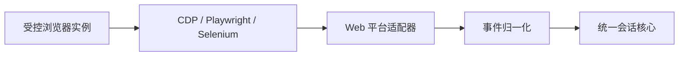
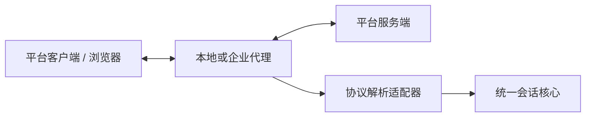
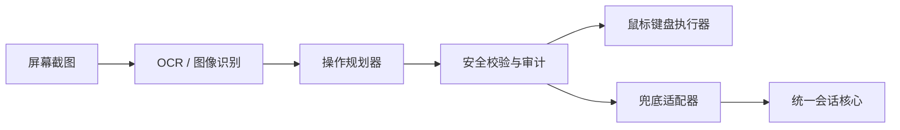
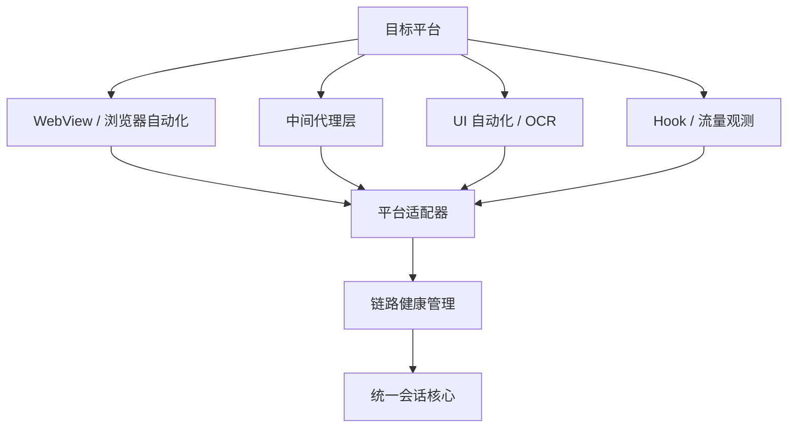

# 多平台会话聚合架构分析文档

## 1. 结论先行

多平台会话聚合不应被理解为“把各个平台消息塞进同一个列表”，而是要建立一层稳定的**Conversation Abstraction Layer**，把不同平台的消息、会话、状态、事件和上下文统一成内部领域模型，再通过平台适配器、代理层和策略层分别处理差异。

### 当前已确认前提

本阶段已确认拿不到目标平台的官方 API / SDK：

- 个人微信 PC 客户端：即使存在相关能力，也无法获得可用授权
- 千牛 PC 客户端：客服相关开放能力不可用或申请不到
- 拼多多商家后台网页版：官方接口申请不到

因此，本文后续方案将以**非官方技术接入手段**为现实约束进行设计。这里的目标不是绕过平台安全机制，而是在客服人员已正常登录、正常使用平台的前提下，通过桌面可见内容、浏览器页面、系统事件、外部工具辅助和人工确认动作，构建一个可控、可降级、可审计的统一会话工作台。

在这个前提下，系统必须接受三个事实：

- 获取到的数据大多不是平台权威回执，而是“可见内容观察结果”
- 消息完整性、已读状态、发送状态和历史补拉能力都会弱于官方 API
- 自动发送、批量操作、Hook 注入、流量代理等能力必须严格限制，默认不进入 MVP 生产主链路

结合《桌面客服工作台系统架构分析文档》的总体架构，推荐采用：

- **桌面客户端 C++**：负责统一会话展示、消息处理、交互和本地缓存
- **平台适配层**：负责微信、千牛、拼多多等平台接入与协议归一
- **Python 策略层**：负责 AI 辅助回复、规则判断、自动化辅助
- **中心后端**：负责权限、配置、审计、归档、统一治理

接入策略上遵循：

1. 拼多多等 Web 平台优先采用指纹浏览器 / 受控浏览器 + CDP / Playwright + DOM 可见内容采集
2. 微信、千牛等 PC 客户端优先采用影刀 / UiBot RPA，必要时补充 UI 自动化、无障碍接口、OCR、窗口状态和剪贴板辅助
3. 所有平台发送动作默认采用“生成草稿 / 填入输入框 / 人工确认发送”
4. Hook / 注入、流量抓包 / 中间人代理只作为高风险实验链路，默认不进入生产主链路

外部工具辅助路线的详细边界见《[外部工具辅助平台接入方案.md](外部工具辅助平台接入方案.md)》。当前只保留“影刀 / UiBot RPA”和“AdsPower / 紫鸟 / 指纹浏览器”两类工具路线；商业客服 SaaS 旁路、硬件 HID 和投屏群控不进入当前 MVP / M5 PoC。

## 2. 多平台接入总体策略

### 2.1 目标

- 统一展示多个平台的会话和消息
- 降低平台差异对 UI 和业务层的污染
- 让新增平台接入尽量只影响适配器，不影响主流程
- 保持可扩展、可审计、可降级

### 2.2 接入原则

| 原则 | 含义 |
|---|---|
| 可见内容优先 | 在用户正常登录和可见页面范围内采集消息、会话和上下文 |
| 差异下沉 | 平台差异留在适配层，不进入统一主模型 |
| 外部工具辅助 | 平台适配层可以借助 RPA、指纹浏览器等成熟工具，不要求所有能力从零自研 |
| 风险隔离 | 高风险接入方式必须与主链路隔离 |
| 可回退 | 单个平台异常不能拖垮整个桌面工作台 |
| 可审计 | 所有自动化动作必须记录来源、时间、结果 |
| 人工确认发送 | MVP 阶段默认不做无人值守自动发送 |

### 2.3 评估维度

选择接入方式时，建议按以下维度评估：

- 合规性
- 稳定性
- 平台变更敏感度
- 开发和维护成本
- 消息实时性
- 能否覆盖消息接收、发送、补拉、撤回、状态变化
- 是否适合生产主链路
- 是否依赖平台 UI 结构
- 是否能明确识别当前账号、店铺和会话
- 是否能避免误发、重发和跨会话发送

## 3. 接入方式分析

### 3.1 官方 SDK / OpenAPI

这是优先级最高的方式，适合平台提供开放能力的场景。

**优点**

- 合规性最好
- 稳定性高
- 能直接拿到结构化消息、状态和回调
- 便于做增量同步和审计

**缺点**

- 平台能力往往不完整
- 会受权限、频控、产品策略限制
- 对客服端“拟人化”交互支持不足

**适用**

- 消息拉取
- 发送消息
- 会话状态同步
- 订单 / 商品上下文补充
- 审计和归档

### 3.2 WebView / 浏览器容器

适合平台存在网页客服后台、且官方能力有限的情况。

**优点**

- 上手快
- 能复用网页端现有功能
- 适合过渡期快速打通主流程

**缺点**

- 依赖页面结构，维护成本高
- 登录态、Cookie、扫码和多账号隔离复杂
- 对 DOM 变化敏感

**建议**

- 仅作为受控接入方式
- 适合后台工作台、辅助页面或低频能力
- 不建议把主消息渲染和核心状态机完全建立在 WebView 上

### 3.3 协议解析 / 抓取

这是高风险方案，只能作为受限兜底。

**适用场景**

- 平台无 API、无 SDK
- 必须支持最小可用接入
- 仅用于内部试点或短期过渡

**风险**

- 封号或风控风险高
- 协议变化频繁
- 维护成本高
- 容易被平台升级打断

**结论**

不应作为生产主链路的长期方案。

### 3.4 中间代理层

中间代理层建议作为中大型系统的标配。

**职责**

- 鉴权
- 统一协议转发
- 缓存
- 限流
- 审计
- 消息归一
- 回调聚合

**部署形态**

- 本机：便于单机试点
- 局域网：适合企业内网部署
- 云端：适合集中治理和统一审计

**作用**

代理层不是替代平台接入，而是把接入复杂度从桌面端剥离出去。

### 3.5 纯技术手段

纯技术手段指在平台没有稳定 API、SDK、合作接口，或官方能力无法覆盖某些客服工作流时，利用桌面端、浏览器、操作系统或页面层能力进行辅助接入。它不是理想方案，也不应默认进入生产主链路。它的合理定位是：**受控补充、临时过渡、人工增强、低风险自动化**。

常见手段包括 UI 自动化、OCR、无障碍接口、窗口消息、剪贴板辅助、浏览器 DOM 监听、浏览器扩展、DevTools 协议、系统通知捕获、输入法/热键辅助、RPA 脚本、页面本地存储读取、屏幕区域识别等。

**定位**

- 只适合作为临时补充或人工辅助能力
- 不适合承担稳定的主消息链路
- 必须通过平台适配器隔离，不允许直接污染统一会话模型
- 必须可关闭、可灰度、可审计
- 必须提前评估平台条款、账号安全和客户数据合规风险

**原因**

- 稳定性不足
- 受 UI 变化影响极大
- 合规和可解释性较弱
- 难以保证消息不丢、不重、不乱序
- 难以覆盖撤回、已读、失败重试等完整状态

#### 3.5.1 UI 自动化

UI 自动化是通过操作系统或自动化框架模拟人工点击、输入、复制、切换窗口等动作。

**可用场景**

- 辅助打开指定会话
- 自动定位搜索框、输入框、发送按钮
- 人工确认后辅助粘贴话术
- 执行低频、可回退的后台操作

**典型能力**

- Windows UI Automation
- Microsoft Active Accessibility
- 坐标点击与控件树识别
- 快捷键和焦点控制

**限制**

- 控件层级变化会导致失效
- 多分辨率、多 DPI、多语言环境适配成本高
- 容易受弹窗、登录过期、广告浮层影响
- 不适合无人工确认的大规模自动发送

#### 3.5.2 OCR 与屏幕识别

OCR 适合在无法直接读取结构化内容时，从屏幕截图中识别文本、订单号、按钮状态或异常提示。

**可用场景**

- 识别页面上的订单号、用户昵称、系统提示
- 判断是否出现验证码、登录失效、发送失败弹窗
- 辅助定位消息区域或按钮

**限制**

- 识别准确率受字体、缩放、主题、遮挡影响
- 对图片、表情、复杂卡片结构还原能力有限
- 不适合作为消息归档的唯一来源

**建议**

- OCR 结果只能作为辅助信号
- 关键动作必须二次校验
- 涉及用户隐私的截图必须加密、脱敏、控制生命周期

#### 3.5.3 无障碍接口

无障碍接口可以读取部分桌面控件的文本、层级和状态，比坐标点击更稳定。

**可用场景**

- 读取标准控件文本
- 识别按钮、列表、输入框
- 辅助判断当前窗口状态

**限制**

- 很多 Electron、Chromium、原生混合应用暴露的信息不完整
- 自绘控件可能无法读取文本
- 平台升级或关闭可访问性支持后能力会下降

#### 3.5.4 剪贴板辅助

剪贴板方式常用于把 AI 生成的话术、快捷回复或订单信息快速填入第三方客服窗口。

**可用场景**

- 人工确认后复制话术
- 辅助填充常用回复
- 在不直接控制平台协议的情况下减少客服输入成本

**限制**

- 会污染用户剪贴板
- 需要处理剪贴板恢复
- 不适合承载敏感凭证和不可见数据传递

**建议**

- 使用前保存原剪贴板内容，操作后恢复
- 敏感内容设置短生命周期
- 所有自动填充必须留审计记录

#### 3.5.5 窗口消息、热键和输入法辅助

这类方式通过系统窗口、快捷键或输入法链路辅助完成窗口激活、内容输入和发送。

**可用场景**

- 激活指定客服窗口
- 触发复制、粘贴、搜索、发送等快捷操作
- 做轻量级桌面联动

**限制**

- 不同应用对窗口消息响应差异很大
- 焦点错误可能导致误输入、误发送
- 难以识别平台内部真实业务状态

**建议**

- 只用于人工可见、可撤销、低风险动作
- 自动发送前必须校验当前窗口、会话和输入框状态

#### 3.5.6 浏览器 DOM 监听

如果平台通过 WebView 或浏览器容器接入，可以在授权和合规范围内通过 DOM MutationObserver、页面事件、注入脚本等方式捕获页面变化。

**可用场景**

- 监听页面新消息节点变化
- 读取会话列表和未读数
- 捕获当前选中会话
- 提取订单卡片、商品卡片中的可见字段

**限制**

- 对页面结构强依赖
- 前端改版后容易失效
- 单页应用的虚拟列表和异步渲染会增加解析难度
- 不应绕过平台权限和风控逻辑

**建议**

- 建立选择器版本管理
- 用页面特征检测判断适配器是否仍然健康
- DOM 数据只能作为平台适配器输入，不能直接进入 UI

#### 3.5.7 浏览器扩展 / DevTools 协议

对于以浏览器承载的平台后台，可以通过企业受控浏览器扩展或 DevTools 协议实现更强的页面观测和调试能力。

**可用场景**

- 捕获页面路由变化
- 读取可见 DOM 状态
- 监听前端网络请求的元信息
- 做自动化测试和适配器健康检测

**限制**

- 浏览器版本、扩展权限、企业安全策略会影响可用性
- 网络内容采集涉及合规边界，必须谨慎
- 不应绕过登录、加密、验证码或平台访问控制

#### 3.5.8 系统通知捕获

部分平台客户端会通过 Windows 通知、托盘提示或弹窗提示新消息。可以将其作为低成本提醒信号。

**可用场景**

- 判断是否有新消息
- 触发轻量级同步或窗口聚焦
- 作为消息丢失的辅助监控信号

**限制**

- 通知内容不完整
- 无法稳定获取消息正文和上下文
- 不适合归档和自动回复

#### 3.5.9 本地缓存/页面存储读取

某些桌面客户端或网页会在本地保存缓存、IndexedDB、LocalStorage 或日志。工程上可能尝试读取这些数据做辅助分析。

**风险**

- 合规风险高
- 数据结构非公开且变化频繁
- 可能包含敏感信息
- 可能违反平台或企业安全规范

**建议**

- 只在明确授权、内部自有系统或官方允许的范围内使用
- 不作为第三方平台接入的推荐方案
- 不读取凭证、密钥、加密会话或绕过访问控制的数据

#### 3.5.10 RPA 脚本

RPA 适合承接桌面客户端平台的“可见内容采集”和“草稿回填”脏活，例如识别千牛 / 微信窗口、读取可见消息、定位输入框、打开售后页、复制订单号、查询物流、回填结果。

**可用场景**

- 低频运营动作
- 半自动客服辅助
- 后台批处理
- 人工触发的流程编排
- 桌面客户端消息搬运
- AI 建议草稿回填

**限制**

- 对 UI 稳定性依赖强
- 异常分支多
- 不适合无人值守自动发送
- 异常时必须停止并降级到人工处理

#### 3.5.11 技术手段选择矩阵

| 纯技术手段 | 可解决的问题 | 稳定性 | 风险 | 推荐定位 |
|---|---|---|---|---|
| UI 自动化 | 点击、输入、窗口切换 | 低-中 | 误操作、页面变化 | 人工辅助 |
| OCR / 图像识别 | 识别可见文字、异常弹窗 | 低-中 | 识别错误、隐私数据 | 辅助判断 |
| 无障碍接口 | 读取标准控件文本和状态 | 中 | 信息不完整 | 辅助接入 |
| 剪贴板辅助 | 填充话术、复制内容 | 中 | 剪贴板污染、误粘贴 | 人工确认后使用 |
| 窗口消息 / 热键 | 激活窗口、快捷操作 | 低-中 | 焦点错误 | 低风险联动 |
| DOM 监听 | 捕获网页端会话变化 | 中 | 页面结构变化 | WebView 适配补充 |
| 浏览器扩展 / DevTools | 页面观测、测试、诊断 | 中 | 权限和合规 | 受控环境 |
| 系统通知捕获 | 新消息提醒 | 低 | 信息不完整 | 辅助信号 |
| 本地缓存读取 | 辅助分析历史状态 | 低 | 合规风险高 | 原则上不推荐 |
| RPA 脚本 | 串联低频后台操作 | 低-中 | 异常分支多 | 运营辅助 |

#### 3.5.12 工程隔离要求

纯技术手段如果确需进入系统，应至少满足：

- 独立适配器进程运行
- 与主客户端通过统一插件接口通信
- 所有动作必须带平台、账号、会话、操作人、触发来源
- 必须有速率限制、超时、熔断和人工接管
- 不允许默认自动发送高风险内容
- 不允许绕过登录、验证码、权限、加密或平台访问控制
- 不允许把截图、Cookie、Token、客户隐私写入明文日志
- 必须具备远程禁用开关

#### 3.5.13 强技术手段深度分析

以下四类手段比普通 UI 辅助更接近平台底层或浏览器自动化层，工程能力要求高，合规和账号风险也更高。它们适合做技术可行性评估、内测验证或受控兜底，不应绕过平台授权、访问控制、加密保护或风控规则。

##### 手段一：桌面客户端 Hook / 注入

**适用对象**

- 有 Windows 桌面客户端的平台
- 典型例子：微信、千牛、部分电商客服专用客户端

**基本原理**

通过 DLL 注入、API Hook、消息 Hook、窗口过程 Hook、进程内函数拦截等方式，在目标客户端运行过程中观察或影响其行为。工程上可能观察窗口消息、网络调用边界、渲染层数据、进程内事件或本地存储访问路径。

**可能获得的能力**

- 捕获新消息提醒或窗口事件
- 识别当前会话切换
- 辅助读取部分可见文本或控件状态
- 辅助完成输入、发送、复制等动作
- 对客户端崩溃、版本、窗口状态做健康检测

**架构位置**

**优点**

- 对纯桌面客户端场景覆盖较强
- 能捕获部分 UI 自动化拿不到的进程内事件
- 实时性可能较好

**主要风险**

- 合规风险高，可能违反平台客户端使用条款
- 容易触发安全软件、平台风控或账号限制
- 平台升级后 Hook 点可能失效
- 进程注入稳定性要求高，容易影响目标客户端
- 排查问题困难，线上维护成本高

**工程约束**

- 必须独立进程隔离，不能把 Hook 逻辑放进主客户端
- 不应修改平台客户端业务逻辑
- 不应绕过登录、加密、权限或风控
- 必须具备版本指纹检测，版本不匹配时自动停用
- 必须具备远程熔断和灰度开关
- 必须记录操作审计和异常日志

**推荐定位**

只适合作为内部可行性验证、受控辅助或特定企业授权场景，不建议作为面向大量客户交付的标准生产主链路。

##### 手段二：Web 端自动化（浏览器控制）

**适用对象**

- 有网页版客服后台的平台
- 典型例子：拼多多商家后台、抖音商家后台、部分 SaaS 客服后台

**基本原理**

使用 CDP 协议控制 Chrome / Edge，或使用 Selenium、Playwright 等自动化框架控制浏览器页面，完成登录态复用、页面导航、DOM 读取、点击、输入、截图、事件监听和自动化测试。

**可能获得的能力**

- 打开指定客服后台页面
- 获取当前会话列表和未读状态
- 读取可见消息 DOM
- 监听 DOM 变化推断新消息
- 自动填充回复内容
- 识别发送失败、登录失效、验证码等状态
- 对适配器做自动化回归测试

**架构位置**

**优点**

- 比桌面 Hook 风险低，工程可控性更好
- 适合 Web 后台接入和自动化回归
- 可观察 DOM、路由、页面状态
- 与 WebView / 浏览器容器路线相容

**主要风险**

- 页面结构变化会导致解析失效
- 登录、验证码、多因子认证会打断自动化流程
- 平台可能限制自动化浏览器特征
- 对虚拟列表、懒加载、前端加密状态处理复杂
- 自动发送仍存在误发和合规风险

**工程约束**

- 不使用无头浏览器承载客服主操作，优先让客服可见可控
- 页面选择器需要版本化管理
- 自动化前必须校验页面、账号、店铺、会话是否匹配
- DOM 解析结果进入适配器后必须转换为 ConversationEvent
- 关键动作需要截图或页面状态快照用于审计，但必须脱敏
- 对自动发送设置人工确认、限流和熔断

**推荐定位**

适合作为无 API 平台的过渡接入方式，也适合作为 WebView 路线的测试和健康检查工具。若平台页面稳定且企业内部可接受维护成本，可承担部分低风险生产能力，但不建议承担不可恢复的高风险操作。

##### 手段三：流量抓包 / 中间人代理

**适用对象**

- 通信协议可分析的平台
- 使用 HTTP(S)、WebSocket、长轮询等网络协议的平台
- 更适合企业自有系统、已授权系统或明确允许代理接入的场景

**基本原理**

通过本地代理、系统代理、企业网关或调试代理观察客户端与服务端之间的 HTTP(S) / WebSocket 流量，并将可合规处理的数据转换为内部事件。对于加密通信，任何证书安装、TLS 终止、内容解密都必须在合法授权和安全合规边界内进行。

**可能获得的能力**

- 观察请求路径、响应状态和部分业务数据
- 捕获 WebSocket 消息事件
- 分析消息同步、发送、撤回等协议行为
- 做接口稳定性评估
- 构建代理层缓存、限流、审计能力

**架构位置**

**优点**

- 可获得比 UI 层更结构化的事件
- 实时性较好
- 对消息同步和状态流转分析有帮助
- 可与中间代理层演进方向结合

**主要风险**

- 合规和法律风险非常高，尤其是第三方平台流量
- HTTPS / 证书 / 加密通信处理敏感
- 平台可能做证书绑定、加密签名、反代理检测
- 协议变化会导致解析失效
- 误处理请求可能影响正常业务

**工程约束**

- 不应绕过加密、证书绑定、登录认证或访问控制
- 不应采集超出业务授权范围的数据
- 不应记录明文 Token、Cookie、密码、密钥
- 必须区分“流量观测”和“主动请求伪造”
- 主动请求发送必须优先走官方 API 或平台允许的入口
- 对第三方平台使用前必须完成法务、合规和平台授权评估

**推荐定位**

适合协议调研、企业自有系统集成、授权代理接入和网络层健康诊断。对微信、千牛、拼多多等第三方平台，不建议作为未授权生产方案。

##### 手段四：UI 自动化（截图 + 模拟操作）

**适用对象**

- 以上手段均失败时的兜底方案
- 目标平台只有可视化客户端或页面，无法获得稳定结构化数据

**基本原理**

通过截图、图像识别、OCR、模板匹配、控件定位、模拟鼠标键盘完成操作。它接近人工操作路径，但由程序辅助执行。

**可能获得的能力**

- 识别是否有新消息提醒
- 识别当前会话和输入框
- 粘贴 AI 建议话术
- 点击发送、转接、复制订单号等按钮
- 识别错误弹窗、验证码、登录失效提示

**架构位置**

**优点**

- 对平台技术栈依赖最低
- 能覆盖部分完全封闭的客户端
- 可快速验证业务流程
- 适合作为人工辅助工具

**主要风险**

- 识别错误会导致误操作
- 焦点错误可能造成误发
- 对分辨率、缩放、主题、语言、弹窗高度敏感
- 无法保证完整消息同步和一致性
- 自动化链路长，异常分支多

**工程约束**

- 默认只做“填入草稿”，不直接发送
- 发送前必须校验窗口标题、平台账号、会话对象、输入框内容
- 对涉及金额、退款、投诉、隐私的信息必须人工确认
- 每次操作保留脱敏截图、识别结果和动作日志
- 失败后必须停止，不允许盲目重试

**推荐定位**

只作为最终兜底或人工增强，不适合作为消息聚合、历史同步、自动回复主链路。

##### 四类强技术手段对比

| 手段 | 数据结构化程度 | 实时性 | 稳定性 | 合规风险 | 维护成本 | 推荐用途 |
|---|---|---|---|---|---|---|
| 桌面客户端 Hook / 注入 | 中 | 高 | 低-中 | 高 | 高 | 内测验证、授权场景、受控辅助 |
| Web 端自动化 | 中 | 中-高 | 中 | 中 | 中-高 | Web 后台过渡接入、回归测试 |
| 流量抓包 / 中间人代理 | 高 | 高 | 中 | 高 | 高 | 授权代理、协议调研、健康诊断 |
| UI 自动化截图模拟 | 低 | 低-中 | 低 | 中 | 高 | 兜底、人工辅助、低频操作 |

##### 推荐优先级

在没有官方 API 的情况下，建议优先级为：

1. Web 端自动化：如果平台存在稳定网页版后台
2. UI 自动化：如果目标是人工辅助，而不是自动归档和自动发送
3. 流量观测：仅在授权和合规前提下做诊断或自有系统集成
4. 桌面 Hook / 注入：仅在明确授权、强隔离、强审计前提下做受控验证

这个优先级不是按技术能力强弱排序，而是按**工程可控性、合规性和可维护性**排序。

### 3.6 外部工具辅助接入

在 M5 单平台真实 PoC 阶段，不要求团队从零自研所有平台适配能力。更推荐把成熟外部工具作为平台适配层的执行器，由 Python sidecar 统一调度，再将结果归一为内部模型。

当前保留两条外部工具路线：

| 路线 | 适用平台 | 工具示例 | 主要职责 |
|---|---|---|---|
| 指纹浏览器 / 受控浏览器 | 拼多多、抖店等 Web 工作台 | AdsPower、紫鸟、普通受控 Chromium | Profile 隔离、CDP 连接、DOM 可见内容采集、草稿回填 |
| RPA 平台 | 千牛 PC、微信 PC 等桌面客户端 | 影刀、UiBot | 窗口识别、可见消息搬运、输入框定位、草稿回填 |

外部工具的定位是“平台适配执行器”，不是客服主界面，也不是绕过人工确认的自动发送器。C++ 聚合工作台仍然负责会话展示、AI 建议、状态流转、人工确认和审计；Python sidecar 负责外部工具协议、健康检测、适配器调度和降级。

当前不进入路线：

- 商业客服 SaaS 旁路：暂不作为主线，避免削弱自研工作台价值和增加商务接口不确定性。
- 硬件 HID / 投屏群控：暂不作为 MVP 方案，避免把软件 PoC 变成设备运维 PoC。

详细设计见《[外部工具辅助平台接入方案.md](外部工具辅助平台接入方案.md)》。

## 4. 平台接入建议

实际工程里，平台接入方式通常不是互斥选择。一个平台可能同时使用官方 API、WebView、浏览器自动化、代理层、UI 自动化等多条链路，只是每条链路承担的职责不同。正确做法是按能力拆分，而不是按平台武断指定唯一接入方式。

推荐把每个平台的接入能力拆成四层：

| 层级 | 目标 | 可用手段 | 定位 |
|---|---|---|---|
| 主链路 | 消息接收、会话识别、可见状态同步 | 指纹浏览器 / CDP、RPA、Web 自动化、无障碍、DOM 监听 | 当前现实主链路 |
| 辅助链路 | 页面态、订单上下文、人工操作辅助 | WebView、浏览器自动化、RPA、DOM 监听 | 补齐能力 |
| 兜底链路 | 主链路不可用时维持最低可用 | UI 自动化、OCR、剪贴板、系统通知 | 临时降级 |
| 实验链路 | 技术验证、内部诊断、授权场景 | Hook / 注入、流量观测 | 严格隔离 |

### 4.0 组合式接入原则

- **按能力组合**：消息、附件、订单、登录态、已读状态、发送动作可以走不同链路
- **主链路清晰**：每个平台必须定义一个默认可信数据源
- **辅助链路不越权**：辅助链路只能补充信息，不能覆盖主链路的权威状态
- **失败可降级**：主链路失败时进入只读、人工辅助或待补偿状态
- **状态可解释**：UI 必须展示平台账号和接入链路健康状态
- **风险可关闭**：高风险链路必须支持远程禁用和灰度

### 4.0.1 组合接入架构

### 4.0.2 链路降级状态

| 状态 | 含义 | UI 表现 | 允许动作 |
|---|---|---|---|
| normal | 主链路健康 | 正常显示 | 接收、发送、同步、AI 建议 |
| degraded | 主链路异常，辅助链路可用 | 标记平台异常 | 只读、人工确认发送、延迟同步 |
| readonly | 只能读取或观察，不能可靠发送 | 禁用自动发送 | 查看、复制、人工处理 |
| manual_assist | 仅能辅助人工操作 | 展示辅助按钮 | 粘贴话术、打开原平台 |
| offline | 全部链路不可用 | 显示断开 | 本地缓存、草稿、等待重连 |

### 4.0.3 非官方条件下的推荐技术路线

在官方 API / SDK 不可用的前提下，推荐的默认技术路线是：

1. **Web 平台优先走指纹浏览器 / 受控浏览器自动化**
   - 适合拼多多等网页版后台
   - 通过 AdsPower、紫鸟或普通受控 Chromium 管理 Profile
   - 通过 CDP / Playwright、DOM 监听、页面截图和选择器解析获取会话和消息

2. **桌面客户端优先走 RPA + 可见内容采集**
   - 适合微信、千牛等 Windows 客户端
   - 优先用影刀 / UiBot 承接窗口识别、消息搬运和草稿回填
   - 必要时补充 UI 自动化、无障碍接口、系统通知、窗口状态、OCR

3. **所有发送动作默认人工确认**
   - AI 只生成草稿，不直接发送
   - 自动填充后必须由客服确认

4. **高风险手段仅用于受控实验**
   - Hook / 注入
   - 流量抓包 / 中间人代理
   - 这些手段默认不进入 MVP

5. **数据来源必须显式标记**
   - `official_like`：来自受控页面中可见且可重复确认的内容
   - `ui_observed`：来自桌面 UI 观察
   - `ocr_extracted`：来自图像识别
   - `manual_confirmed`：来自人工确认
   - `experimental`：来自实验链路，不能作为权威状态
   - `rpa_dom_observed`：来自指纹浏览器 / CDP / Playwright 的可见 DOM 观察
   - `rpa_ui_observed`：来自影刀 / UiBot 等 RPA 的桌面可见内容观察

### 4.1 微信

微信类平台的核心难点是登录态、账号风控、多端一致性和官方能力边界。不要把微信接入简单定义为某一种手段，应拆成“消息主链路、人工操作链路、上下文补充链路、异常兜底链路”。

**组合接入建议**

| 能力 | 优先手段 | 备选手段 | 降级策略 |
|---|---|---|---|
| 登录态 | 识别 PC 客户端登录窗口状态 | 系统通知 / 截图识别 | 登录失效后只读并提示重新登录 |
| 新消息接收 | 系统通知 + 窗口状态 + 会话列表识别 | OCR / 无障碍文本读取 | 无法确认消息完整性时只做提醒 |
| 消息发送 | 剪贴板填入草稿 + 人工确认 | UI 自动化定位输入框 | 默认填入草稿，不自动发送 |
| 会话切换 | 桌面窗口辅助 + UI 自动化 | 搜索框定位 / 快捷键 | 打开原客户端处理 |
| 历史补拉 | 可见消息滚动读取 | 本地缓存补偿 | 标记历史不完整 |
| 媒体附件 | 可见附件下载入口 | 截图引用 / 跳转原平台 | 延迟加载或跳转原平台 |
| 健康检测 | 客户端进程、窗口、登录态识别 | 通知状态、截图识别 | 降级为人工处理 |

**推荐策略**

- 由于官方 API 不可用，微信默认走 RPA + 桌面可见内容采集路线
- 优先让影刀 / UiBot 承接窗口识别、消息搬运和草稿回填
- 消息接收可组合使用窗口事件、系统通知、无障碍接口和 OCR
- 会话切换和输入框填充优先通过 RPA 脚本编排，必要时补充 UI 自动化
- 消息发送默认采用“草稿填入 + 人工确认 + 发送结果回读”
- Hook / 注入不作为默认生产方案，只作为受控诊断或实验链路

**关注点**

- 登录态管理
- 消息同步可靠性
- 多端消息一致性
- 媒体消息和引用消息处理
- 自动化操作引发账号风控

**典型降级**

- UI 识别失效：停用自动填充，仅保留本地缓存和人工打开原平台
- 系统通知丢失：以轮询截图和窗口焦点检查补偿
- 发送状态无法确认：标记为 `pending_manual`，不重复发送
- 登录态失效：停用自动化动作，仅保留本地缓存浏览

### 4.2 千牛

千牛接入通常不仅是聊天，还强关联店铺、订单、商品、售后和客服分流。在官方开放能力不可用的前提下，更现实的方式是围绕 PC 客户端可见内容、辅助页面和人工确认动作做组合接入。

**组合接入建议**

| 能力 | 优先手段 | 备选手段 | 降级策略 |
|---|---|---|---|
| 店铺账号 | 客户端窗口标题 / 店铺标识识别 | 截图 OCR / 人工绑定 | 店铺维度只读 |
| 消息接收 | 会话列表识别 + 无障碍文本读取 | OCR / 系统通知 | 延迟同步，提示去原平台 |
| 消息发送 | 输入框草稿填入 + 人工确认 | 剪贴板辅助 | 禁止自动发送 |
| 订单上下文 | 页面可见卡片解析 | 截图 OCR / 人工确认 | 仅展示基础字段 |
| 售后状态 | 跳转原后台 / 页面可见状态 | OCR 辅助识别 | 显示“需原平台确认” |
| 附件图片 | 页面下载入口 | 截图引用 | 延迟加载 |
| 已读/未读 | 客户端可见状态推断 | 本地状态推断 | 状态标记为不确定 |

**推荐策略**

- 由于开放接口不可用，千牛默认走 RPA + Windows 客户端可见内容采集
- 优先让影刀 / UiBot 承接会话识别、消息搬运、输入框定位和草稿回填
- 必要时用无障碍接口、窗口消息、OCR 和 UI 自动化组合确认会话与订单上下文
- 订单和售后入口可通过浏览器或页面跳转辅助打开
- 消息发送必须人工确认，不能做无提示自动批量发送
- Web 端若存在辅助页面，可作为补充态来源，但不作为权威数据源

**关注点**

- 商品/订单卡片结构
- 客服会话与交易上下文关联
- 店铺维度账号与权限隔离
- 多店铺、多客服账号之间的权限边界

**典型降级**

- 客户端控件树变化：熔断 UI 自动化，降级为截图识别与人工处理
- OCR 无法识别订单卡：订单卡片只显示人工确认过的基础字段
- 发送状态不明：统一标记为 `unknown` 并提示复核
- 页面跳转失败：退回原平台客户端手工处理

### 4.3 拼多多商家后台

拼多多商家后台更常见的是 Web 化工作台和强订单/售后场景。由于官方接口申请不到，组合方案应以受控浏览器、DOM 可见内容采集、截图校验和人工确认发送为核心。

**组合接入建议**

| 能力 | 优先手段 | 备选手段 | 降级策略 |
|---|---|---|---|
| 登录态 | 受控浏览器 Profile | 页面状态识别 / 人工重新登录 | 登录异常时切回原后台 |
| 新消息接收 | DOM 监听 / 页面可见会话列表 | 截图 OCR / 系统通知 | 只做提醒或低置信度事件 |
| 消息发送 | 浏览器控制填入并人工确认 | 剪贴板辅助 | 禁止无确认自动发送 |
| 历史消息 | 页面滚动加载解析 | 本地缓存窗口 | 标记历史窗口范围 |
| 订单卡片 | DOM 解析可见卡片 | 截图 OCR | 只展示可见字段 |
| 售后/物流 | 跳转原后台 / 页面可见状态 | OCR 辅助识别 | 显示外部处理入口 |
| 页面健康 | 选择器版本检测 | 截图识别异常页 | 熔断 Web 自动化 |

**推荐策略**

- 由于官方接口申请不到，拼多多默认走指纹浏览器 / 受控浏览器控制
- 可通过 AdsPower、紫鸟或普通受控 Chromium 管理店铺 Profile 和登录态
- 以 CDP / Playwright 获取会话、消息列表、商品卡、售后入口等页面态
- 对关键字段做 DOM 读取与截图双重确认
- 消息发送默认人工确认，AI 只生成建议文本
- 截图识别只作为页面异常和字段缺失的补充，不承担权威归档

**关注点**

- 会话和订单强关联
- 状态变更频繁
- 需要对接售后场景中的上下文信息
- Web 页面改版带来的选择器失效
- 自动化浏览器被平台限制的可能性

**典型降级**

- Web 自动化失效：降级为原后台人工操作 + 本地草稿保留
- DOM 解析异常：改用页面截图 + OCR 读取关键字段
- 发送状态不确定：消息标记为 `pending_manual`
- 页面登录失效：停用自动同步，保留会话索引与草稿

### 4.4 其他平台

其他平台不建议一开始为每个平台单独设计一套系统，而应先做能力盘点，然后组合接入。

**能力盘点顺序**

1. 是否有 Web 客服后台
2. 是否有 Windows 桌面客户端
3. 页面或客户端是否能稳定识别当前账号、店铺、会话
4. 是否有稳定的可见消息列表和时间戳
5. 是否有订单、商品、售后等业务上下文
6. 是否允许自动化辅助或企业内部集成
7. 是否需要 OCR、无障碍接口、系统通知作为补偿

**组合策略**

| 平台能力 | 推荐组合 |
|---|---|
| Web 稳定 | Web 自动化主链路 + 页面 DOM 采集 + 人工确认发送 |
| 仅有桌面客户端 | UI 自动化 + 无障碍 + OCR + 系统通知 |
| 桌面客户端复杂但窗口稳定 | UI 自动化主，Hook 仅作受控诊断 |
| 无稳定结构化能力 | 只做人工辅助，不进入统一消息主链路 |

### 4.5 多链路融合规则

当同一个平台存在多条链路时，必须定义权威来源和冲突处理规则。

| 数据类型 | 权威优先级 | 冲突处理 |
|---|---|---|
| 消息正文 | 人工确认 > Web DOM / 无障碍文本 > OCR > 系统通知 | 低优先级只补缺，不覆盖高优先级 |
| 发送结果 | 人工确认 > 页面发送状态 > UI 识别结果 | 不确定时标记 `unknown` 并人工核验 |
| 已读状态 | 页面可见状态 > 本地推断 | 推断状态不能写入权威归档 |
| 订单信息 | 页面卡片 > OCR > 人工补录 | 页面字段标记来源 |
| 登录态 | 浏览器 Profile / 客户端窗口状态 > 截图识别 | 任一链路失效均触发健康降级 |
| 附件 | 页面下载 > 可见链接 > 截图引用 | 截图不得替代原始附件 |

### 4.6 降级路径设计

推荐每个平台至少配置以下降级路径：

1. **可见内容主链路失败**
   - 停止自动发送
   - 切换为 WebView / 原平台打开
   - 本地消息进入待补偿队列

2. **Web 自动化失败**
   - 停用 DOM 解析和页面自动点击
   - 保留原平台人工操作入口
   - 提示需要手动在原平台确认

3. **发送状态不确定**
   - 不重复发送
   - 标记消息为 `unknown`
   - 触发人工核验或延迟回查

4. **登录态失效**
   - 平台账号进入 `degraded`
   - 禁用自动回复
   - 保留本地缓存和草稿

5. **高风险链路触发异常**
   - 立即熔断该链路
   - 不影响其他平台和其他链路
   - 上报审计和健康事件

## 5. 接入方式对比

在官方 API / SDK 不可用的当前前提下，下表中的“适合主链路”表示是否适合成为**现实可选主链路**，不是表示其风险等同于官方接口。

| 方式 | 稳定性 | 合规性 | 开发成本 | 维护成本 | 实时性 | 当前是否适合主链路 |
|---|---|---|---|---|---|---|
| 官方 SDK / API | 高 | 高 | 中 | 低 | 高 | 当前不可用 |
| WebView / 浏览器容器 | 中 | 中 | 低 | 中-高 | 中 | Web 平台可用 |
| 协议解析 / 抓取 | 低 | 低 | 高 | 高 | 高 | 否 |
| 中间代理层 | 高 | 高 | 中 | 中 | 高 | 自有或授权场景可用 |
| UI 自动化 / OCR / 无障碍 / RPA | 低-中 | 中-低 | 中 | 高 | 低-中 | 桌面平台受限可用 |
| 桌面客户端 Hook / 注入 | 低-中 | 低 | 高 | 高 | 高 | 否 |
| Web 端自动化 / 浏览器控制 | 中 | 中 | 中 | 中-高 | 中-高 | Web 平台可用 |
| 流量抓包 / 中间人代理 | 中 | 低 | 高 | 高 | 高 | 否 |
| 截图识别 + 模拟鼠标键盘 | 低 | 中-低 | 中 | 高 | 低 | 否 |

## 6. 统一会话模型设计

统一会话抽象层的目标，是让 UI 和上层业务只看到一种会话和消息模型，而不直接感知平台差异。

### 6.1 核心对象

#### Conversation

统一会话对象，代表一次客服交互上下文。

关键字段建议：

- `conversationId`
- `platformType`
- `platformConversationId`
- `accountId`
- `contactId`
- `status`
- `lastMessageAt`
- `unreadCount`
- `priority`
- `tags`
- `platformContext`
- `metadata`

#### Message

统一消息对象，表示平台上的一次消息事件。

关键字段建议：

- `messageId`
- `conversationId`
- `platformMessageId`
- `senderType`
- `senderId`
- `contentType`
- `content`
- `sentAt`
- `status`
- `direction`
- `attachments`
- `quoteMessageId`
- `metadata`

#### PlatformAccount

平台账号对象，承载登录态、授权和健康状态。

#### Contact

联系人对象，用于统一买家、客户、访客等不同身份。

#### ConversationEvent

统一事件对象，用于表达消息到达、已读、撤回、状态切换等行为。

#### SendMessageCommand

统一发送命令对象，用于发消息、撤回、引用回复等操作。

#### Attachment

统一附件对象，封装图片、文件、视频、语音、商品卡片、订单卡片等资源。

#### PlatformContext

平台上下文对象，承载订单、物流、售后、商品、店铺等平台特有信息。

### 6.2 设计原则

- 主模型保持稳定
- 平台差异进入 `metadata` 或 `PlatformContext`
- 不把平台特定字段塞进通用字段
- 不因为某个平台的特殊能力破坏整体一致性

### 6.3 无官方 API 条件下的可信度字段

在当前无法使用官方 API 的前提下，统一模型必须记录数据来源和置信度。否则系统会把 OCR、DOM 观察、人工确认和平台回执混在一起，后续会引发误判。

建议在 `Conversation`、`Message`、`ConversationEvent` 中增加以下通用字段：

| 字段 | 含义 |
|---|---|
| `sourceType` | 数据来源，如 `dom_observed`、`ui_observed`、`ocr_extracted`、`notification_observed`、`rpa_dom_observed`、`rpa_ui_observed`、`manual_confirmed`、`experimental` |
| `confidence` | 置信度，建议 0-100 |
| `observedAt` | 本系统观察到该数据的时间 |
| `platformDisplayedAt` | 平台页面显示的时间，可能为空或不可信 |
| `evidenceRef` | 证据引用，如脱敏截图、DOM 快照哈希、窗口标题哈希 |
| `verificationStatus` | `unverified`、`auto_verified`、`manual_verified`、`conflict` |

不同来源的默认可信度建议：

| 来源 | 默认可信度 | 是否可直接归档 | 是否可触发自动发送 |
|---|---|---|---|
| DOM 可见文本 | 70-85 | 可归档但需标记来源 | 否 |
| UI 无障碍文本 | 65-80 | 可归档但需标记来源 | 否 |
| 指纹浏览器 / CDP 可见 DOM | 80-85 | 可归档但需标记来源 | 否 |
| RPA 桌面可见内容 | 70-80 | 可归档但需标记来源 | 否 |
| OCR 文本 | 40-70 | 不建议单独归档 | 否 |
| 系统通知 | 30-60 | 仅作提醒 | 否 |
| 人工确认 | 90-100 | 可归档 | 可触发人工发送 |
| Hook / 流量实验 | 不固定 | 默认不进入权威归档 | 否 |

## 7. 差异归一化

### 7.1 消息类型

平台消息类型建议统一映射为：

- `text`
- `image`
- `video`
- `audio`
- `file`
- `emoji`
- `link`
- `product_card`
- `order_card`
- `system`
- `unknown`

### 7.2 消息状态

统一状态建议：

- `pending`
- `sent`
- `delivered`
- `read`
- `failed`
- `recalled`

### 7.3 会话状态

统一会话状态建议：

- `new`
- `active`
- `waiting_customer`
- `waiting_agent`
- `transferring`
- `closed`
- `error`

### 7.4 事件机制

不同平台可能是轮询、长连接、Webhook、DOM 监听或客户端事件，统一都归到 `ConversationEvent`。

### 7.5 身份与上下文

不同平台的“用户”概念差异很大，需要统一抽象为 Contact，并在 `metadata` 中保留平台原始身份标识和上下文引用。

## 8. 同步与一致性

### 8.1 增量同步

- 每个平台按自己的游标、时间戳或消息序号同步
- 客户端本地保存同步进度
- 重连后补拉缺失消息

### 8.2 去重与幂等

- 使用 `platformMessageId + accountId + conversationId` 生成幂等键
- 对无稳定消息 ID 的平台，采用内容指纹 + 时间窗辅助去重

### 8.3 乱序与补偿

- 会话维度串行处理事件
- 允许消息先入库后校正顺序
- 对撤回、编辑、删除事件做补偿修正

### 8.4 本地与远端一致性

- 本地先落盘，保障可用性
- 远端负责归档和跨端同步
- UI 以本地缓存为主，远端校正为辅

## 9. 插件化接入架构

### 9.1 插件接口

平台适配器建议统一实现以下能力：

- `connect`
- `disconnect`
- `sync`
- `sendMessage`
- `fetchHistory`
- `acknowledge`
- `healthCheck`

### 9.2 生命周期

1. 加载
2. 初始化
3. 登录恢复
4. 事件订阅
5. 运行
6. 异常隔离
7. 卸载

### 9.3 隔离要求

- 插件崩溃不能拖垮主进程
- 高风险插件建议放入独立进程
- 配置、日志和版本必须可追踪

## 10. 安全与合规

### 10.1 凭证保护

- Token / Cookie 加密存储
- 账号隔离
- 敏感信息不落明文日志

### 10.2 自动化边界

- 自动发送必须有风控阈值
- 高风险类消息默认人工确认
- 非官方接入方案必须明确风险并做隔离

### 10.3 审计

所有关键操作应记录：

- 谁操作的
- 哪个平台
- 什么时间
- 做了什么
- 结果如何

## 11. 推荐落地方案

### MVP

- 先接入 1 个最核心平台，不建议一开始同时攻微信、千牛、拼多多
- 若优先拼多多：采用指纹浏览器 / 受控浏览器 + CDP / Playwright + DOM 监听 + 人工确认发送
- 若优先微信或千牛：采用影刀 / UiBot RPA + 可见内容采集 + 草稿回填 + 人工确认发送
- 先完成统一会话、消息和账号模型
- 自动回复只做建议，不做自动发
- 所有消息来源标记 `sourceType` 和 `confidence`
- 对发送结果不确定的消息使用 `pending_manual` 或 `unknown`

### V1

- 增加链路健康管理和适配器熔断
- 完成平台插件机制
- 接入有限窗口内的可见历史消息补偿
- 增加页面结构版本检测、OCR 校验和截图审计
- 打通审计和归档

### V2

- 平台接入标准化
- AI 话术和规则引擎统一化
- 更完整的跨平台协同和统计
- 根据实际授权情况再评估代理层、官方接口或合作接口演进

### 不进入 MVP 的能力

- 个人微信 Hook / 注入式接入
- 未授权流量解密或中间人代理
- 无人工确认的自动批量发送
- 商业客服 SaaS 旁路主链路
- 硬件 HID / 投屏群控
- 基于 OCR 的权威消息归档
- 无法确认会话对象时的自动填充和发送
- 绕过登录、验证码、权限或平台访问控制的能力

## 12. 主要风险与应对

| 风险 | 应对 |
|---|---|
| 平台页面结构变化 | 尽量不把主链路绑死在单一 DOM 选择器上，使用工具健康检测和选择器版本管理 |
| 登录态失效 | 登录恢复和状态回退机制 |
| 官方 API 不可用 | 采用可见内容采集、浏览器控制和人工确认发送 |
| 消息重复/丢失 | 幂等键、增量同步、补偿拉取 |
| 自动回复误发 | 人工确认 + 风控阈值 |
| 封号或风控 | 非官方能力仅作为受限补充 |
| 插件崩溃 | 进程隔离和健康检查 |
| 数据合规问题 | 加密、脱敏、审计、权限控制 |
| OCR 识别错误 | 置信度阈值、人工确认、关键字段二次校验 |
| 焦点错误导致误填 | 窗口、账号、会话三重校验 |
| DOM 选择器失效 | 选择器版本检测、健康检查、自动熔断 |
| 外部工具不可用 | Python adapter 熔断，C++ 降级到只读、草稿和人工打开原平台 |

## 13. 结论

多平台会话聚合的本质，是把平台差异变成适配器内部复杂度，而不是让复杂度渗透到桌面主壳和客服工作流中。在已经确认拿不到微信、千牛、拼多多官方 API / SDK 的前提下，最务实的路线是：Web 平台走指纹浏览器 / 受控浏览器与页面可见内容采集，桌面客户端平台走影刀 / UiBot RPA 与可见内容采集，所有高风险能力通过适配器进程隔离，并统一归一到 Conversation Abstraction Layer。

纯技术手段可以作为边缘补充，但不应承担核心会话聚合责任。它们最适合的角色是：

- 临时打通某个平台的最低可用链路
- 辅助人工客服减少重复操作
- 在受控环境里做自动化验证和健康检测
- 作为官方能力缺失时的过渡层

一旦某种纯技术手段开始承载高频主链路，就应重新评估其稳定性、合规性、账号风险和维护成本；如果后续拿到官方能力或合作接口，应优先迁移。

对于本文新增的强技术手段和外部工具，建议把它们统一视为“平台适配执行器”，放在平台适配层的最外侧，并用开关、白名单、审计、限流、健康检测和进程隔离做硬边界。它们不应该改变统一会话模型的定义，只能向模型投喂经过归一后的事件和状态。外部工具辅助接入的详细边界见《[外部工具辅助平台接入方案.md](外部工具辅助平台接入方案.md)》。
