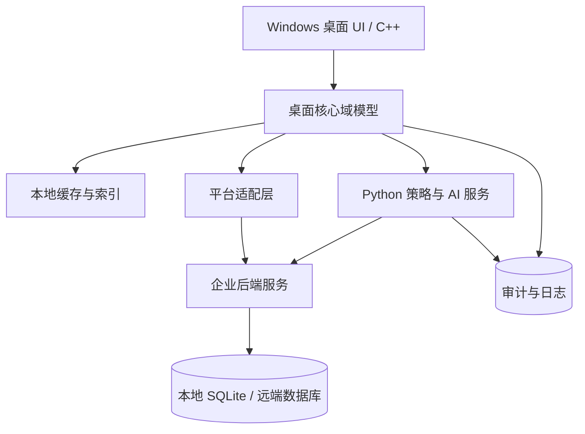
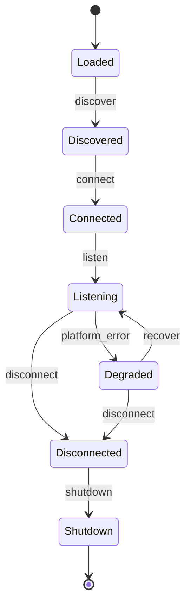

# 桌面客服工作台系统架构分析文档

## 1. 背景与目标

这是一个面向企业客服团队的 Windows 桌面工作台，用于统一接入微信、千牛、拼多多商家后台及后续扩展的 IM / 电商客服平台。系统的核心不是“做一个聊天窗口”，而是把多平台会话、账号状态、客服操作、AI 辅助回复和审计能力收敛到一个稳定、可扩展、可运维的桌面工作环境中。

### 设计原则

- 桌面端优先稳定和流畅，业务复杂度向后端和 Python 辅助链路收敛
- 平台接入做成插件化适配层，不把平台差异扩散到 UI 和核心会话模型
- AI 能力默认可用、允许降级，不能阻塞人工接待主链路
- 任何自动化能力都必须可审计、可回放、可关停
- 本地缓存服务于“可用性”，远端存储服务于“一致性”和“协同”

### 关键假设

- 客服坐席在 Windows 10/11 环境运行桌面端
- 单坐席可能同时管理多个平台账号和大量会话
- 企业存在统一账号体系、权限管理和审计要求
- Python 服务可作为本机 sidecar，也可演进为局域网/中心化服务

## 2. 业务目标与边界

### 系统解决的问题

1. 统一多个平台的会话入口，避免客服在多个窗口间切换
2. 将消息同步、会话状态、标签、快捷回复、工单动作统一建模
3. 提供 AI 辅助回复、话术推荐、自动回复和策略判断
4. 让平台接入和规则调整可配置、可扩展、可灰度

### 职责划分

| 层级 | 职责 | 不做什么 |
|---|---|---|
| C++ 桌面客户端 | UI、会话列表、消息渲染、输入框、快捷操作、高性能缓存、离线可用 | 不直接承担复杂平台逻辑和大规模策略计算 |
| Python 辅助服务 | 策略编排、AI 调用、规则引擎、数据处理、文本清洗、自动化任务 | 不承担高频 UI 渲染和强交互主流程 |
| 平台适配层 | 对接微信/千牛/拼多多等平台协议、抓取/订阅/回调适配、字段归一 | 不暴露平台细节给上层业务 |
| 企业后端 | 账号、权限、审计、配置、策略下发、历史同步、数据归档 | 不参与桌面端每次按键级交互 |

### 本地与服务端边界

- 本地必须保留：会话列表、最近消息、输入草稿、快捷回复索引、离线队列、关键审计缓存
- 服务端必须承载：统一账号管理、权限、策略配置、审计归档、AI 网关、平台元数据、跨端同步
- Python 可以两种部署形态：
  - 本机 sidecar：适合试点和单机增强
  - 局域网/中心服务：适合规模化部署和统一治理

## 3. 总体架构设计

### 分层架构



### 架构解读

- UI 层只负责交互，不直接理解平台协议
- 核心域模型统一表达会话、消息、账号、工单、标签、AI 建议
- 平台适配层将各平台输入输出映射成统一事件
- Python 层负责非实时高成本逻辑，如策略决策、AI 编排、批量数据处理
- 企业后端负责全局一致性、配置和审计

## 4. 核心模块拆分

### C++ 桌面客户端

- `AppShell`：启动、登录、更新、自检、异常恢复
- `SessionListView`：会话列表、置顶、未读、过滤、搜索
- `ChatPanel`：消息渲染、输入、附件、引用、快捷操作
- `AccountCenter`：账号切换、在线状态、平台健康度
- `CommandBar`：快捷回复、转接、标记、结束会话
- `LocalStore`：SQLite、全文索引、草稿、最近数据
- `SyncEngine`：增量同步、补偿、幂等处理
- `IPCClient`：与 Python 和平台插件通信

### 平台适配器

- `WeChatAdapter`
- `QianNiuAdapter`
- `PDDAdapter`
- `GenericIMAdapter`

适配器统一输出：

- 新消息事件
- 会话状态变化
- 账号状态变化
- 发送结果
- 媒体附件事件

### Python 策略与 AI 服务

- `PolicyEngine`：自动回复规则、命中判断、风控
- `AIGateway`：统一接入大模型 / 小模型 / 向量检索
- `ReplyComposer`：模板拼装、话术推荐、上下文整理
- `TaskRunner`：批处理、定时任务、回放、同步辅助

### 后端服务

- `AuthService`：统一登录、令牌、权限
- `ConfigService`：平台参数、策略配置、灰度发布
- `AuditService`：操作审计、行为追踪、异常告警
- `MessageArchive`：历史消息归档和检索
- `AIProxy`：集中管理模型调用、限流、成本控制

## 5. 关键业务流程

### 新消息接入

1. 平台适配器捕获新消息
2. 归一化为统一消息事件
3. SyncEngine 做幂等校验、去重、排序
4. 写入本地缓存和消息索引
5. 通知 UI 更新未读、会话排序和提醒
6. 需要 AI 时将上下文送入 Python 层

### 会话打开与切换

1. 用户点击会话
2. 客户端读取本地最近消息和草稿
3. 如果消息不完整，触发增量补拉
4. 渲染消息流并预热上下文
5. 记录打开行为和已读状态

### AI 辅助回复

1. 用户停留在输入区或点击推荐按钮
2. 客户端收集上下文、客户标签、历史话术
3. 发送给 Python `ReplyComposer`
4. Python 调用规则引擎和模型服务
5. 返回多个候选回复及置信度、风险标签
6. UI 展示可编辑建议，最终由客服确认发送

### 自动回复触发

1. 新消息进入策略引擎
2. 根据关键词、会话状态、时段、风险等级判断
3. 命中时生成自动回复候选
4. 进行二次风控检查
5. 满足条件后发送，失败则回退为人工建议

### 断线重连与补偿

1. 检测平台连接中断
2. 标记账号状态为 degraded
3. 重连后按游标拉取增量消息
4. 对比本地消息 id 去重
5. 对缺失会话进行补偿同步

### 多平台账号同步

1. 后端下发账号配置和权限
2. 客户端加载本地缓存
3. 平台适配器执行登录态恢复
4. 同步在线状态、会话挂载状态和错误码
5. 将异常状态回写到审计和监控

## 6. C++ 与 Python 的职责划分

### 必须由 C++ 实现

- 桌面 UI 和交互
- 消息列表虚拟化渲染
- 输入法、剪贴板、拖拽、附件交互
- 本地索引查询和离线浏览
- 启动、崩溃恢复、进程保活
- 高频 IPC 和事件分发

### 适合 Python 实现

- 规则和策略编排
- AI 请求聚合与重试
- 结构化文本清洗
- 批量数据处理
- 低频自动化任务
- 实验性能力验证

### 通信方式

推荐两种模式：

1. 本机 `gRPC + Unix/Named Pipe` 风格 IPC，适合高频结构化调用
2. 本地 HTTP / WebSocket，适合调试和扩展

原则是：

- 高频小包走 IPC
- 异步任务走队列
- 结果回调带任务 id
- 不把 Python 当成 UI 线程的同步依赖

## 7. 数据设计与状态管理

### 核心实体

| 实体 | 关键字段 |
|---|---|
| Account | 平台类型、账号 id、登录态、状态、权限域 |
| Conversation | 会话 id、来源平台、未读数、置顶、最后消息时间 |
| Message | 消息 id、会话 id、发送方、内容、类型、时间戳、幂等键 |
| Ticket | 工单状态、关联会话、处理人、SLA |
| Tag | 标签名、来源、可见范围 |
| QuickReply | 文案、分类、适用场景、版本 |
| AISuggestion | 建议内容、置信度、风控结果、引用上下文 |

### 状态机建议

- 会话状态：`new -> active -> waiting_customer -> waiting_agent -> closed`
- 账号状态：`offline -> logging_in -> online -> degraded -> error`
- 消息状态：`received -> normalized -> stored -> rendered -> acknowledged`

### 一致性策略

- 以平台事件 id + 会话 id + 时间戳构造幂等键
- 本地写入采用先落盘再通知 UI
- 远端同步采用增量游标和重放补偿
- 对顺序性要求高的消息按会话维度串行处理

### 本地与远端存储

- 本地：SQLite + FTS 索引 + 小型 KV 缓存
- 远端：关系数据库 + 对象存储 + 搜索引擎
- 本地只保留高频和最近访问数据，远端保存全量历史和审计

## 8. 高可用与性能设计

### 客户端性能目标

- 冷启动：可控制在 3-5 秒内进入可交互状态
- 会话切换：首屏消息在 200ms 级别可见
- 输入响应：避免主线程阻塞
- 消息滚动：虚拟列表，按需渲染

### 关键优化

- 消息列表使用虚拟化和分页加载
- 全文搜索使用本地索引，不扫内存数组
- 图像和附件延迟加载
- 适配器事件批处理，减少 UI 刷新频率
- Python 结果异步回填，UI 不等待同步调用

### 容错策略

- 断网时允许离线浏览最近消息和草稿
- 平台异常时显示 degraded 状态，不阻塞其他平台
- AI 服务失败时降级为快捷回复和最近话术
- 自动回复失败时回退到人工确认模式

## 9. 插件化与扩展性设计

### 插件化的范围定义

本文档中的“插件化”是系统级扩展机制，不只等同于平台接入。它至少包含四类扩展点：

| 插件类型 | 主要职责 | 示例 |
|---|---|---|
| 平台接入插件 | 将外部平台的窗口、DOM、API、消息和发送动作归一化 | 微信、千牛、拼多多、小红书 |
| AI Provider 插件 | 接入不同模型、向量库、知识库和 AI 网关 | OpenAI 兼容接口、私有模型、企业知识库 |
| 策略规则插件 | 扩展关键词、时段、风控、自动回复、转人工等规则节点 | 敏感词复核、超时安抚、首响提速 |
| 推送与审计插件 | 将事件同步到外部系统 | 企业微信机器人、钉钉、飞书、审计归档 |

其中，平台接入插件是 MVP 阶段最重要的插件化边界。它决定系统能否在不同平台频繁变化时保持核心业务稳定。

### 平台插件抽象

平台插件抽象的目标是把“平台怎么操作”与“客服系统怎么理解消息”彻底分离。核心层只认识统一会话、统一消息、统一发送任务和统一状态，不直接理解微信 UIA、千牛 OCR、拼多多 DOM 或浏览器 CDP。

平台插件负责：

- 发现平台窗口、浏览器页、账号实例或运行环境
- 建立监听连接，捕获新消息、会话变化和账号状态变化
- 将平台原始数据归一化为统一事件
- 执行发送、草稿填充、附件上传、会话打开等平台动作
- 暴露当前平台能力、健康状态和错误码
- 保存少量平台私有临时状态，但不持有全局业务状态

平台插件不负责：

- AI 回复生成
- 全局自动回复决策
- UI 渲染
- 审计主链路
- 跨平台会话路由
- 全局配置和权限判断

核心原则是：插件负责“采集和执行”，核心负责“理解和决策”。

### 平台接入插件协议

平台插件统一实现以下接口。具体语言可以是 C++ 动态库、Python sidecar 模块、独立进程或浏览器扩展，但对核心层暴露的协议应保持一致。

| 接口 | 职责 |
|---|---|
| `manifest()` | 返回插件 id、版本、平台类型、协议版本和能力声明 |
| `discover()` | 发现可接入的窗口、浏览器页、账号或运行环境 |
| `connect(target)` | 连接到指定平台实例，建立监听上下文 |
| `disconnect()` | 断开连接并释放资源 |
| `sync(cursor)` | 按游标补拉会话和消息，支持断线补偿 |
| `listen()` | 持续输出平台事件，如新消息、会话变化、账号状态变化 |
| `send_message(request)` | 执行文本、图片、文件等发送动作 |
| `fill_draft(request)` | 将内容填入平台输入框，等待人工确认发送 |
| `fetch_history(conversation_id, cursor)` | 拉取指定会话历史消息 |
| `get_health()` | 返回插件、账号、平台环境的健康状态 |
| `shutdown()` | 优雅停止插件，确保队列和审计事件刷出 |

MVP 阶段可以先实现 `manifest()`、`discover()`、`connect()`、`listen()`、`send_message()`、`fill_draft()`、`get_health()`，其余接口按平台成熟度逐步补齐。

### 统一事件模型

平台插件不直接调用 UI，而是向消息路由层输出统一事件。

```json
{
  "event_id": "evt_20260527_000001",
  "event_type": "message.received",
  "platform_id": "pdd",
  "account_id": "shop_001",
  "conversation_id": "pdd:shop_001:buyer_123",
  "timestamp": 1779868800000,
  "payload": {
    "message_id": "msg_abc",
    "sender_role": "customer",
    "sender_name": "buyer_123",
    "content_type": "text",
    "content": "这个今天能发货吗",
    "raw_ref": {
      "source": "dom",
      "selector_version": "pdd_2026_05"
    }
  }
}
```

建议保留 `raw_ref` 字段，用于审计、问题复现和平台适配调试，但核心业务逻辑不应依赖 `raw_ref` 中的平台私有结构。

### 能力声明

每个平台插件启动时必须声明能力，核心层根据能力决定是否启用自动回复、是否允许后台发送、是否需要人工确认、是否需要 OCR 降级。

```json
{
  "plugin_id": "platform.pdd.cdp",
  "platform_id": "pdd",
  "protocol_version": "1.0",
  "version": "0.1.0",
  "capabilities": {
    "text_message_read": true,
    "image_message_read": false,
    "file_message_read": false,
    "send_text": true,
    "send_image": false,
    "fill_draft": true,
    "background_send": false,
    "fetch_history": false,
    "multi_account": false,
    "requires_foreground_window": false,
    "requires_ocr": false,
    "supports_event_push": true
  }
}
```

能力声明的价值是避免核心层写死平台特判。例如：

- 微信插件声明 `requires_foreground_window=true` 时，核心层可以提示窗口不可最小化
- 千牛插件声明 `requires_ocr=true` 时，核心层可以降低自动发送等级，只展示 AI 建议
- 拼多多插件声明 `fill_draft=true` 且 `background_send=false` 时，核心层默认走人工确认发送

### 插件生命周期

平台插件的生命周期建议统一为：



核心调度器需要订阅生命周期状态，避免平台异常扩散到全局：

- 单个插件异常时，只标记对应平台 degraded
- 插件重启不影响其他平台会话
- 插件连续失败时，暂停自动化能力，保留人工查看与快捷回复
- 插件升级时必须先停新任务，再等待已有发送任务完成或超时

### 插件目录建议

建议将平台插件、AI 插件和策略插件分目录管理。MVP 阶段可以只实现平台插件目录。

```text
plugins/
  platforms/
    pdd_cdp/
      manifest.json
      adapter.py
      parser.py
      sender.py
      selectors.json
      tests/
    qianniu_uia/
      manifest.json
      adapter.py
      detector.py
      ocr_reader.py
      sender.py
    weixin_uia/
      manifest.json
      adapter.py
      uia_trigger.py
      reader.py
      sender.py
  ai_providers/
    openai_compatible/
      manifest.json
      provider.py
  rules/
    sensitive_word_review/
      manifest.json
      rule.py
```

平台插件内部也要继续分层，避免所有逻辑堆在一个适配器文件中：

- `adapter`：生命周期、连接、事件输出
- `detector`：窗口、页面、账号、未读检测
- `parser` / `reader`：消息解析、OCR、DOM 或 UIA 读取
- `sender`：输入框填充、发送按钮触发、附件上传
- `selectors`：DOM 选择器、UIA 控件路径、坐标模板等易变配置

### 平台实现策略与插件边界

不同平台可以采用完全不同的底层路线，但输出统一事件和统一发送结果。

| 平台类型 | 推荐插件实现 | 插件输出 |
|---|---|---|
| Web 后台 | Playwright CDP / Chrome Extension | DOM 消息事件、发送状态、页面健康状态 |
| 原生客户端 | UIA / Win32 / OCR 混合 | 窗口事件、OCR 消息、控件操作结果 |
| 半开放平台 | 官方 API + 本地辅助自动化 | API 消息、发送回执、平台错误码 |
| 高风险平台 | 只读建议或人工确认模式 | AI 建议、草稿填充结果 |

这可以让拼多多优先走 Playwright CDP，千牛走 UIA + OCR，微信走 UIA 触发无障碍 + 截图补充，而核心会话、AI、审计和 UI 不需要重写。

### 扩展点

- 新增平台接入
- 新增 AI 模型提供方
- 新增规则节点
- 新增消息内容类型
- 新增审计事件
- 新增推送渠道
- 新增平台选择器或 OCR 模板

### 版本兼容

- 插件接口按 `protocol_version` 协商
- 插件自身按语义化版本管理
- 核心数据模型只允许向后兼容扩展字段
- 平台私有字段必须放入 `raw_ref` 或 `extensions`，不得污染核心模型
- 破坏性变更通过双协议兼容、灰度和双写过渡
- 每个插件必须提供最小回归测试样例，例如 DOM 快照、UIA 树快照、OCR 截图样本

### MVP 取舍

MVP 不建议一开始实现完整插件市场或动态热加载。更稳妥的落地方式是：

1. 先把 `PlatformAdapter` 协议、统一事件模型和能力声明固化
2. 用内置插件方式实现 1 个 Web 平台和 1 个原生客户端平台
3. 插件进程与核心进程之间使用本地 HTTP / WebSocket 或 gRPC 通信
4. 等接口稳定后，再考虑外部插件包、签名校验和热更新

## 10. 安全、合规与风控

### 安全控制

- 凭证加密存储，不落明文
- 本地敏感字段脱敏展示
- 操作全链路审计
- 高风险动作二次确认
- 自动回复支持白名单和置信阈值

### 风控建议

- 对“金额”“退款”“投诉升级”等敏感词触发人工复核
- 对连续自动回复命中设置冷却时间
- 对异常账号切换、异常发送频率做限流
- 对 AI 建议保留引用上下文和版本号，方便追责

## 11. 技术选型建议

### 桌面端

- C++ + Qt 作为主框架更稳妥
- 原因：Windows 桌面成熟、控件丰富、渲染和事件模型稳定

### Python 服务

- FastAPI + gRPC 组合较合适
- 原因：HTTP 易调试，gRPC 适合结构化高频调用

### 存储与检索

- 本地：SQLite + FTS5
- 服务端：PostgreSQL / MySQL + Redis + Elasticsearch / OpenSearch

### 消息与通信

- 进程间：gRPC / Named Pipe
- 端到端事件：WebSocket 或消息队列

### 配置与发布

- 远端配置中心控制平台参数、策略和灰度
- 桌面端支持增量更新和热配置拉取

## 12. 风险分析与取舍

### 主要风险

1. 各平台协议变化快，适配器维护成本高
2. 自动回复误发的业务风险大
3. 本地缓存与远端状态不一致会带来客服误判
4. Python 过度介入会拖慢主流程
5. 插件化做不好容易演化成不可控脚本系统

### 必须做的取舍

- 不把所有逻辑前置到桌面端
- 不让 AI 直接决定高风险发送动作
- 不追求一开始就全平台全功能覆盖
- 不把平台协议细节泄露到 UI 层

### 一期可不做

- 复杂知识图谱
- 全量跨平台统一客户画像
- 高级自动化编排平台
- 完整的多租户市场化插件商店

## 13. 分阶段落地路线

### MVP

- 支持 1-2 个核心平台
- 打通统一会话、消息、草稿、快捷回复
- 提供基础 AI 推荐，不做自动发送
- 完成本地缓存、崩溃恢复、基本审计

### V1

- 增加多平台接入
- 完成策略引擎和自动回复风控
- 接入中心化账号、权限、配置和审计
- 支持搜索、标签、工单、历史消息

### V2

- 平台插件化标准化
- AI Gateway 统一化
- 多端同步和跨坐席协同
- 灰度发布、策略实验和更完整的指标体系

## 14. 推荐结论

这类系统的核心不是“把聊天接进来”，而是把多平台差异、会话状态、自动化策略和客服操作统一收敛到一套稳定的桌面工作流里。建议采用“C++ 桌面主壳 + Python 策略辅助 + 平台插件层 + 中心化后端治理”的混合架构。这样做的好处是桌面端保持高性能和可控性，Python 保持迭代效率，后端负责一致性、权限和审计，整体更适合中大型企业客服场景。


