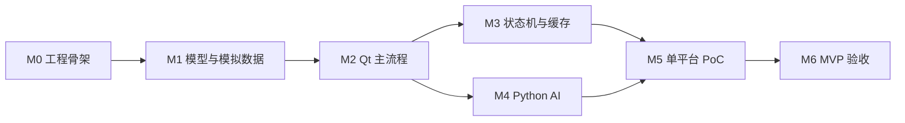

# 开发任务拆分与里程碑

## 1. 总体原则

MVP 开发按“小步可运行”推进，不并行铺开多平台接入。

开发顺序遵循：

1. 先统一模型
2. 再跑通 Qt 客户端基础体验
3. 再接入模拟平台
4. 再接入 Python AI 建议
5. 再加入本地持久化
6. 最后做单平台真实 PoC

## 2. 阶段总览

| 阶段 | 目标 | 核心产出 |
|---|---|---|
| M0 | 工程骨架准备 | 项目目录、基础模块、空窗口 |
| M1 | 统一模型与模拟数据 | Conversation、Message、模拟适配器 |
| M2 | Qt 工作台主流程 | 会话列表、消息区、输入区 |
| M3 | 状态机与本地缓存 | 消息状态、草稿、最近会话 |
| M4 | Python AI 建议 | C++ 调 Python，展示建议 |
| M5 | 单平台真实 PoC | 可见消息采集、人工确认发送 |
| M6 | MVP 验收收尾 | 日志、降级、验收清单 |

## 3. M0：工程骨架准备

### 目标

建立可运行的 Qt 桌面客户端工程骨架。

### 任务

- 创建或整理 `client/` 目录
- 建立 `models/`、`core/`、`platform/`、`ipc/`、`storage/`、`ui/`
- 创建主窗口
- 加入基础应用启动流程
- 加入基础日志输出

### 验收点

- Qt Creator 可打开项目
- 客户端可启动
- 主窗口可显示
- 目录结构清晰

### 风险

- 一开始塞入过多业务逻辑
- UI 与平台逻辑过早耦合

## 4. M1：统一模型与模拟数据

### 目标

实现 MVP 所需的统一数据模型，并用模拟数据验证结构。

### 任务

- 实现 `Conversation`
- 实现 `Message`
- 实现 `PlatformAccount`
- 实现 `ConversationEvent`
- 实现 `AISuggestion`
- 实现基础枚举
- 实现 `MockPlatformAdapter`
- 生成模拟会话和消息

### 验收点

- 模拟适配器能产生会话和消息
- 消息包含 `sourceType` 和 `confidence`
- Core 能接收模拟事件

### 依赖

- [`统一数据模型与状态机.md`](../design/统一数据模型与状态机.md)
- [`工程骨架与模块边界.md`](../design/工程骨架与模块边界.md)

## 5. M2：Qt 工作台主流程

### 目标

跑通客服工作台基础交互。

### 任务

- 实现会话列表
- 实现消息区
- 实现输入区
- 实现会话切换
- 实现未读数展示
- 实现平台状态展示
- 实现消息状态展示

### 验收点

- 能看到模拟会话列表
- 点击会话后能看到消息
- 能输入文本
- 能发送模拟消息
- 会话列表能更新最后消息

### 风险

- UI 手动刷新逻辑过多
- 没有为后续 Qt Model/View 留边界

## 6. M3：状态机与本地缓存

### 目标

加入基础状态流转和本地恢复能力。

### 任务

- 实现消息状态流转
- 实现会话状态流转
- 保存最近会话
- 保存最近消息
- 保存输入草稿
- 保存平台账号状态
- 应用重启后恢复基础数据

### 验收点

- 消息能从 `draft` 到 `pending` 到 `sent` 或 `failed`
- 草稿重启后可恢复
- 最近会话重启后可恢复
- 平台异常状态可显示

### 风险

- 过早设计复杂数据库
- 把本地缓存做成全量归档系统

## 7. M4：Python AI 建议

### 目标

打通 C++ 客户端与 Python 服务通信，并展示 AI 回复建议。

### 任务

- 创建 Python service 骨架
- 定义 AI 请求结构
- 定义 AI 响应结构
- C++ 调用 Python 服务
- 展示 1-3 条 AI 建议
- 支持建议填入输入框
- 记录 AI 建议日志

### 验收点

- 选中会话后可请求 AI 建议
- AI 建议能展示
- 点击建议可填入输入框
- AI 不会自动发送

### 风险

- Python 直接驱动 UI
- AI 输出未经人工确认直接发送

## 8. M5：单平台真实 PoC

### 目标

验证一个真实平台的可见内容采集和人工确认发送链路。

### 推荐优先级

1. 拼多多商家后台网页版
2. 千牛 PC 客户端
3. 个人微信 PC 客户端

### 任务

- 确定 PoC 目标平台
- 实现 PoC 适配器
- 识别平台可用状态
- 采集当前可见会话
- 采集当前可见消息
- 转换为统一模型
- 调用 AI 建议
- 将建议复制或填入输入框
- 人工确认发送
- 记录日志和降级状态

### 验收点

- 能识别平台状态
- 能采集至少一条可见消息
- 能转换为统一 `Message`
- 能生成 AI 建议
- 能填入草稿或复制到剪贴板
- 发送必须由人工确认
- 失败时不崩溃、不误发

### 风险

- 页面结构变化
- OCR 或 DOM 识别不稳定
- 登录态失效
- 自动化动作误触发

## 9. M6：MVP 验收收尾

### 目标

整理 MVP 可演示版本，补齐关键日志、降级和验收项。

### 任务

- 补充错误提示
- 补充适配器健康状态
- 补充基础日志
- 补充降级提示
- 整理测试验收清单
- 整理已知问题

### 验收点

- 模拟平台主流程完整
- AI 建议可用
- 本地数据可恢复
- 单平台 PoC 能演示
- 异常状态可见
- 不存在自动误发路径

## 10. 任务依赖关系

## 11. 不进入 MVP 的任务

- 多平台同时接入
- 插件热更新
- 个人微信 Hook / DLL 注入
- 未授权抓包 / 中间人代理
- 无人值守自动发送
- 复杂知识库
- 完整权限系统
- 数据仓库和 BI

## 12. MVP 完成标准

MVP 完成需要同时满足：

- Qt 客户端可运行
- 模拟平台主链路完整
- 统一模型和状态机可用
- 本地缓存可恢复
- Python AI 建议可用
- 单平台真实 PoC 可演示
- 人工确认发送边界清晰
- 失败可降级，不误发

## 13. 当前执行状态

> **详细进度日志见** [`开发进度记录.md`](开发进度记录.md)

| 阶段 | 状态 | 关键产出 |
|------|------|---------|
| M0 工程骨架 | ✅ 完成 | 项目结构已建立 |
| M1 统一模型 | ✅ 完成 | `Models::*` 已定义，旧模型兼容层已建立 |
| M2 Qt 主流程 | ✅ 完成 | Model/View 架构已收敛 |
| M2.5 模块边界 | ✅ 完成 | IPC 层、RPA 服务层已建立 |
| M3 状态机与缓存 | ✅ 完成 | 消息状态流转、草稿保存、会话状态流转 |
| M4 Python AI | ✅ 完成 | Python sidecar、AI 建议接口、进程管理 |
| M5 单平台 PoC | ⏳ 待做 | - |
| M6 MVP 验收 | ⏳ 待做 | - |

已完成重构项：

- ✅ 统一模型对齐（`src/models/`）
- ✅ IPC 边界抽离（`src/ipc/`）
- ✅ MessageRouter 收敛（统一模型信号）
- ✅ RPA 服务层建立（`src/services/rpa/`）
- ✅ UI 层 RPA 控制简化为代理
- ✅ Python sidecar 协议收口
