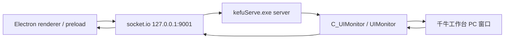

# 千牛平台静态拆解

> 来源：`D:\AI客服[2025-06-12]\resources\kefuServe.exe`
>
> 关联：`D:\AI客服[2025-06-12]\使用前必看.txt`、`D:\AI客服[2025-06-12]\resources\知识库`
>
> 记录时间：2026-06-26
>
> 分析方式：静态解析 PyInstaller 包、PYZ 模块表和可读字符串；未启动 `AI客服.exe`、未运行 `kefuServe.exe`、未连接真实千牛客户端。

## 1. 结论概览

类似产品存在千牛工作台链路，但它不在 CRX 网页注入脚本里。

已确认事实：

- `resources/crx/manifest.json` 的匹配域名只覆盖抖店、快手、拼多多相关网页，没有千牛/淘宝域名。
- `使用前必看.txt` 明确写有：支持千牛工作台、抖店飞鸽、快手小店、拼多多客服。
- `resources/知识库/` 下存在 `千牛工作台_有求必应羊羊_王刚` 目录。
- `resources/kefuServe.exe` 是 PyInstaller Python sidecar，内部存在 `UIMonitor` 模块。
- `UIMonitor` 模块包含 `parseQianniuMsgItem`、`activeChatWindow`、`sendTextMsg`、`sendPicMsg` 等函数名。
- `UIMonitor` 同时包含 `uiautomation` 控件类型、千牛窗口控件路径和 `https://h5.m.taobao.com` 字符串。

推断结论：

- 千牛链路走本地 sidecar 的桌面 UI 自动化，不走 CRX content script。
- `server` 模块里的平台 key `tb` 大概率对应淘宝/千牛平台。
- 千牛的消息读取、会话切换和发送动作集中在 `UIMonitor`，由 socket.io 本地协议接收主界面下发任务。

## 2. 与主程序的链路位置

主程序 preload 侧已经有本地 socket.io 连接：

```text
http://127.0.0.1:9001
```

`kefuServe.exe` 里的 `server` 入口可见事件和对象：

| 字符串 | 含义 |
|---|---|
| `socketio`、`eventlet.wsgi` | Python 本地 socket.io 服务 |
| `127.0.0.1` | 本地监听地址 |
| `C_UIMonitor` | UI 自动化监控对象 |
| `addTask` | 接收任务并压入监控器任务队列 |
| `activeChatWindow` | 激活聊天窗口 |
| `startApp` | 按平台启动或打开应用 |
| `platformMap` | 平台 key 到应用名/能力的映射 |
| `tb`、`pdd`、`jd`、`dy`、`ks` | sidecar 里的平台 key |
| `new-task` | 主程序下发任务 |
| `active-window` | 激活聊天窗口 |
| `update-monitor` | 开关监控 |
| `update-message` | sidecar 向前端推送消息更新 |

抽象链路如下：



这条链路和拼多多不同：拼多多是在平台网页内注入 JS 读 DOM；千牛是在本地 Python 进程里用 UIA 操作 Windows 桌面窗口。

## 3. PyInstaller 包内证据

`kefuServe.exe` 的 PyInstaller cookie 可解析，核心信息：

| 项 | 值 |
|---|---|
| Python 版本标记 | `308` |
| Python DLL | `python38.dll` |
| CArchive 入口数量 | `333` |
| PYZ 模块数量 | `1354` |
| PYZ 包 | `PYZ-00.pyz` |

PYZ 模块表里与千牛链路相关的模块：

| 模块 | 作用判断 |
|---|---|
| `UIMonitor` | 千牛 UI 自动化主模块 |
| `ProcessMonitor` | 进程/窗口监控辅助 |
| `uiautomation` | UI Automation 依赖包 |
| `uiautomation.uiautomation` | UIA 具体实现 |

注意：当前记录没有做源码级反编译，结论来自 PyInstaller 结构、模块名、函数名和字节码常量字符串。

## 4. `UIMonitor` 的核心职责

`UIMonitor` 中可见的方法名：

| 方法名 | 静态判断 |
|---|---|
| `walkDeskTop` | 遍历桌面窗口/控件树 |
| `updateShopInfo` | 更新店铺/账号信息 |
| `updateMsgWindow` | 更新消息提醒窗口 |
| `updateChatWindow` | 更新聊天窗口 |
| `addChatWindow` | 记录新增聊天窗口 |
| `removeChatWindow` | 移除聊天窗口 |
| `updateNomsgUsers` | 维护暂无消息/无需回复用户集合 |
| `parseQianniuMsgItem` | 解析千牛消息项 |
| `activeChatWindow` | 激活指定聊天窗口 |
| `sendTextMsg` | 发送文本 |
| `sendPicMsg` | 发送图片 |
| `addTask` | 接收任务 |
| `mainTask` | 主任务循环 |
| `handleWinTasks` | 执行窗口相关任务 |

从命名看，它不是单纯窗口探测，而是覆盖了完整链路：

1. 找千牛窗口。
2. 找店铺/客服信息。
3. 找接待列表和消息提醒。
4. 切换到需要回复的会话。
5. 解析消息内容。
6. 执行文本/图片发送。
7. 把新消息通过 `update-message` 推回 Electron。

## 5. 千牛窗口与控件定位

`UIMonitor` 依赖 `uiautomation`，可见控件类型包括：

| 控件类型 | 可能用途 |
|---|---|
| `WindowControl` | 千牛主窗口/聊天窗口 |
| `GroupControl` | 容器节点 |
| `TreeControl` | 会话树/列表 |
| `EditControl` | 输入框 |
| `ButtonControl` | 按钮 |
| `TextControl` | 文本节点 |
| `TextRichEdit` | 千牛富文本输入框 |

可见窗口/区域名：

| 字符串 | 静态判断 |
|---|---|
| `WorkbenchView` | 千牛工作台主视图 |
| `MutilChatView` | 多聊天窗口视图，原字符串疑似拼写为 `Mutil` |
| `ChatView` | 单聊天视图 |
| `MessageMergeNotifyView` | 消息聚合提醒窗口 |
| `ReceptionListView` | 接待列表 |

店铺信息路径：

```text
.WorkbenchView.LeftBarWidgetView.label_shopname
```

接待列表路径包括普通窗口和多窗口两套结构：

```text
UIWindow.centralwidget.SubChatView.ChatListWidget.ChatListView.centralwidget.list_widget.ReceptionListView.stackedWidget.groupList.GroupReceptionListView.receptionListWidget
UIWindow.centralwidget.SubChatView.ChatListWidget.ChatListView.centralwidget.list_widget.ReceptionListView.stackedWidget.normalList.NormalReceptionListView.receptionListWidget
UIWindow.mutilcentralwidget.stackedWidget.SingleChatView.centralwidget.stackedWidget.SubChatView.ChatListWidget.ChatListView.centralwidget.list_widget.ReceptionListView.stackedWidget.groupList.GroupReceptionListView.receptionListWidget
UIWindow.mutilcentralwidget.stackedWidget.SingleChatView.centralwidget.stackedWidget.SubChatView.ChatListWidget.ChatListView.centralwidget.list_widget.ReceptionListView.stackedWidget.normalList.NormalReceptionListView.receptionListWidget
```

消息提醒列表路径：

```text
MessageMergeNotifyView.messageMergeList
```

这说明类似产品不是只靠 OCR 或截图，而是至少尝试通过 UIA 控件树定位千牛的工作台、接待列表、消息提醒和输入框。

## 6. 入站消息解析

`parseQianniuMsgItem` 附近可见的静态线索：

| 字符串/模式 | 含义 |
|---|---|
| `parseQianniuMsgItem` | 千牛消息项解析入口 |
| `https://h5.m.taobao.com` | 淘宝 H5 链接，可能用于商品/订单/卡片识别 |
| `fullmatch`、`compile` | 用正则判断消息内容或时间格式 |
| `lastMsg`、`lastMsgItems` | 最近消息去重/缓存 |
| `timeItem`、`contentBox`、`text` | 从 UIA 节点提取时间与内容 |
| `isSelf` | 判断是否客服自己发出的消息 |

可推断的入站流程：

1. `UIMonitor` 从消息提醒或接待列表定位待回复用户。
2. 激活聊天窗口或切换会话。
3. 遍历消息项控件。
4. `parseQianniuMsgItem` 提取发送方、时间、文本/卡片内容。
5. 根据 `isSelf` 过滤客服自己的出站消息。
6. 使用 `lastMsg` / `lastMsgItems` 做去重。
7. 通过 `update-message` 或同类 socket.io 事件推给 Electron。

需要继续实测确认的点：

- 千牛消息内容是否全部可由 UIA 读取，还是只读取部分控件，复杂消息仍依赖截图/OCR。
- 商品、订单、图片等卡片的最终上报前缀是否与网页脚本一致，例如 `[图片]`、`[商品]`、`[订单]`。
- `https://h5.m.taobao.com` 在解析中用于链接过滤、卡片识别还是商品详情提取。

## 7. 会话切换与未读发现

相关字符串：

| 字符串 | 静态判断 |
|---|---|
| `activeChatWindow` | 激活指定聊天窗口 |
| `toChatTree` | 切换到会话树或聊天列表 |
| `getToReplyItem` | 找到需要回复的用户项 |
| `MSG_WINS` | 消息提醒窗口集合 |
| `CHAT_WINS` | 聊天窗口集合 |
| `LAST_TASK_NAME` | 最近任务目标名 |
| `NOMSG_USERS` | 无消息用户集合 |

`MessageMergeNotifyView.messageMergeList` 附近同时出现：

- `ProcessId`
- `NativeWindowHandle`
- `win32gui.IsWindowVisible`
- `GetChildren`
- `Click`

这说明它会判断消息提醒窗口是否可见，并遍历子项，点击需要处理的用户。

可推断流程：

1. 遍历桌面窗口，收集千牛主窗口、聊天窗口和消息提醒窗口。
2. 优先从 `MessageMergeNotifyView.messageMergeList` 找待回复提醒。
3. 如果没有提醒，则从接待列表路径扫描普通/分组接待列表。
4. 点击用户项后进入聊天窗口。
5. 记录当前窗口和用户名，供后续任务发送复用。

## 8. 出站文本发送

`sendTextMsg` 附近可见：

| 字符串 | 含义 |
|---|---|
| `TextRichEdit` | 千牛富文本输入框类名 |
| `EditControl` | 输入控件 |
| `SendKeys` | 键盘模拟 |
| `{ENTER}` | 发送按键 |
| `toChatTree` | 发送前可能切换/确认聊天区域 |
| `Time sleep` | 发送过程有固定等待 |

可推断的文本发送步骤：

1. 根据任务目标激活或切换到对应千牛聊天窗口。
2. 找到 `TextRichEdit` 或 `EditControl` 输入框。
3. 写入回复文本。
4. 通过 `SendKeys` 触发输入/回车。
5. 使用 `{ENTER}` 完成发送。

这条链路和网页平台的 `element.value + InputEvent + click(send)` 不同，千牛更依赖焦点、输入框可见性和键盘模拟。

## 9. 出站图片发送

`sendPicMsg` 附近可见：

| 字符串 | 含义 |
|---|---|
| `sendPicMsg` | 图片发送入口 |
| `{Ctrl}v` | 粘贴图片 |
| `edit` | 输入框对象 |
| `pic` | 图片任务字段 |

结合 preload 里已有 `writeToClipboard(pathOrUrl)`，可推断类似产品的图片发送链路是：

1. Electron/preload 或任务前置逻辑把图片路径/URL 写入系统剪贴板。
2. sidecar 激活千牛聊天输入框。
3. `sendPicMsg` 通过 `{Ctrl}v` 粘贴图片。
4. 再通过键盘或按钮完成发送。

需要实测确认：

- 图片是否由 Electron 下载后写剪贴板，还是 sidecar 自己处理文件路径。
- 粘贴后是否自动回车，还是需要点击千牛发送按钮。

## 10. 与拼多多链路的关键差异

| 项 | 拼多多 | 千牛 |
|---|---|---|
| 接入位置 | CRX content script | Python sidecar |
| 自动化对象 | 浏览器 DOM | Windows 桌面窗口 |
| 定位方式 | CSS selector | UIA 控件树 + 窗口句柄 |
| 消息读取 | DOM 节点文本/图片 URL | UIA 文本节点/卡片控件，可能需降级 |
| 会话切换 | 点击 DOM 会话项 | 点击接待列表/消息提醒控件 |
| 文本发送 | 设置输入框值、派发 input、点击发送 | 激活输入框、键盘输入/回车 |
| 图片发送 | 剪贴板粘贴到网页编辑器 | 剪贴板粘贴到千牛输入框 |
| 风险点 | 页面 DOM/class 变更 | 千牛版本、UIA 树、焦点和窗口遮挡 |

## 11. 对当前项目的启发

可以借鉴：

1. 千牛应作为桌面平台适配器独立实现，不应强行塞进 Web DOM 平台模型。
2. 会话列表、消息提醒、聊天窗口和输入框定位要分层缓存，并保留重新扫描能力。
3. 图片发送优先复用剪贴板粘贴路线，和微信/千牛桌面端天然输入习惯一致。
4. 事件协议应统一成平台无关消息模型，但底层要保留 `raw`、控件路径、窗口句柄、截图证据等调试字段。
5. 千牛发送前必须校验目标会话，避免焦点漂移导致误发。

不建议照搬：

1. 直接用全局焦点和 `{ENTER}` 作为唯一发送确认，风险较高。
2. 只用最近消息文本去重，容易在相同文本重复咨询时漏报。
3. 把 `tb`、`pdd`、`dy` 等平台 key 散落在 sidecar 内部，后续应统一平台枚举和能力声明。
4. 把控件路径硬编码为唯一方案，应提供版本探测、降级策略和可观测日志。

## 12. 后续验证清单

真实 PoC 时建议按以下顺序验证：

1. 启动千牛后，用 UIA Inspect 或脚本确认 `WorkbenchView`、`MessageMergeNotifyView`、`ReceptionListView` 是否仍存在。
2. 分别验证普通接待列表和分组接待列表路径。
3. 验证消息提醒窗口 `MessageMergeNotifyView.messageMergeList` 是否能稳定被 UIA 读取。
4. 验证普通文本消息、图片消息、商品卡片、订单卡片的控件树形态。
5. 验证 `TextRichEdit` 输入框定位、文本输入和回车发送。
6. 验证剪贴板图片粘贴和发送。
7. 做焦点漂移测试：当前会话不是目标会话时，发送前是否能强制切换并二次确认。
8. 做重复消息测试：同一用户连续发送相同文本时是否漏报。

