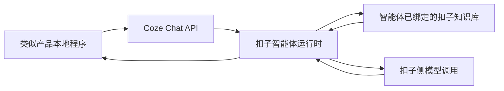

# 知识库与 AI 回复静态拆解

> 来源：`D:\AI客服[2025-06-12]\resources\app.asar`、`D:\AI客服[2025-06-12]\resources\知识库`
>
> 记录时间：2026-06-26
>
> 分析方式：静态读取 asar 内 `out/main/index.js`、`out/preload/index.js`、renderer bundle 关键片段，并读取内置知识库模板；未启动外部程序。

## 1. 结论概览

类似产品本地实现的知识库不是向量库，也不是独立检索服务，而是“本地文件目录 + Excel 表格 + 提示词拼接”模式。

它同时支持接入 Coze/扣子智能体。这个模式下，本地程序没有实现扣子知识库检索，也没有向请求里传 `knowledge_id` / `dataset_id` 一类字段；它只是调用扣子智能体 Chat API。扣子智能体如果已经绑定知识库，则知识库检索、RAG 上下文组织和模型调用都发生在扣子侧。

AI 回复主链路在 Electron 主进程里完成：

1. 平台脚本或 sidecar 上报新消息。
2. renderer 选中一个 `aiSolution`。
3. 主进程收到 `type == "comment"` 的消息请求。
4. 先处理图片/订单/商品等特殊前缀。
5. 再做关键词规则、兜底回复、AI 模型分流。
6. 若配置了 `zhishikuDir`，读取本地知识库目录并拼进 system prompt。
7. 调用 OpenAI 兼容接口、Gemini 代理、会员通道、豆包、Coze 或微信机器人。
8. 返回 `{ answer, ans_node_id, type }` 给前端，再由任务链路决定是否发送。

## 2. 知识库目录结构

知识库根目录固定为：

```text
resources/知识库/
```

安装包内置目录：

| 目录 | 说明 |
|---|---|
| `千牛工作台_有求必应羊羊_王刚` | 千牛模板 |
| `抖店飞鸽_snrt` | 抖店模板，含采集商品 |
| `即时零售_软1` | 即时零售模板 |
| `软件店铺示例` | 示例店铺，包含额外提示词模板和问答 txt |

标准文件：

| 文件 | 用途 |
|---|---|
| `店铺知识库.txt` | 店铺基础信息、发货、退换货、通用规则 |
| `商品列表.xlsx` | 商品结构化信息 |
| `问答列表.xlsx` | FAQ / 固定问答 |
| `说明.txt` | 编辑说明 |

示例目录额外包含：

| 文件 | 静态判断 |
|---|---|
| `提示词模版.txt` | 人工可编辑的提示词样例 |
| `问答列表.txt` | 旧版或说明型 FAQ 文本；主进程运行态读取的是 `问答列表.xlsx` |

## 3. preload 暴露的知识库 API

`out/preload/index.js` 暴露给 renderer 的 `pyapi` 方法包括：

| 方法 | 行为 |
|---|---|
| `openZhishiku(name)` | `start resources/知识库/<name>`，打开知识库目录 |
| `createIfNotExistsZhishiku(name, data)` | 如果目录/文件不存在则创建默认模板 |
| `getZhishikus()` | `readdirSync(resources/知识库/)` 返回目录列表 |

`createIfNotExistsZhishiku` 的默认创建内容：

| 文件 | 创建逻辑 |
|---|---|
| `店铺知识库.txt` | 写入店铺基础信息、发货快递、退换货和通用问题 |
| `商品列表.xlsx` | 用 ExcelJS 创建表头和默认商品 |
| `问答列表.xlsx` | 用 ExcelJS 创建表头和默认 FAQ |
| `说明.txt` | 写入编辑说明、商品规格示例、绑定问答示例 |

默认 `商品列表.xlsx` 表头：

| 列 |
|---|
| 商品ID |
| 商品名称 |
| 所属分类 |
| 商品规格 |
| 商品价格 |
| 商品链接 |
| 商品详情 |
| 绑定问答 |

默认 `问答列表.xlsx` 表头：

| 列 |
|---|
| 问题类型(可不填) |
| 问题 |
| 答案 |

## 4. 运行时知识库读取

AI 调用函数里会先取：

```js
let o = n.zhishikuDir || ""
```

如果 `zhishikuDir` 非空，则固定读取：

```text
resources/知识库/<zhishikuDir>/店铺知识库.txt
resources/知识库/<zhishikuDir>/商品列表.xlsx
resources/知识库/<zhishikuDir>/问答列表.xlsx
```

读取规则：

| 文件 | 处理方式 |
|---|---|
| `店铺知识库.txt` | `readFileSync(..., "utf-8")` 直接读文本 |
| `商品列表.xlsx` | ExcelJS 读取第一个 worksheet，跳过表头，按行转 `{ id,title,cata,sku,price,url,desc,qa }` |
| `问答列表.xlsx` | ExcelJS 读取第一个 worksheet，跳过表头，按行转 `{ type,q,a }` |

商品表会拼成文本块：

```text
#### 售卖商品信息
格式：商品ID|商品名称|商品规格|商品价格|商品链接|商品详情|商品相关问答
<id>|<title>|<cata>|<sku>|<price>|<url>|<desc>|<qa>
```

问答表会拼成文本块：

```text
#### 其它问题请按以下问答列表回复
格式：问题类型|问题|答案
<type>|<q>|<a>
```

然后：

```js
n.liveroomInfo = 店铺知识库文本 + 商品表文本块
n.qaList = 问答表文本块
```

注意：商品解析结果按文件路径缓存在 `sre`，问答解析结果按文件路径缓存在 `are`。同一路径后续请求会复用缓存，直到进程重启或显式清缓存。

## 5. 提示词拼装

模型 system prompt 的来源有两种：

| 优先级 | 来源 |
|---|---|
| 1 | `n.prompt`，如果调用方直接传入 prompt，则直接使用 |
| 2 | `n.replyPrompt.replace("{店铺知识库}", n.liveroomInfo).replace("{问答列表}", n.qaList)` |

也就是说，知识库并不是先做语义召回，而是把店铺知识库、商品表、FAQ 表转成大段文本，塞入 `replyPrompt`。

`软件店铺示例/提示词模版.txt` 中的模板结构包括：

| 模块 | 作用 |
|---|---|
| 角色规范 | 定义“专业电商客服助理” |
| 意图识别模块 | 识别产品、价格、物流、售后、人工等意图 |
| 情绪感知引擎 | 将负面情绪分为 L1/L2/L3 或人工 |
| 知识库检索模块 | 要求根据知识库生成回复 |
| `{店铺知识库}` | 占位符 |
| `{问答列表}` | 占位符 |

模板里明确要求：知识库找不到时使用问答列表，问答列表也不存在时回复“找不到”。这与主进程里的“关键词替换/情绪词监控”后处理可以配合使用。

## 6. AI 方案配置

renderer bundle 中可见 `aiSolutionTpl` 默认结构：

| 字段 | 作用 |
|---|---|
| `id`、`name`、`isDefault` | AI 方案标识 |
| `keywordList` | 关键词规则 |
| `aiConfig.replyModel` | 回复模型类型 |
| `aiConfig.replyPrompt` | 提示词模板 |
| `aiConfig.gpthost` | OpenAI 兼容接口地址 |
| `aiConfig.apikey` | OpenAI 兼容 API key |
| `aiConfig.googlekey` | Gemini key |
| `aiConfig.doubaokey` | 豆包 key |
| `aiConfig.doubaoep` | 豆包 endpoint / model |
| `aiConfig.token` | 微信机器人 token |
| `aiConfig.liveroomInfo` | 店铺知识库文本缓存 |
| `aiConfig.qaList` | FAQ 文本缓存 |
| `aiConfig.zhishikuDir` | 绑定的知识库目录 |
| `productReply` | 商品卡片固定回复 |
| `orderReply` | 订单消息固定回复 |
| `picReply` | 图片消息固定回复 |
| `interceptList` | AI 输出后的替换/情绪词规则 |

renderer 会调用：

```js
pyapi.getZhishikus()
pyapi.createIfNotExistsZhishiku(name)
pyapi.openZhishiku(name)
```

并把模型配置保存到 `aiSolution.aiConfig`。

## 7. AI 回复优先级

主进程处理 `type == "comment"` 时，大致优先级如下：

| 顺序 | 规则 | 结果 |
|---|---|---|
| 1 | 前缀匹配 `[图片]`、`[订单]`、`[商品]`、`[通知]` | 返回 `picReply`、`orderReply`、`productReply` 等固定回复；Coze 图片可配置跳过 |
| 2 | 关键词规则 `keywordList` | 支持全匹配、包含、正则表达式 |
| 3 | 兜底开关 | 若开启则直接返回 `doudiReply` |
| 4 | 测试模式 `keyword` | 只返回关键词匹配提示 |
| 5 | 模型分流 | 调用微信机器人、OpenAI 兼容、Gemini、豆包、会员通道或 Coze |
| 6 | 回复后处理 | 变量替换、模板命令执行、情绪词监控、关键词替换 |

关键词规则逻辑：

| 类型 | 判断方式 |
|---|---|
| `全匹配` | 分号分隔关键词中任一项等于用户问题 |
| `包含` | 用户问题包含分号分隔关键词中任一项 |
| `正则表达式` | `new RegExp(keywords).test(content)` |

后处理变量替换：

| 占位符 | 替换为 |
|---|---|
| `{昵称}` | 客户昵称 |
| `{提问}` | 用户原问题 |
| `{店铺}` | 店铺名 |
| `{平台}` | 平台 |
| `{客服}` | 客服名 |

后处理还会调用本地命令模板引擎，把 `cmds` 里 `system/user/tpl` 类型的模板变量展开。

## 8. 模型通道

### 8.1 OpenAI 兼容 / DeepSeek

默认接口：

```text
https://api.openai-proxy.com/v1/chat/completions
```

如果配置了 `gpthost`：

1. 取 `new URL(gpthost).origin + "/v1/chat/completions"`。
2. 如果 URL 包含 `volces.com`，改成 `/api/v3/chat/completions`。
3. 如果解析失败，回到默认接口。

模型选择：

| 条件 | model |
|---|---|
| 默认 | `gpt-3.5-turbo` |
| URL 包含 `deepseek.com` | `deepseek-chat` |

请求体：

```json
{
  "stream": false,
  "model": "...",
  "messages": [
    { "role": "system", "content": "<拼装后的提示词>" },
    "...历史对话",
    { "role": "user", "content": "<用户问题>" }
  ]
}
```

### 8.2 Gemini 代理

固定接口：

```text
https://cladder-gemini-open-99.deno.dev/v1/chat/completions
```

使用 `googlekey` 作为 bearer token。请求体仍按 OpenAI 兼容格式。

### 8.3 会员通道

固定接口：

```text
https://api.siliconflow.cn/v1/chat/completions
```

模型：

```text
Qwen/Qwen2.5-7B-Instruct
```

API key 来自会员账号 `userInfo.sks`，会随机取一个 key。账号未激活或过期时返回错误。

### 8.4 豆包

固定接口：

```text
https://ark.cn-beijing.volces.com/api/v3/chat/completions
```

使用：

| 字段 | 作用 |
|---|---|
| `doubaokey` | API key |
| `doubaoep` | model / endpoint id |

### 8.5 Coze

固定接口：

```text
https://api.coze.cn/v3/chat
```

配置字段：

| 字段 | 作用 |
|---|---|
| `cozeToken` | bearer token |
| `cozeAppId` | bot id |
| `cozeWorkflowId` | UI 中有字段，但主请求使用的是 bot id；当前静态片段未看到 workflow id 进入请求体 |

请求体：

```json
{
  "user_id": "<客户昵称>",
  "bot_id": "<cozeAppId>",
  "stream": true,
  "auto_save_history": true,
  "additional_messages": [
    "...历史对话",
    { "content": "<用户问题>", "content_type": "text", "role": "user" }
  ]
}
```

从静态代码看，类似产品接入 Coze 时只传 `bot_id`、`user_id`、历史消息和当前用户消息，没有单独调用扣子的知识库检索接口，也没有在本地做 embedding / 向量召回。

因此 Coze 链路应理解为：



边界判断：

| 问题 | 结论 |
|---|---|
| 类似产品是否自己检索扣子知识库 | 没有看到，本地只调用 Coze Chat API |
| 是否会用到扣子里配置的知识库 | 取决于该 `bot_id` 对应智能体是否绑定并启用了知识库 |
| 向量库在哪里 | 如果使用扣子知识库，向量化、索引、召回、重排等能力属于扣子侧托管能力 |
| 本地是否需要维护向量库 | 这条 Coze 链路不需要 |

Coze 会按客户昵称缓存 `conversation_id`，下一次请求拼到 URL：

```text
https://api.coze.cn/v3/chat?conversation_id=<conversation_id>
```

流式解析事件：

| 事件 | 行为 |
|---|---|
| `event:conversation.message.delta` | 累加 `answer` 或 `tool_response` 内容 |
| `event:conversation.message.completed` | 返回最终内容，并缓存 `conversation_id` |

如果 Coze 回复 Markdown 图片：

```text

```

主进程会转换成：

```text
[图片]url
```

如果图片后还有文字，会拼到下一行。

### 8.6 微信机器人

固定接口：

```text
https://chatbot.weixin.qq.com/openapi/aibot/${TOKEN}
```

请求体：

```json
{
  "signature": "...",
  "query": "<用户问题>"
}
```

## 9. 对当前项目的启发

可以借鉴：

1. 文件型知识库对 MVP 友好，客服能直接编辑 `txt/xlsx`，不需要先建设复杂后台。
2. 商品表和 FAQ 表先转成可读文本，再交给模型，调试成本低。
3. AI 方案把模型配置、关键词规则、特殊消息固定回复放在一起，适合按店铺/平台切换。
4. Coze 图片回复转 `[图片]url` 的约定，可以和现有平台出站任务协议衔接。
5. 外接扣子智能体可以作为“托管知识库/RAG”选项，让早期版本不用自建向量库也能支持更复杂知识库。

需要改进：

1. 大段拼提示词没有召回，商品多时 token 成本和误答风险会快速上升。
2. Excel 解析只按列位读取，表头变化或旧表多一列时容易错位。示例 `软件店铺示例/商品列表.xlsx` 有 9 列，运行时代码只按 8 个业务字段读取。
3. 缓存按文件路径保存，没有看到文件 mtime 校验；用户编辑知识库后可能需要重启或重新加载才生效。
4. `问答列表.xlsx` 的 worksheet 名仍叫 `商品列表`，说明模板生成较粗糙。
5. 自动发送前应保留人工确认边界，尤其是 AI 输出 `[图片]`、转接、命令类前缀时。

## 10. 与当前项目的相似性

这个类似产品和当前项目在总体方向上很接近：

| 维度 | 类似产品 | 当前项目方向 |
|---|---|---|
| 产品形态 | Windows 桌面客服工作台 | Windows 桌面客服工作台 |
| 平台接入 | Web 注入 + 本地 sidecar + 桌面 UIA | 平台 adapter + Python RPA/sidecar |
| 知识库 | 本地文件型知识库，可外接扣子 | 可先做文件型知识库，再预留外部 RAG/智能体 |
| AI 回复 | 关键词/固定回复/多模型通道/Coze | AI 建议链路 + 人工确认边界 |
| 数据边界 | 非官方 API，读可见内容并操作真实平台 | 同样偏非官方可见内容采集路线 |

关键差异是取舍：类似产品更偏“能自动执行就自动执行”，包括自动发送、粘贴图片、转接等；当前项目应继续坚持“AI 先生成草稿/建议，最终发送保留人工确认”，这样风险更可控。

## 11. 当前项目建议

建议我们拆成三层，而不是照搬到平台脚本里：

| 层 | 职责 |
|---|---|
| `KnowledgeStore` | 管理店铺目录、txt/xlsx 读取、mtime 缓存、表结构校验 |
| `RetrievalComposer` | 按问题召回商品/FAQ/店铺规则，生成 system prompt 上下文 |
| `ReplyEngine` | 统一处理关键词、特殊消息、模型通道、后处理和安全策略 |

首版可以先支持文件型知识库，但应保留：

1. 表头校验和错误提示。
2. 用户编辑后的显式 reload。
3. prompt 预览。
4. token 预算裁剪。
5. AI 草稿只回填，不默认自动发送。
