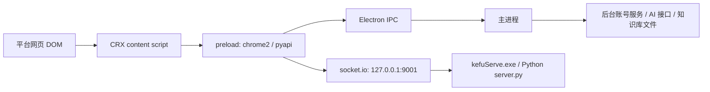

# 类似产品静态拆解：接口、桥协议与平台脚本

> 调研对象：`D:\AI客服[2025-06-12]`
>
> 关联记录：[`类似产品调研记录.md`](./类似产品调研记录.md)
>
> 记录时间：2026-06-26

## 1. 分析范围

本次继续拆解安装包内的静态文件，不启动外部程序、不运行 `AI客服.exe` 和 `kefuServe.exe`。

重点文件：

- `resources/app.asar/out/main/index.js`
- `resources/app.asar/out/preload/index.js`
- `resources/crx/manifest.json`
- `resources/crx/js/insert.js`
- `resources/crx/js/dy.js`
- `resources/crx/js/ks.js`
- `resources/crx/js/pdd.js`

`app.asar` 是标准 Electron asar 包。内部 `package.json` 显示：

- 应用名：`AIkefu`
- 版本：`1.0.0`
- 主进程入口：`./out/main/index.js`
- 关键依赖：`axios`、`electron-store`、`exceljs`、`socket.io`、`socket.io-client`、`adm-zip`

## 2. 总体链路

可以归纳为四层：

1. Electron 主进程：窗口、托盘、登录态、后台接口、AI 调用、全局 IPC。
2. preload 桥：向页面暴露 `pyapi` 和 `chrome2`，连接本地 sidecar。
3. 本地 sidecar：默认启动 `resources/kefuServe.exe`，开发模式可启动 `src/python/server.py`。
4. CRX 注入脚本：按平台注入页面，读取 DOM 消息，执行输入、发送、转接等动作。

核心通信方向：



## 3. 主进程接口

### 3.1 后台账号服务

主进程内固定后台地址：

- `http://43.138.152.198/kefu/index.php`

派生接口包括：

| 名称 | 路径 |
|---|---|
| 用户信息 | `/Home/Crx/getInfo` |
| 注册 | `/Home/User/regRS` |
| 代理列表 | `/Home/Crx/getProxyList` |
| 用户存在检查 | `/Home/User/userExists` |
| 登录 | `/Home/User/loginRS` |
| 验证码 | `/Home/User/verifycode` |
| 订单列表 | `/Home/Crx/orderList` |
| 支付 | `/Home/User/pay` |
| 用户中心 | `/Home/User/index` |
| 登出 | `/Home/User/logout` |
| 试用状态 | `/Home/Crx/getTrial` |
| 找回密码 | `/Home/User/findPwd` |
| 更新检查 | `/assets/kefu/update.json` |

主进程还对 `http://43.138.152.198/*` 做 cookie 注入和 `Set-Cookie` 持久化，说明账号态由 Electron 主进程统一维护。

### 3.2 AI 接口

主进程里可见多种 AI 通道：

| 通道 | URL / 规则 | 备注 |
|---|---|---|
| 默认 OpenAI 兼容 | `https://api.openai-proxy.com/v1/chat/completions` | `gpthost` 为空时默认值 |
| 自定义 OpenAI 兼容 | `new URL(gpthost).origin + /v1/chat/completions` | 若域名包含 `volces.com` 改为 `/api/v3/chat/completions` |
| Gemini 代理 | `https://cladder-gemini-open-99.deno.dev/v1/chat/completions` | 使用 `googlekey` |
| 会员通道 | `https://api.siliconflow.cn/v1/chat/completions` | 模型为 `Qwen/Qwen2.5-7B-Instruct`，key 来自会员账号 `sks` |
| 豆包 | `https://ark.cn-beijing.volces.com/api/v3/chat/completions` | 模型使用配置里的 `doubaoep` |
| Coze | `https://api.coze.cn/v3/chat` | 使用流式事件，缓存 `conversation_id` |
| 微信机器人 | `https://chatbot.weixin.qq.com/openapi/aibot/${TOKEN}` | 发送 `signature` 和 `query` |

普通 OpenAI 兼容调用体大致为：

```json
{
  "stream": false,
  "model": "gpt-3.5-turbo / deepseek-chat / Qwen... / doubaoep",
  "messages": [
    { "role": "system", "content": "知识库拼装后的系统提示词" },
    "...历史消息",
    { "role": "user", "content": "用户问题" }
  ]
}
```

## 4. preload 桥协议

### 4.1 本地服务连接

preload 使用 `socket.io-client` 连接：

- `http://127.0.0.1:9001`

可见事件：

| 事件 | 方向 | 含义 |
|---|---|---|
| `connect` / `disconnect` / `error` | sidecar -> preload | 本地服务连接状态 |
| `update-message` | sidecar -> preload | 侧边服务推送消息更新 |
| `new-msg` | sidecar -> preload | 检测到新消息 |
| `new-task` | preload -> sidecar | 下发新任务 |
| `hello` | 双向 RPC | 打开平台或握手 |
| `active-window` | 双向 RPC | 激活聊天窗口 |
| `update-monitor` | 双向 RPC | 更新监控状态 |

### 4.2 `pyapi`

`pyapi` 面向渲染页和注入页暴露，职责更像本地业务 API：

| 方法 | 作用 |
|---|---|
| `openZhishiku(name)` | 打开 `resources/知识库/<name>` |
| `createIfNotExistsZhishiku(name, data)` | 创建知识库模板目录和默认文件 |
| `getZhishikus()` | 读取 `resources/知识库/` 下的店铺目录 |
| `onMessage(event, callback)` | 监听 preload 内部事件 |
| `sendMessage(event, data)` | 触发 preload 内部事件 |
| `execCmd(cmd, msg, context)` | 执行通知、播放音频、企业微信通知 |
| `sendTaskToServer(task)` | 通过 socket.io 发 `new-task` 给本地服务 |
| `sendTaskToWeb(result)` | 通过 Electron IPC 向指定网页窗口发 `new-task` |
| `openPlatform(data)` | RPC 到本地服务的 `hello` |
| `writeToClipboard(pathOrUrl)` | 下载或读取图片并写入系统剪贴板 |
| `activeChatWindow(data)` | RPC 到本地服务的 `active-window` |
| `activeWebChatWindow(pid)` | 通过主进程激活网页窗口 |
| `updateMonitor(data)` | RPC 到本地服务的 `update-monitor` |
| `updateWebMonitor(data)` | 向网页窗口广播监控状态 |

### 4.3 `chrome2`

`chrome2` 是一个 Chrome extension API shim，主要给 CRX 脚本使用：

| 路径 | 作用 |
|---|---|
| `chrome2.app.getDetails()` | 返回 `{ name: "AI客服", version: "2025.06.12" }` |
| `chrome2.runtime.sendMessage(message, callback)` | 通过 IPC `message` 发给主进程，并用 `__message_id__` 做回调关联 |
| `chrome2.runtime.onMessage.addListener(callback)` | 监听主进程回包 |
| `chrome2.storage.local.get(keys, callback)` | 通过 IPC `getStorage` 读取 `electron-store` |
| `chrome2.storage.local.set(data, callback)` | 通过 IPC `setStorage` 写入 `electron-store` |

### 4.4 Electron IPC

可见主进程 IPC：

| IPC | 方向 | 作用 |
|---|---|---|
| `win:invoke` | renderer -> main | 最小化、最大化、重启、关闭、通知等窗口命令 |
| `getStorage` | renderer/preload -> main | 读取 `electron-store` |
| `setStorage` | renderer/preload -> main | 写入 `electron-store` |
| `message` | 双向 | 模拟 Chrome runtime message |
| `to-renderer` | 双向 | 在主窗口、网页窗口和渲染进程之间转发任务/消息 |
| `set-browser-info` | main -> preload | 标记当前网页窗口的 `pid/session/platform` 等信息 |

常见消息包：

```js
{
  to: "main" | "renderer" | "all",
  pid: 12345,
  channel: "new-msg",
  type: "new-task",
  data: {
    shopName: "...",
    kefuName: "...",
    platform: "dy" | "ks" | "pdd",
    data: []
  }
}
```

## 5. 知识库逻辑

知识库目录固定在：

- `resources/知识库/<店铺目录>/`

`createIfNotExistsZhishiku` 会创建：

| 文件 | 作用 |
|---|---|
| `店铺知识库.txt` | 店铺基础信息、发货、退换货、通用问题 |
| `商品列表.xlsx` | 商品结构化列表 |
| `问答列表.xlsx` | FAQ / 固定问答 |
| `说明.txt` | 知识库编辑说明 |

`商品列表.xlsx` 默认列：

| 列名 |
|---|
| 商品ID |
| 商品名称 |
| 所属分类 |
| 商品规格 |
| 商品价格 |
| 商品链接 |
| 商品详情 |
| 绑定问答 |

`问答列表.xlsx` 的读取逻辑按行提取：

```js
let [empty, type, q, a] = row.values
```

然后拼成：

```text
问题类型|问题|答案
```

AI 提示词组装逻辑会把：

- `{店铺知识库}` 替换为店铺知识库文本
- `{问答列表}` 替换为 FAQ 表格内容

这说明它本地更接近“文件型店铺配置 + FAQ 拼提示词”，不是严格意义上的向量库。若选择 Coze/扣子智能体，则本地只调用扣子 Chat API；智能体已绑定知识库时，知识库检索和可能的向量召回发生在扣子侧托管能力里。

更细拆解见：[`知识库与AI回复静态拆解.md`](./知识库与AI回复静态拆解.md)。

## 6. CRX 注入模型

`manifest.json` 只加载 `js/insert.js`，匹配：

- `https://*.jinritemai.com/*`
- `https://*.kwaixiaodian.com/*`
- `https://*.pinduoduo.com/*`

`insert.js` 再按 `location` 注入：

| 域名特征 | 注入脚本 |
|---|---|
| `jinritemai` | `dy.js` |
| `kwaixiaodian` | `ks.js` |
| `pinduoduo` | `pdd.js` |

三个平台脚本都使用同一类消息约定：

| 方向 | 事件 |
|---|---|
| 页面 -> 主进程 | `pyapi.sendMessage("to-renderer", { to: "main", channel: "new-msg", data })` |
| 主进程 -> 页面 | `pyapi.onMessage("update-message", callback)` |
| 主进程下发任务 | `type: "new-task"` |
| 监控开关 | `type: "update-monitor", flag: "add" | "del"` |

动作指令主要靠消息内容前缀区分：

| 前缀 | 含义 |
|---|---|
| `[转接组]` | 按组名转接 |
| `[转接]` | 按客服/对象转接 |
| `[图片]` | 把图片写入剪贴板并粘贴发送 |
| `[延迟]` | 抖店脚本可见，按秒等待 |

入站消息会归一成类似：

```js
{
  shopName: "...",
  kefuName: "-",
  platform: "dy" | "ks" | "pdd",
  data: [
    { name: "用户名", time: "12:30", content: "消息内容" }
  ]
}
```

消息内容会额外加前缀区分类别：

- `[图片]...`
- `[商品]...`
- `[订单]...`
- `[线索]...`

## 7. 平台脚本要点

### 7.1 抖店飞鸽 `dy.js`

商品接口：

```text
https://fxg.jinritemai.com/product/tproduct/list?page=0&pageSize=1000&draft_status=0
```

商品字段映射：

| 输出 | 来源字段 |
|---|---|
| `id` | `product_id` |
| `cata` | `category_name` |
| `title` | `name` |
| `price` | `market_price / 100` |
| `url` | `product_url` |

店铺信息上报：

```js
{
  to: "main",
  type: "goodsInfo",
  shopName: "抖店",
  kefuName: "...",
  platform: "dy",
  goodsInfo: {}
}
```

关键 DOM 特征：

| 用途 | 特征 |
|---|---|
| 输入框 | `textarea[data-qa-id="qa-send-message-textarea"]` |
| 发送按钮 | `div[data-qa-id="qa-send-message-button"]` |
| 转接入口 | `span[data-qa-id="qa-transfer-conversation"]` |
| 转接客户列表 | `div[data-qa-id="qa-transfer-customer"]` |
| 消息包裹 | `qa-message-wrapper2`、`qa-message-warpper` |
| 未读/提示 | `.i-icon.i-icon-alert-solid-fill` |

抖店脚本的消息分类包括：`pic`、`goods`、`order`，最终转成 `[图片]`、`[商品]`、`[订单]`。

### 7.2 快手小店 `ks.js`

商品列表请求可见为快手小店商品管理接口，调用体包含：

```js
{
  managerTab: "...",
  pagination: { curPage: 1, pageSize: 50 },
  queryForm: { itemProfileQuery: "normal" },
  tableSort: {}
}
```

返回字段映射可见：

| 输出 | 来源 |
|---|---|
| `total` | `data.total` |
| `id` | 商品 `itemId` 一类字段 |
| `title` | `title.text` |
| `price` | 商品价格字段 |
| `url` | 拼接商品详情地址 |

关键 DOM 特征：

| 用途 | 特征 |
|---|---|
| 输入框 | `.SendBox-Editor .ql-editor` |
| 转接弹窗 | `.transferSessionModal`、`.ant-modal-close-x` |
| 会话列表 | `.SessionList...`、`.SessionBar...` |
| 登录用户 | `.LoginUser...` |
| 消息列表 | `div[id*="cs-common-message-list-item"]` |
| 商品卡片 | `.kwaishop-*GoodsCard` 一类结构 |

快手脚本同样监听 `update-message`，接收 `new-task`，向主进程发送 `new-msg`。

### 7.3 拼多多客服 `pdd.js`

更细拆解见：[`拼多多平台静态拆解.md`](./拼多多平台静态拆解.md)。

店铺信息上报：

```js
{
  to: "main",
  type: "updateShopInfo",
  shopName: "拼多多",
  kefuName: "...",
  platform: "pdd"
}
```

关键 DOM 特征：

| 用途 | 特征 |
|---|---|
| 最新消息 | `.msg-list li:last-child` |
| 图片消息 | `.image-msg` |
| 商品卡片 | `.good-card .good-name` |
| 订单卡片 | `.order-card` |
| 系统消息 | `.msg-system` |
| 输入框 | `#replyText` |
| 发送按钮 | `.reply-footer .send-btn` |
| 客服昵称 | `.nickname`、`.LoginUserInfo-mainTitle-text` |
| 会话列表 | `.SessionListGroupItem` |
| 未读标记 | `.SessionBaseCard-unread-rot` |
| 消息列表 | `div[id*="cs-common-message-list-item"]` |
| 转接弹窗 | `div[aria-label="转移会话"].tranform-chat-dialog tbody`、`tr.el-table__row` |

拼多多脚本可见消息类型：

- `pic`
- `goods`
- `order`
- `clue`

对应内容前缀：

- `[图片]`
- `[商品]`
- `[订单]`
- `[线索]`

### 7.4 千牛工作台 `kefuServe.exe / UIMonitor`

千牛工作台没有出现在 CRX `matches` 中。继续拆 `resources/kefuServe.exe` 后确认，千牛链路位于 PyInstaller sidecar 内部的 `UIMonitor` 模块，不是网页注入脚本。

关键静态证据：

| 项 | 证据 |
|---|---|
| 平台支持 | `使用前必看.txt` 写有“支持千牛工作台、抖店飞鸽、快手小店、拼多多客服” |
| 知识库模板 | `resources/知识库/千牛工作台_有求必应羊羊_王刚` |
| sidecar 模块 | `PYZ-00.pyz` 中存在 `UIMonitor`、`ProcessMonitor`、`uiautomation` |
| 千牛函数 | `parseQianniuMsgItem`、`activeChatWindow`、`sendTextMsg`、`sendPicMsg` |
| UIA 路径 | `MessageMergeNotifyView.messageMergeList`、`ReceptionListView...receptionListWidget`、`.WorkbenchView.LeftBarWidgetView.label_shopname` |
| 本地协议 | `new-task`、`active-window`、`update-monitor`、`update-message` |

更细拆解见：[`千牛平台静态拆解.md`](./千牛平台静态拆解.md)。

## 8. 对当前项目的启发

1. 平台适配层需要独立出来。类似产品把平台 DOM 规则直接写在平台脚本里，短期快，但后续维护成本高。
2. 消息协议可以借鉴，但要更显式。建议我们统一为 `platform`、`shop_id`、`conversation_id`、`message_id`、`message_type`、`confidence`、`raw`。
3. 任务下发要区分“建议”和“执行”。类似产品的 CRX 已经具备自动粘贴、发送、转接能力；我们的 MVP 应默认保留人工确认边界。
4. 知识库可以先采用文件模板。`店铺知识库.txt + 商品列表.xlsx + 问答列表.xlsx` 对 MVP 足够直观，后续再接向量索引。
5. DOM 适配要带降级状态。页面结构变化时，需要明确输出 `unknown`、`selector_missing`、`permission_required` 等状态，而不是静默重试。

## 9. 仍需继续确认

1. `kefuServe.exe` 已拆到 PyInstaller/PYZ 模块和可读字符串层，仍未源码级还原完整控制流。
2. 快手商品接口 URL 在混淆拼接后仍需继续还原完整地址。
3. 千牛工作台链路已确认在 `kefuServe.exe` 的 `UIMonitor` 模块中，后续仍需真实千牛客户端验证 UIA 控件路径、消息卡片解析和发送焦点安全性。
4. CRX 脚本存在大量混淆和无效分支，本记录只保留可静态验证的主路径事实。
