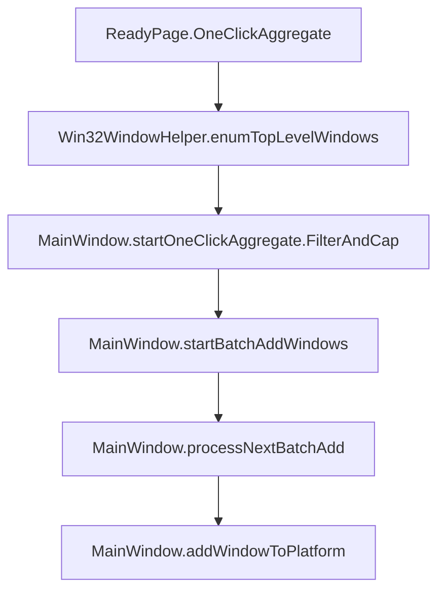

# 一键聚合方案

## 背景与目标

当前主界面 Ready 页存在“点击选择平台”入口，但其逻辑尚未实现，且功能名称偏冗余。新增“一键聚合”能力，用于把用户当前系统中**可识别**的平台窗口自动加入现有的窗口管理/聚合流程，降低手动选择成本。

## 需求与约束（必须满足）

- 仅聚合以下三类窗口：
  - **客服平台可识别窗口**：能被 `MainWindow::matchCustomerServicePlatform(const WindowInfo&)` 命中的窗口（千牛/拼多多/抖店）。
  - **微信窗口**：与现有 UI/浮窗逻辑一致的识别规则（当前实现为 `mainwindow.cpp` 内的微信识别 helper）。
  - **浏览器类窗口**：`WindowInfo::isBrowserLike == true`（由顶层窗口枚举逻辑标记）。
- **不做去重**：同进程/同标题多窗口允许一起进入队列。
- **在线窗口上限**：非客服平台命中者（例如微信/浏览器）作为“在线平台”新增项，最多自动添加 **10** 个。
- **失败继续**：遇到无效句柄/添加失败时继续下一项，不中断整体批量添加。

## 复用现有链路（不新增分叉逻辑）

### 窗口枚举与噪声过滤

- 枚举入口：`Win32WindowHelper::enumTopLevelWindows()`  
  文件：`src/utils/win32windowhelper.cpp` / `src/utils/win32windowhelper.h`
- 说明：该枚举已做基础过滤（可见、无 owner、排除系统噪声/输入法等），并对浏览器类窗口设置 `WindowInfo::isBrowserLike`。

### 批量添加队列（现有能力）

- 批量队列入口：`MainWindow::startBatchAddWindows(const QVector<WindowInfo>& list)`  
  文件：`src/ui/mainwindow.cpp`
- 队列执行：`MainWindow::processNextBatchAdd()` 逐个调用 `addWindowToPlatform(info)`  
  关键点：内部会检查 `Win32WindowHelper::isWindowValid(info.handle)`，无效句柄将跳过并继续。

### 单窗口添加与平台归类（现有能力）

文件：`src/ui/mainwindow.cpp`

- 平台命中（客服平台）：`MainWindow::matchCustomerServicePlatform(const WindowInfo& info) const`
- 展示模式：`MainWindow::determineDisplayMode(const WindowInfo& info)`（千牛类 Embed，其它 FloatFollow）
- 在线平台新增项：未命中客服平台时，`addWindowToPlatform()` 会创建 `online_%1` 条目并加入“在线平台”组。

## 设计：一键聚合的实现位置与行为

### 新增入口方法

在 `MainWindow` 增加私有方法：

- `void MainWindow::startOneClickAggregate();`

行为定义：

1. 调用 `Win32WindowHelper::enumTopLevelWindows()` 获取候选窗口列表。
2. 按顺序遍历每个 `WindowInfo`，构建批量添加队列 `QVector<WindowInfo> queue`：
   - 若 `matchCustomerServicePlatform(info)` 非空：加入队列（**不计入在线窗口上限**）。
   - 否则若为微信窗口：加入队列（**计入在线窗口上限**）。
   - 否则若 `info.isBrowserLike == true`：加入队列（**计入在线窗口上限**）。
   - 其他窗口：忽略。
3. 维护 `onlineCount`，当在线窗口计数达到 10 后，不再加入微信/浏览器类窗口（客服平台命中仍允许加入）。
4. 若 `queue` 为空：仅通过状态栏提示“未发现可聚合窗口”，不弹窗、不影响现有流程。
5. 否则调用 `startBatchAddWindows(queue)` 复用现有 overlay + 逐项添加。

### 微信识别函数复用

当前微信识别为 `mainwindow.cpp` 内部 helper（例如 `isWechatWindow(const WindowInfo&)`）。为避免在“一键聚合”中复制规则，需将其提升为 `MainWindow` 可复用函数（例如 `static bool MainWindow::isWechatWindowInfo(const WindowInfo&)`），并替换现有调用点，保证判定一致。

## UI 与交互变更

文件：`src/ui/mainwindow.cpp`

- Ready 页卡片文案：
  - 将“点击选择平台”改为“**一键聚合**”
  - Tooltip：`自动聚合可识别窗口（客服平台/微信/浏览器），在线窗口最多 10 个`
- 交互绑定：
  - 点击事件由原来的聚焦操作改为调用 `startOneClickAggregate()`
- 说明：
  - 原“添加新窗口”保持不变，继续服务于需要手动选择/编辑平台名/多选的用户（`AddWindowDialog` 入口）。

## 调用链（关键路径）

## 最小验收标准（手工）

1. 打开若干窗口：千牛/拼多多/抖店、微信、浏览器、以及无关窗口（记事本/资源管理器）。
2. 进入主界面 Ready 页，点击“一键聚合”。
3. 期望：
   - 出现批量添加 overlay 与进度提示；
   - 客服平台窗口正确关联到对应树项；
   - 微信/浏览器类窗口进入在线平台，且最多自动添加 10 个；
   - 无关窗口不会被添加；
   - 个别窗口句柄失效不会中断整体流程。

