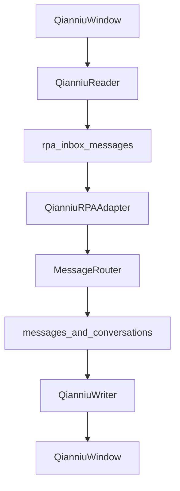
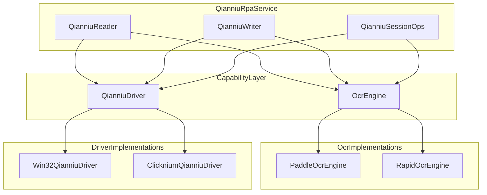

# 千牛RPA改造方案设计与实现

> 文档目标：在不改变现有 Qt + SQLite 消息总线的前提下，吸收 `d:/pyqianniu` 中 Clicknium 与 RapidOCR 的优点，重构本项目千牛 RPA 的 Python 能力层，降低 OCR 冷启动与运行开销、减少区域校准脆弱性、降低定位与点击维护成本，并作为后续实施过程中的持续同步文档。
>
> 适用范围：仅讨论千牛 RPA 改造方案，不涉及微信/PDD，不包含具体代码实现。

---

## 1. 改造目标

当前项目中的千牛 RPA 已完成单会话读写闭环，并具备第一阶段的多会话 Reader 能力，但其核心实现仍以 **PaddleOCR + Win32 截图/坐标/模拟输入** 为主。这条路线可工作，但在实际联调与维护中存在几个明显问题：

- **OCR 偏重**：`PaddleOCR` 冷启动慢、资源占用高，Reader / Writer 双侧启用 OCR 时更明显。
- **区域依赖强**：`chat_region`、`input_region`、`send_button`、`conversation_list_region` 等高度依赖窗口尺寸、DPI 与校准质量。
- **定位与点击维护成本高**：输入框、发送按钮、列表点击等能力主要依赖 Win32 坐标与 PostMessage/模拟点击路径，排障成本较高。
- **千牛 UI 自绘**：该场景下纯 UIA 路线不可用，继续单靠坐标硬编码的长期收益有限。

本次改造的目标不是推翻现有架构，而是做两件事：

1. **把 OCR 从单实现改成可插拔实现**，让 `RapidOCR` 成为千牛场景的轻量首选。
2. **把定位/截图/点击从单一路径改成双路径**，让 `Clicknium` 成为千牛场景的可选增强 Driver。

---

## 2. 范围与非目标

### 2.1 范围内

- 千牛 Reader 的截图、OCR、标题识别、列表识别、聊天区识别改造。
- 千牛 Writer 的会话校验、输入框聚焦、发送按钮点击、回执校验改造。
- 千牛专属配置模型与部署说明改造。
- 千牛专属公共能力抽象（OCR / Driver / 会话操作）。

### 2.2 明确不做

- **不改 Qt 主干**：`QianniuRPAAdapter`、`MessageRouter`、`ConversationManager`、聚合 UI 的消息路由不改。
- **不改数据库协议**：继续沿用 `rpa_inbox_messages`、`messages(sync_status)`、`RPA-DB-协议.md` 既有约定。
- **不迁移 `pyqianniu` 的业务闭环**：不引入 `conversation_worker.py` 的整套自动回复监控循环，不引入 `reply_strategy.py`、脚本内知识库、脚本内 LLM 逻辑。
- **不把 Clicknium 设为默认强依赖**：它是千牛增强能力，而非全项目 RPA 的统一默认底座。

---

## 3. 当前实现与耦合点

### 3.1 当前读写主干

当前千牛 RPA 的整体链路如下：



其中：

- Reader 入口：`python/rpa/readers/qianniu_reader.py`
- Writer 入口：`python/rpa/writers/qianniu_writer.py`
- Qt 侧桥接：`src/services/platforms/qianniurp_adapter.cpp`
- 数据交换协议：`docs/RPA-DB-协议.md`

这条主干本身没有问题，且是当前项目与 Qt 聚合客服系统解耦的核心基础，因此应保持稳定。

### 3.2 现有强耦合点

#### 3.2.1 OCR 耦合

当前千牛 Reader / Writer / 公共会话能力直接依赖 `PaddleOCREngine`：

- `python/rpa/readers/qianniu_reader.py`
- `python/rpa/writers/qianniu_writer.py`
- `python/rpa/common/qianniu_session.py`

主要表现为：

- 接口类型直接写死为 `PaddleOCREngine`
- Writer 的标题校验与输入框 OCR 回执也直接绑定 Paddle
- 标题 OCR、聊天 OCR、列表 OCR 都默认共享同一实现思路

这种设计的问题不是“不能用”，而是：

- 任何替换 OCR 的尝试都会波及 Reader / Writer / Session 全部签名
- 千牛场景只想切到轻量 OCR 时，无法做到局部试点
- 与微信/PDD 未来可能不同的 OCR 选择耦合在一起

#### 3.2.2 Driver 耦合

当前“定位、截图、点击、输入、切会话”能力分散在：

- `python/rpa/common/screenshot.py`
- `python/rpa/common/input_sim.py`
- `python/rpa/common/qianniu_session.py`
- `python/rpa/common/qianniu_coords.py`
- `python/rpa/common/win32_window.py`

主要耦合方式：

- 截图依赖 `PrintWindow` / `capture_region`
- 定位依赖 `qianniu_config.json` 中的矩形坐标与比例坐标
- 输入与发送依赖屏幕点、窗口点、PostMessage、模拟鼠标、剪贴板
- 会话切换依赖“列表 OCR + 行中心点击”与 `Ctrl+F` 搜索

这条路径可以保留，但它现在同时承担了“默认路径”和“唯一路径”的职责，导致千牛场景缺乏更高层的替代能力。

#### 3.2.3 配置耦合

当前 `python/rpa/config/qianniu_config.json` 同时承载：

- 窗口定位
- 聊天区域、标题区域、会话列表区域
- 输入框区域、发送按钮区域
- 列表扫描参数
- 未读检测参数
- 锁配置、调试参数、OCR 行为参数

问题在于：

- 一旦某个区域失准，会直接影响整条链路
- 无法表达“某个动作由 Clicknium 驱动、某个动作仍由 Win32 驱动”
- 无法表达“标题 OCR 用 RapidOCR，回执 OCR 用 Paddle 或关闭”

---

## 4. 参考方案的可吸收优点

`d:/pyqianniu/clicknium_qianniu_demo` 提供了两个值得吸收的方向，但不适合整体迁入。

### 4.1 RapidOCR 的优点

- 基于 `rapidocr-onnxruntime`，CPU 路线轻量，冷启动与常驻占用更友好
- 适合标题区、聊天区整块 OCR、列表标签 OCR 这类“先拿文本、再做上层解析”的场景
- 已在 PoC 中通过“**双次 OCR 一致才采信**”降低抖动，适合千牛聊天区滚动场景

### 4.2 Clicknium 的优点

- 录制定位器后，可直接按元素截图、点击、发送
- 输入框、发送按钮、聊天区、会话列表都可从“矩形校准”切换到“元素定位”
- 对千牛自绘 UI 更友好，减少大量坐标与比例的维护成本

### 4.3 不应直接迁入的部分

- `conversation_worker.py` 的轮询闭环与当前项目已有 Reader/Writer 主循环重复
- `reply_strategy.py`、本地知识库、脚本内 LLM 与当前聚合 AI/人工接待设计冲突
- `conversation_state.json` 的状态模型不能替代当前项目里的 SQLite 协议与 Qt 侧单点落库

结论：**吸收能力层，不迁移业务闭环。**

---

## 5. 目标架构

改造后的千牛 Python 侧应引入两层抽象：

1. `OcrEngine`：统一 OCR 接口，支持多后端
2. `QianniuDriver`：统一截图/定位/点击/输入/切会话动作，支持多实现



关键原则：

- **Qt 与 DB 总线完全不动**
- **Reader / Writer 逻辑保持原职责**
- **只把底层能力做成可替换**
- **Win32 路径保留为默认与兜底**

---

## 6. OCR 抽象方案

### 6.1 设计目标

把 `python/rpa/common/ocr_engine.py` 从“Paddle 包装器”升级为“统一 OCR 能力层”。

目标接口建议如下：

- `warmup()`
- `recognize(bgra, w, h)`
- `recognize_from_pil(img)`（可选）
- 输出统一为：`[(text, bbox, confidence), ...]`

其中 `bbox` 保持与当前 `layout_parser.parse_chat_layout()` 兼容，避免改动上游 Reader 解析逻辑。

### 6.2 引擎分工建议

#### `RapidOcrEngine`

优先用于：

- 聊天区 OCR
- 标题区 OCR
- 会话列表 OCR 标签识别
- Writer 输入框 OCR 回执

推荐作为千牛默认首选，原因：

- 启动快
- 资源轻
- 对“整区识别 + 上层逻辑自己解析”的场景足够适配

#### `PaddleOcrEngine`

保留为兼容与兜底实现，适用于：

- RapidOCR 识别率不满足的历史场景
- 需要更高召回的复杂排障场景
- 与微信/PDD 共享既有能力时的兼容路径

### 6.3 适配策略

推荐不要一上来全量替换，而是采用如下顺序：

1. **先对千牛 Reader 的聊天区 OCR 做双引擎切换**
2. 再切标题区 OCR
3. 再切会话列表 OCR
4. 最后再切 Writer 的标题校验与回执 OCR

理由：

- 聊天区 OCR 是收益最高、最容易对比性能的点
- Writer 侧 OCR 更偏校验逻辑，不宜成为第一波变量

### 6.4 保持不变的层

以下层级建议保持不变：

- `layout_parser`
- `IncrementalDetector`
- `content_hash / make_platform_msg_id`
- `write_inbox_message`
- Qt 侧 `QianniuRPAAdapter`

这意味着 OCR 改造只应改变“文本从图里怎么出来”，不应改变“文本出来后怎么去重、怎么入库、怎么进 UI”。

### 6.5 聊天区 OCR 的优先改造结论

结合 `pyqianniu` 的实测日志，千牛聊天区 OCR 已经能稳定输出接近消息日志的结构化文本。例如：

- 对方消息常呈现为：`tb号 -> 时间 -> 正文`
- 己方消息常呈现为：`时间 -> 客服名 -> 正文 -> 已读/未读`

这说明千牛聊天区最值得优先替换的，不只是 OCR 引擎本身，而是 **“聊天区 OCR + 千牛专用 parser”** 这一整段链路。相较于当前项目中依赖 bbox、左右阈值和块合并的 `layout_parser` 路线，千牛聊天区更适合：

- 先用 `RapidOCR` 读出**顺序稳定的文本行**
- 再用千牛专用 parser 按“行序语义”还原消息

这一路线比继续强化几何布局判断更适合千牛，因为千牛聊天区的时间、买家标识、客服名、已读未读标记都具备较强的顺序语义。

### 6.6 千牛聊天区专用 parser 设计

建议不要让千牛继续完全复用通用 `layout_parser` 主路径，而是在聊天区增加一个千牛专用 parser，采用：

- **OCR 全文行序**
- **有限状态机**
- **规则优先、几何 fallback**

#### 6.6.1 输入形态

推荐把聊天区 OCR 结果先标准化为有序文本行：

```text
tb4947894539
2026-4-18 13:53:35
你好
2026-4-18 13:53:51
有求必应羊羊：王刚
您好
已读
```

再由 parser 处理，而不是直接把 bbox block 丢给通用布局分析。

#### 6.6.2 消息类型

千牛聊天区 parser 第一版只关注三类：

- `incoming`：客户消息
- `outgoing`：客服消息
- `system/noise`：已读、未读、日期分隔、空行等

最终再映射回当前项目中的 `in / out / system`。

#### 6.6.3 规则模式

第一版只支持两种最稳定模式：

1. **对方消息**
   - `tb号 -> 时间 -> 正文`
2. **己方消息**
   - `时间 -> 客服名 -> 正文 -> 已读/未读`

建议先不要一开始就兼容太多变体，避免 parser 快速失控。

#### 6.6.4 状态机建议

建议 parser 采用如下状态：

- `idle`
- `reading_incoming`
- `reading_outgoing`

基本逻辑：

- 在 `idle`：
  - 若当前行匹配 `tb\\d+`，且下一行为时间，则开启一条 `incoming`
  - 若当前行匹配时间，且下一行像客服名，则开启一条 `outgoing`
- 在 `reading_incoming`：
  - 持续收正文，直到遇到下一条头部
- 在 `reading_outgoing`：
  - 持续收正文
  - 遇到 `已读/未读` 时记为尾标记，不写入正文
  - 遇到下一条头部时 flush 当前消息

#### 6.6.5 边界情况

第一版需要明确支持以下情况：

- 多行正文合并为同一条消息
- OCR 漏掉客服名时，允许 `outgoing` 无 `sender_name`
- OCR 漏掉 `已读/未读` 时，允许 `read_flag` 为空

以下情况可以后置：

- 时间与客服名被 OCR 合到同一行
- `tb号` 以外的客户标识模式
- 更复杂的系统提示与插入型提示

#### 6.6.6 与现有链路的并存方式

推荐采用“新 parser 优先，旧 parser 兜底”的方式：

```text
聊天区截图
  -> RapidOCR
  -> 行序标准化
  -> qianniu_chat_parser
  -> 若成功则直接产出结构化消息
  -> 若失败再 fallback 到现有 layout_parser(platform='qianniu')
```

这样可以在不破坏现有可用链路的前提下，逐步切换千牛聊天区主路径。

#### 6.6.7 建议的数据结构

建议新增一个千牛专用的中间消息结构，避免一开始就被现有通用 `ParsedMessage` 约束死：

```python
@dataclass
class QianniuChatMessage:
    side: str                  # "in" | "out" | "system"
    sender_name: str = ""
    original_timestamp: str = ""
    content_lines: list[str] = field(default_factory=list)
    read_flag: str = ""        # "已读" | "未读" | ""
    raw_lines: list[str] = field(default_factory=list)

    @property
    def content(self) -> str:
        return "\\n".join(x for x in self.content_lines if x).strip()
```

推荐保留以下字段：

- `side`
- `sender_name`
- `original_timestamp`
- `content_lines`
- `read_flag`
- `raw_lines`

原因：

- `content_lines` 便于处理多行正文
- `raw_lines` 便于调试和回溯误判
- `read_flag` 未来可用于己方消息回执或调试，但 A 阶段 Reader 入库时仍可忽略

完成千牛专用解析后，再转换为现有 Reader 需要的消息结构即可。

#### 6.6.8 建议的基础规则函数

建议先把 parser 依赖的基础判断拆成几个小函数，避免主循环里堆满正则：

```python
def is_timestamp_line(line: str) -> bool: ...
def is_tb_buyer_line(line: str) -> bool: ...
def is_read_flag_line(line: str) -> bool: ...
def looks_like_agent_name(line: str) -> bool: ...
def is_noise_line(line: str) -> bool: ...
```

推荐第一版至少有以下正则/规则：

**1）时间行**

```python
TIMESTAMP_RE = r"^\\d{4}[-/]\\d{1,2}[-/]\\d{1,2}\\s+\\d{1,2}:\\d{2}(:\\d{2})?$"
```

后续可再兼容 OCR 漏空格、全角冒号、日期时间粘连等情况。

**2）买家标识**

```python
TB_BUYER_RE = r"^tb\\d+$"
```

第一版先只吃最稳定模式，不急于一次性覆盖所有买家昵称变体。

**3）已读未读**

```python
READ_FLAG_RE = r"^(已读|未读)$"
```

**4）客服名**

客服名不建议过度正则化。第一版可采用“排除法 + 上下文位置”：

- 不是时间
- 不是 `tb号`
- 不是 `已读/未读`
- 非空
- 位于“时间之后、正文之前”

后续若观察到稳定格式，再补充更强规则。

#### 6.6.9 行标准化建议

在真正进入 parser 前，建议先做一层轻量标准化：

```python
def normalize_ocr_lines(lines: list[str]) -> list[str]:
    # 1. strip
    # 2. 去空行
    # 3. 统一全角/半角冒号
    # 4. 合并明显的 OCR 噪声片段
    # 5. 保留原顺序
```

建议这一步只做“轻清洗”，不要在这里做太重的语义判断。  
原因是：

- 过度清洗容易把后续 parser 能用到的线索提前删掉
- 真正的语义边界应由状态机控制，而不是由 normalize 阶段硬裁

第一版可以考虑的轻清洗包括：

- 去掉纯空白行
- 把全角冒号 `：` 与半角冒号统一
- 去掉明显无意义的单个噪声字符行
- 对连续重复完全相同的短噪声行做压缩

#### 6.6.10 parser 主流程伪代码

建议的主流程如下：

```python
def parse_qianniu_chat_lines(lines: list[str]) -> list[QianniuChatMessage]:
    rows = normalize_ocr_lines(lines)
    messages = []
    current = None
    state = "idle"
    i = 0

    while i < len(rows):
        line = rows[i]
        next_line = rows[i + 1] if i + 1 < len(rows) else ""

        if state == "idle":
            if is_tb_buyer_line(line) and is_timestamp_line(next_line):
                current = QianniuChatMessage(
                    side="in",
                    sender_name=line,
                    original_timestamp=next_line,
                    raw_lines=[line, next_line],
                )
                state = "reading_incoming"
                i += 2
                continue

            if is_timestamp_line(line) and looks_like_agent_name(next_line):
                current = QianniuChatMessage(
                    side="out",
                    sender_name=next_line,
                    original_timestamp=line,
                    raw_lines=[line, next_line],
                )
                state = "reading_outgoing"
                i += 2
                continue

            i += 1
            continue

        if state == "reading_incoming":
            if is_tb_buyer_line(line) and is_timestamp_line(next_line):
                flush_current(messages, current)
                state = "idle"
                continue
            if is_timestamp_line(line) and looks_like_agent_name(next_line):
                flush_current(messages, current)
                state = "idle"
                continue
            current.content_lines.append(line)
            current.raw_lines.append(line)
            i += 1
            continue

        if state == "reading_outgoing":
            if is_read_flag_line(line):
                current.read_flag = line
                current.raw_lines.append(line)
                i += 1
                continue
            if is_tb_buyer_line(line) and is_timestamp_line(next_line):
                flush_current(messages, current)
                state = "idle"
                continue
            if is_timestamp_line(line) and looks_like_agent_name(next_line):
                flush_current(messages, current)
                state = "idle"
                continue
            current.content_lines.append(line)
            current.raw_lines.append(line)
            i += 1
            continue

    flush_current(messages, current)
    return post_normalize(messages)
```

这里的关键点是：

- 头部识别只在 `idle` 开启新消息
- 在消息体读取阶段，只关心“是否遇到下一条头部”
- `已读/未读` 只作为己方尾标记消费，不进入正文

#### 6.6.11 post-normalize 建议

在状态机跑完后，建议再做一层轻量后处理：

- 删除正文为空的消息
- 合并正文前后无意义噪声
- `content = "\\n".join(content_lines).strip()`
- 对 `incoming` 与 `outgoing` 做最基础一致性修正

例如：

- 若 `incoming` 只有 `tb号` 和时间，没有正文，则默认丢弃
- 若 `outgoing` 只有时间和客服名，没有正文，但有 `已读/未读`，也应视作无效消息

#### 6.6.12 parser 成功判定与 fallback 触发

建议不要只要解析出 1 条消息就算成功，而要有一个简单的成功判定。

例如可以满足以下任一条件才认为“专用 parser 成功”：

- 解析出了至少 1 条 `incoming`，且正文非空
- 解析出了多条消息，且头部模式匹配率明显高于噪声行
- 关键字段（时间 / 正文）完整度达到最低阈值

若不满足，则 fallback 到现有 `layout_parser(platform='qianniu')`。

推荐第一版增加一个简单的诊断结果：

```python
@dataclass
class QianniuChatParseResult:
    messages: list[QianniuChatMessage]
    success: bool
    reason: str
    matched_headers: int = 0
    total_lines: int = 0
```

这样后续可以在 debug 日志中看到：

- 为什么本轮走了专用 parser
- 为什么本轮回退到了旧布局 parser

#### 6.6.13 与 Reader 对接时的映射建议

在 `qianniu_reader.py` 中接入时，建议只让 `incoming` 消息进入现有 inbox 写入逻辑：

- `side == "in"`：继续走现有 `detector.filter_new(...)` 与 `write_inbox_message(...)`
- `side == "out"`：A 阶段先不入 inbox，只用于调试与后续 Writer/回执能力
- `system/noise`：直接忽略

这样可以做到：

- 对 Qt、SQLite、聚合界面几乎零扰动
- 千牛聊天区 parser 只替换入站识别能力
- 己方消息先解析出来，但不急着改变现有业务协议

---

## 7. Driver 抽象方案

### 7.1 设计目标

为千牛引入 `QianniuDriver`，统一以下动作：

- 找到聊天区
- 找到输入框
- 找到发送按钮
- 找到会话列表
- 对元素或区域截图
- 点击输入框 / 点击发送按钮
- 按行切换会话
- 必要时执行搜索切换

### 7.2 建议的两套实现

#### `Win32QianniuDriver`

复用现有能力：

- `screenshot.py`
- `input_sim.py`
- `qianniu_session.py`
- `qianniu_coords.py`
- `win32_window.py`

它的职责不是变化，而是被封装成统一 Driver 接口，继续作为：

- 默认实现
- Clicknium 失败后的 fallback
- 无 Clicknium 环境下的标准实现

#### `ClickniumQianniuDriver`

只吸收 Clicknium 在千牛场景最有价值的部分：

- 元素级截图：聊天区、列表区、输入区
- 元素点击：输入框、发送按钮
- 元素位置获取：会话列表控件矩形，再做按行点击

不建议让 Clicknium 负责所有动作，尤其不建议直接让其接管整套 Reader/Writer 主循环。更合理的做法是：

- **截图、定位、点按钮** 优先走 Clicknium
- **数据库读写、发送状态更新、锁协调、重试策略** 仍走现有项目机制

### 7.3 Driver 边界建议

`QianniuDriver` 建议统一暴露如下类别能力：

- `capture_chat()`
- `capture_header()`
- `capture_conversation_list()`
- `focus_input()`
- `click_send_button()`
- `switch_to_list_entry(...)`
- `switch_to_search_target(...)`
- `is_driver_ready()`

这样可以把 Reader / Writer / SessionOps 从“拿坐标做动作”改成“调用动作接口”，后续替换底层实现时对业务逻辑扰动最小。

### 7.4 为什么不直接用 Clicknium 全接管

原因有四个：

1. 当前项目已存在稳定的 DB 协议与 Qt 链路，无需重做
2. Clicknium 的录制与部署链路不应成为全项目默认要求
3. CI、打包、无录制环境机器上仍需有可运行路径
4. Writer 的失败回退、前台恢复、状态回写等已有逻辑应复用

结论：**Clicknium 是“增强 Driver”，不是“重做项目”。**

---

## 8. 配置模型改造建议

建议保留 `python/rpa/config/qianniu_config.json`，但拆分为三类语义：

### 8.1 基础运行配置

- 窗口定位
- 轮询参数
- 锁配置
- 调试配置

### 8.2 OCR 配置

建议新增：

- `ocr.engine = rapidocr | paddle`
- `ocr.warmup = true | false`
- `ocr.min_confidence`
- `ocr.double_read_stable = true | false`
- `ocr.double_read_delay_sec`

其中“连续两次 OCR 一致才采用”的思路，建议以配置方式纳入千牛 Reader，而不是仅停留在 PoC。

### 8.3 Driver 配置

建议新增：

- `driver.type = win32 | clicknium`
- `driver.allow_fallback = true | false`

若启用 Clicknium，再增加独立子配置：

- `clicknium.project_root`
- `clicknium.locators.chat`
- `clicknium.locators.input`
- `clicknium.locators.send`
- `clicknium.locators.session_list`

### 8.4 Win32 fallback 配置

当前以下配置继续保留，作为 Win32 路径或兜底路径：

- `chat_region`
- `contact_header_region`
- `conversation_list_region`
- `input_region`
- `send_button`

结论：**新配置是“能力选择”配置，不是替代原有校准配置。**

---

## 9. 分阶段实施建议

### 阶段 A：优先替换聊天区 OCR 主路径

目标：先解决千牛当前最重、最慢、最值得替换的部分，即聊天区 OCR 与聊天区消息解析。

#### A1. OCR 与聊天区解析主路径替换

A 阶段已完成的核心工作是把千牛聊天区主路径从“单一 PaddleOCR + `layout_parser`”切成了“轻量 OCR + 专用 parser + fallback”。

当前实现如下：

- `python/rpa/common/ocr_engine.py`
  - 已抽象出统一 OCR 接口
  - 保留 `PaddleOCREngine`
  - 新增 `RapidOCREngine`
  - 新增 `build_ocr_engine(...)`
- `python/rpa/common/qianniu_chat_parser.py`
  - 已新增千牛聊天区专用 parser
  - 先把 OCR 结果标准化为有序文本行
  - 按“`tb号 -> 时间 -> 正文` / `时间 -> 客服名 -> 正文 -> 已读未读`”规则解析
  - 输出 `side / sender_name / original_timestamp / content`
- `python/rpa/readers/qianniu_reader.py`
  - `_process_current_chat(...)` 已接入聊天区专用主路径
  - 先跑聊天区 OCR，再跑 `qianniu_chat_parser`
  - parser 成功时直接映射为当前 Reader 可消费的消息结构
  - parser 失败时再 fallback 到 `parse_chat_layout(platform='qianniu')`
  - `detector.filter_new(...)`、内容清洗、`write_inbox_message(...)` 等后半段协议逻辑保持不变

当前聊天区主流程已经变成：

```text
聊天区截图
  -> 选择聊天区截图驱动
  -> 选择聊天区 OCR 引擎
  -> 标准化为有序文本行
  -> qianniu_chat_parser
  -> 若失败则 fallback parse_chat_layout(...)
  -> 统一映射为 Reader 可消费消息
  -> detector.filter_new(...)
  -> 内容清洗/拆分
  -> write_inbox_message(...)
```

联调结果上，A 阶段已经验证过以下几点：

- `RapidOCR` 已实际用于千牛聊天区
- 专用 parser 已能直接产出 `incoming` 消息并写入 `rpa_inbox_messages`
- fallback 仍可保留用于兜底排障
- 新路径接通后，日志里已出现稳定的 inbox 写入记录

#### A2. 聊天区截图从坐标裁剪扩展为 Clicknium 增强路径

随着联调推进，A 阶段实际又补上了一个高价值增强：聊天区截图不再只依赖 Win32 坐标裁剪，而是增加了 Clicknium 元素级截图能力。

当前实现如下：

- `python/rpa/readers/qianniu_reader.py`
  - 已新增聊天区截图驱动选择
  - 支持 `auto / clicknium / win32`
  - `auto` 下优先尝试 Clicknium 聊天区 locator 截图
  - Clicknium 失败时自动回退现有 Win32 坐标裁剪
- `python/rpa/config/qianniu_config.json`
  - 已新增 `chat_capture`
  - 支持：
    - `driver`
    - `clicknium_chat_locator`
    - `clicknium_project_root`
    - `clicknium_project_root_env`
- 项目根目录
  - 已加入 `.locator/aliworkbench.cnstore`
  - Reader 在 `clicknium_project_root` 为空时，会优先把当前仓库根目录识别为 Clicknium 工程根

这部分是 A 阶段后半程联调中补进来的实际实现，原因也很明确：

- 纯坐标裁剪在千牛聊天区上存在空图、错位、瞬时截取不稳定的问题
- 引入 Clicknium 聊天区元素截图后，聊天区输入给 OCR / parser 的数据稳定性明显提升
- 这部分改动只收敛在聊天区截图入口，没有扩散到 Writer、Qt 消息总线和平台协议层

因此，A 阶段现在的实际边界应更新为：

- 聊天区 OCR 主路径已替换
- 聊天区 parser 已替换
- 聊天区截图已支持 Clicknium 增强
- 标题区、列表区、Writer 主体能力仍暂不改动

#### A3. 配置、调试与验收现状

A 阶段现已落地的配置主要集中在 `qianniu_config.json` 中：

```json
"ocr": {
  "engine": "paddleocr",
  "chat_engine": "rapidocr",
  "fallback_engine": "paddleocr",
  "lang": "ch",
  "min_confidence": 0.5,
  "max_side": 960,
  "double_read_stable": false,
  "double_read_delay_sec": 0.25
},
"chat_parser": {
  "mode": "hybrid",
  "prefer_sequence_parser": true,
  "allow_layout_fallback": true,
  "drop_empty_messages": true,
  "min_incoming_messages_for_success": 1,
  "min_content_chars": 1
},
"chat_capture": {
  "driver": "auto",
  "clicknium_chat_locator": "aliworkbench.group_uiwindow_centralwidget_subchatview_chatdisplaywidget_chatc2",
  "clicknium_project_root": ""
}
```

补充的调试能力主要有：

- parser 失败诊断日志
  - 输出 `reason`
  - 输出归一化行预览
  - 输出已识别消息预览
  - 对重复失败做合并计数
- Clicknium 聊天截图失败日志
  - 输出定位器缺失、工程根错误、截图文件无效等原因
  - 对重复失败做合并计数

当前 A 阶段的实际验收口径可以简化为三条：

1. 聊天区是否优先走 `RapidOCR + qianniu_chat_parser`
2. parser 失败时是否仍可回退而不打断 Reader 链路
3. 是否能稳定写入 `rpa_inbox_messages`

从现阶段联调结果看，A 阶段已经完成的部分包括：

- `RapidOCR` 聊天区接入
- 千牛聊天区专用 parser 接入
- parser 失败诊断日志
- Clicknium 聊天区截图接入
- 项目内 `.locator` 工程接入
- 真实窗口联调下的 inbox 写入验证

A 阶段尚未纳入范围的内容仍保持不变：

- 标题区 OCR 轻量化
- 会话列表 OCR 轻量化
- Writer OCR 轻量化
- Clicknium 列表点击、输入框点击、发送按钮点击的系统化抽象
- 更完整的 Driver 接口统一

### 阶段 B：把 RapidOCR 扩到标题区与列表区

目标：让千牛 Reader 侧 OCR 能力统一到轻量路线，但仍不碰 Driver 层。

#### B1. 标题区切换

- 让标题 OCR 可配置使用 `RapidOCR`
- 对比标题识别稳定性与误判率

#### B2. 会话列表 OCR 切换

- 让会话列表 OCR 标签识别可配置使用 `RapidOCR`
- 保持未读检测、列表切换策略不变

#### B3. Reader 全链路复验

- 当前会话读取
- 多会话扫描
- 未读优先模式
- 与 `window_lock` 的配合

### 阶段 C：Writer 侧 OCR 轻量化

目标：让 Writer 中依赖 OCR 的校验部分也可切换到轻量方案，但不改变发送主逻辑。

#### C1. 标题校验切换

- `verify_current_conversation` 允许配置使用 `RapidOCR`

#### C2. 回执 OCR 切换

- 输入框内容 OCR 与发送后回执判断允许切到 `RapidOCR`

#### C3. Writer 复验

- 会话切换正确率
- 发送成功率
- 回执判断稳定性

### 阶段 D：Driver 抽象与 Clicknium 增强

目标：在聊天区 OCR 与解析主路径稳定后，把**定位、截图、点击**从散落在 Reader/Writer 中的 Win32 与 Clicknium 调用，收敛成可替换的 Driver 层，降低维护成本并统一 fallback 策略。

**与当前实现的边界说明（重要）**

- A 阶段已在 `qianniu_reader.py` 内落地了**聊天区**的 Clicknium 元素截图（`chat_capture` + 项目根 `.locator`），并带有 **Clicknium 失败则回退 Win32 坐标裁剪** 的行为。
- 这属于「Driver 能力」的一部分，但**尚未**抽象为独立的 `QianniuDriver` / `ClickniumQianniuDriver` 类，也未覆盖 Writer、会话列表点击、输入框与发送按钮等路径。
- 阶段 D 要做的，是把上述已验证能力**收编进接口**，而不是从零再发明一遍聊天区截图。

#### D1. 抽象 `QianniuDriver`

- 定义千牛侧最小接口集合，例如：
  - 聊天区截图（BGRA 或统一中间格式）
  - 会话列表区域截图（可选）
  - 标题/顶栏区域截图（可选）
  - 输入框聚焦、文本写入、发送点击（可选，与 Writer 对齐）
  - 列表行点击切会话（可选，与 Reader 多会话扫描对齐）
- 封装现有 Win32 实现为 `Win32QianniuDriver`（内部仍调用现有 `capture_region`、坐标比例与 `input_sim` 等）
- Reader / Writer / SessionOps 逐步改为只依赖接口，避免直接散落 `find_element`、`capture_region` 与坐标计算

#### D2. 引入 `ClickniumQianniuDriver`

- **聊天区元素截图**：与 A 阶段已接入的 locator 行为对齐，迁移为 Driver 内实现，配置仍可由 `chat_capture` 驱动。
- **输入框点击与粘贴、发送按钮点击**：从 Writer 现有逻辑中剥离，改为 Driver 方法（可与 demo 中 `LOC_INPUT` / `LOC_SEND` 思路一致，但 locator 名以项目 `.locator` 为准）。
- **会话列表截图与按行点击**：从 Reader 多会话扫描中剥离，统一由 Driver 提供；未读红点像素扫描可仍保留在 Reader 策略层，或视情况下沉。

#### D3. 保留 fallback

- Clicknium 失败后允许回退 Win32（与 A 阶段聊天区 `chat_capture.driver=auto` 一致，推广到 Driver 层后为统一策略）。
- 默认部署仍建议 **Win32 为基座、Clicknium 为增强**：无 `.locator` 或未安装 `clicknium` 的环境必须可运行。

### 阶段 E：配置、部署与文档同步

目标：把改造结果工程化，并确保文档能跟着实现持续演进。

#### E1. 配置收敛

- `ocr.*`、`chat_parser.*`、`chat_capture.*` 已在 A 阶段落地于 `qianniu_config.json`，后续 D 阶段主要是**命名与分层收敛**，而不是再堆一套平行配置。
- 规划中的 `driver.type`（或等价字段）用于在配置层显式选择 `win32 | clicknium | auto`，与代码中 `QianniuDriver` 实现绑定；在抽象完成前可继续沿用 `chat_capture.driver` 作为聊天区子域开关。
- Clicknium locator 与 `.locator` 工程资产需纳入版本管理与部署说明（与 10.1 风险节一致）。

#### E2. 部署说明

- 默认模式如何运行
- Clicknium 增强模式如何录制、Validate、部署
- RapidOCR 与 Paddle 的选型建议

#### E3. 文档同步

- 本文档持续同步“已实现 / 待实现 / 风险 / 回退方案”
- 后续实现过程中，始终以本文档为千牛 RPA 的设计与实现说明

---

## 10. 风险与取舍

### 10.1 Clicknium 相关风险

- 引入额外依赖与录制流程
- 与开发机、测试机、生产机环境一致性相关
- `.locator` 资产需要纳入版本与运维规范
- 打包/CI 是否可用需要额外确认

因此建议：

- 默认模式仍为 Win32
- Clicknium 作为千牛增强模式
- 先在开发环境和指定联调机验证，不立即覆盖全部运行环境

### 10.2 RapidOCR 相关风险

- 虽然更轻，但未必在所有场景都优于 Paddle
- 不同区域识别率可能不一致
- 若输出 bbox 质量不足，需在适配层做标准化

因此建议：

- 不删除 Paddle
- 保留引擎切换能力
- 先做千牛专属试点，不扩散到全平台

### 10.3 工程复杂度风险

如果同时重写 OCR、Driver、配置、部署说明，容易把一个“能力优化”项目做成“大重构”。

因此必须坚持：

- 先 OCR，后 Driver
- 先千牛，后考虑是否推广
- 先兼容，后替换

---

## 11. 最终建议

对于本项目的千牛 RPA，推荐结论如下：

1. **保留现有 Qt + SQLite 总线，不做架构级推翻**
2. **先把 OCR 抽象出来，让 RapidOCR 成为千牛默认首选，Paddle 保留为兜底**
3. **聊天区已可经 Clicknium 元素截图增强；继续把定位/截图/点击抽象成 Driver，让 Clicknium 覆盖 Writer 与列表等路径，Win32 保留为默认与 fallback**
4. **不迁入 `pyqianniu` 的自动回复业务闭环，只吸收其轻量 OCR 与元素定位能力**
5. **通过三阶段推进，避免一次性大改导致千牛链路回归风险**

简言之，本次改造不是“把 `pyqianniu` 搬进项目”，而是：

**在不改变现有产品与数据库主干的前提下，把 `pyqianniu` 已验证有效的轻量 OCR 与元素定位能力，嵌入当前千牛 RPA 的能力层。**
