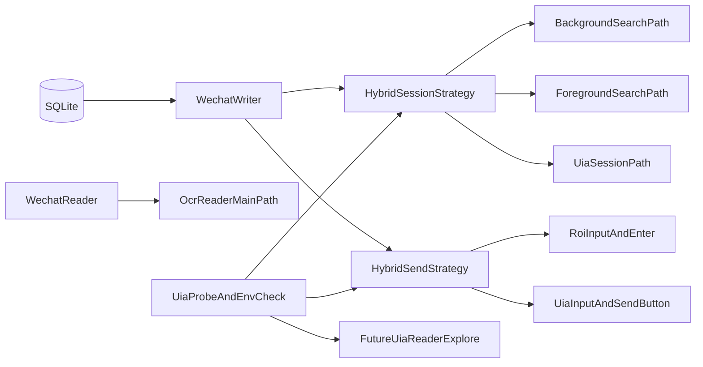

# 微信 RPA 融合评估与落地建议

本文基于当前仓库中的微信 RPA 主链路与 `poc/pywechat-poc2.0` 的 PyUIAutomation POC，回答一个更具体的问题：

- 现有微信 RPA 为什么慢、为什么不稳
- PyUIAutomation 现在到底能补什么
- 下一步应该如何融合，而不是一刀切替换

结论先行：

- **短期最值得做的是 Writer/Session 混合增强**，不是立刻推翻 OCR Reader。
- **PyUIAutomation 已经证明可用于“找会话、找输入框、找发送按钮”**，这正好对应现有链路最不稳定、最耗时的部分。
- **Reader 去 OCR 化是可探索方向，但还不具备直接替换条件**；当前证据足以支持“继续深挖”，不足以支持“直接切主链路”。

---

## 1. 现状审计：现有微信 RPA 为什么慢

### 1.1 后台搜索切会话链路过长

当前后台切会话集中在 `python/rpa/common/wechat_session.py`：

```818:874:python/rpa/common/wechat_session.py
def switch_to_contact_foreground(hwnd: int, cfg: dict, contact_name: str) -> bool:
    """前台搜索切联系人：Ctrl+F -> 粘贴 -> 点击第一条结果。"""
    ...

def ensure_in_target_chat_foreground(
    ocr: Optional[PaddleOCREngine],
    hwnd: int,
    header_cfg: dict,
    cfg: dict,
    target_name: str,
    max_retry: int = 2,
) -> bool:
    """确保前台已切换到目标联系人。"""
    ...
```

```880:1074:python/rpa/common/wechat_session.py
def switch_to_contact_background(
    hwnd: int,
    cfg: dict,
    contact_name: str,
    ocr: Optional[PaddleOCREngine] = None,
    header_cfg: Optional[dict] = None,
    max_retry: int = 2,
) -> bool:
    """后台搜索切联系人：优先回车直达，失败后尝试方向键导航，再兜底搜索结果区域点击。"""
    ...
```

这条链路的问题不是“只有一次搜索”，而是它实际上包含多层验证与回退：

- 搜索框填充
- 搜索框 OCR 校验
- 聊天输入框 OCR 安全校验
- 回车直达尝试
- 方向键导航尝试
- 搜索结果区域 OCR 定位
- 标题区 OCR 二次确认

优点是安全，缺点是链路很长，且每一步都可能受 OCR、焦点、群聊命名、搜索结果排序影响。

对群聊尤其不友好的原因：

- 群聊名称长、易折叠、易被 OCR 截断
- 群聊搜索结果与搜索框文本的精确匹配更难
- 搜索命中后仍要靠标题 OCR 再确认，耗时进一步放大

### 1.2 Writer 对输入框和发送动作仍强依赖 ROI

当前 Writer 发送文本主要在 `python/rpa/writers/wechat_writer.py`：

```119:183:python/rpa/writers/wechat_writer.py
def _send_text(hwnd: int, cfg: dict, text: str) -> bool:
    """Type text into the current conversation and send via Enter."""
    ...
    ix, iy, iw, ih = rect_input_region_resolved(cfg, win_h)
    cx, cy = _get_input_click_point(cfg, ix, iy, iw, ih)
    ...
    simulate_key_combo(VK_CONTROL, VK_A)
    simulate_key(VK_DELETE)
    ...
    if input_method == "unicode":
        simulate_type_unicode(text, delay_per_char_ms=12)
    ...
    simulate_key(VK_RETURN)
```

这意味着：

- 输入框位置来自 `wechat_config.json` 的坐标校准
- 输入框焦点是否正确，只能靠点击、等待、再次点击来“尽量保证”
- 发送动作默认依赖 Enter，而不是“发送按钮控件”

因此它虽然可用，但对以下因素敏感：

- 分辨率 / DPI / 窗口尺寸变化
- 微信布局微调
- 输入框焦点偶发漂移
- 当前窗口前后台状态变化

### 1.3 Reader 的 OCR 成本确实高

当前 Reader 入口在 `python/rpa/readers/wechat_reader.py`，其头部注释已经说明了当前设计是“列表 OCR 缓存 + 红点驱动 + 聊天区 OCR”。

```1:16:python/rpa/readers/wechat_reader.py
"""
WeChat PC reader: capture chat region -> PaddleOCR -> layout parse -> write rpa_inbox_messages.
...
Key features (v2):
  - Red-dot-driven auto-switch: only switches to conversations with unread badges,
  - List OCR cache (D): periodic full conversation-list OCR; other polls reuse cache + red-dot scan.
  - Current-chat path: chat region OCR every poll; header + list reconcile throttled via reader_ocr.
"""
```

配套配置也能看出当前 Reader 的负担：

```83:133:python/rpa/config/wechat_config.json
"reader_ocr": {
    "current_chat_header_refresh_scans": 4,
    "current_chat_header_refresh_sec": 8,
    "list_full_refresh_scans": 0,
    "list_full_refresh_sec": 12,
    ...
},
"unread_detection": {
    "enabled": true,
    ...
}
```

当前慢的根因不是单点，而是“多区域截图 + 多次 OCR + 多次对齐”：

- 会话列表 OCR
- 会话标题 OCR
- 聊天区 OCR
- 搜索框 / 搜索结果区 OCR
- 输入框 OCR（用于安全校验与回执）

所以你的判断成立：**现在的慢，不只是 PaddleOCR 慢，而是业务决策高度绑定 OCR。**

---

## 2. PyUIAutomation 现在已经能解决什么

`poc/pywechat-poc2.0` 已经证明，在 UIA 树完整时，以下能力是现实可用的：

- 找微信主窗 `mmui::MainWindow`
- 找输入框 `mmui::ChatInputField`
- 找发送按钮 `mmui::XTextView`
- 在左侧列表按会话名匹配并点击
- 复制粘贴到输入框并发送

对应证据：

```26:44:poc/pywechat-poc2.0/wechat_send.py
INPUT_CLASS = "mmui::ChatInputField"
SEND_CLASS = "mmui::XTextView"
...
UIA_ENV_HINT = (
    ...
    "若已确认会话存在但仍找不到控件：请完全退出微信（结束进程）→ 先打开 Windows「讲述人」→ 再启动微信并登录 → 再运行本程序。\n"
)
```

```130:190:poc/pywechat-poc2.0/wechat_send.py
def _find_session_row(
    win: auto.Control,
    keyword: str,
    *,
    session_class: Optional[str] = None,
    exact: bool = False,
    ...
) -> Optional[auto.Control]:
    """
    在会话列表区域查找标题含 keyword 的控件并点击。
    """
    ...
```

```169:195:poc/pywechat-poc2.0/PyUIAutomation技术文档.md
| 用途 | 示例 ClassName | 说明 |
|------|------------------|------|
| 左侧竖栏 Tab | `mmui::XTabBarItem` | Name 如「微信」「通讯录」… |
| 聊天文字气泡 | `mmui::ChatTextItemView` | 文本多在 **Name** 上 |
| 输入框 | `mmui::ChatInputField` | |
| 发送按钮 | `mmui::XTextView` | Name 常为「发送」；同类节点很多，需加规则筛选 |
```

从融合价值上看，UIA 当前最适合补位 3 个点：

1. **会话切换**
2. **输入框定位**
3. **发送动作定位**

这 3 个点恰好就是现有 Writer/Session 最脆弱、最慢的部分。

---

## 3. 混合架构建议：先增强 Writer/Session，不替换 Reader

建议采用“主链路保守、局部能力激进”的混合策略。



### 3.1 推荐的执行顺序

#### 阶段 A：UIA 只增强 Writer / Session

建议未来实现时，把 UIA 作为 fallback，而不是作为默认唯一策略。

建议顺序：

1. 先保留现有后台搜索切会话为默认主路径
2. 当后台搜索失败时，尝试前台搜索切换
3. 若 UIA 环境可用，再尝试“左侧会话列表点选”
4. 发送时优先沿用现有写入策略；焦点异常或发送失败时，再尝试 UIA 输入框 / 发送按钮

对应收益：

- 群聊切换命中率提升
- 输入框焦点准确率提升
- 发送动作可从“按键语义”升级为“控件语义”

#### 阶段 B：产品化 UIA 自检

建议把 `poc/pywechat-poc2.0/wechat_probe.py` 的思路吸收为正式诊断脚本，用来回答：

- 当前机器 UIA 树是否完整
- 当前微信版本下能否看到 `ChatInputField`
- 能否看到 `XTextView(发送)`
- 能否枚举到 `ChatTextItemView`

只有自检通过，才启用 UIA fallback。

### 3.2 为什么不建议直接切 Reader

因为 Reader 和 Writer 的问题结构不同。

Writer 当前痛点是“定位不准、切换不准、输入不准”，而 UIA 对这些问题天然更擅长。

Reader 当前痛点是“识别慢、语义还原成本高”，但 UIA 目前只证明了“可能读到气泡控件”，还没有证明以下事情：

- 文本读取在不同版本、不同机器都稳定
- 可以区分自己 / 对方 / 系统消息
- 可以处理滚动加载后的旧消息
- 可以稳定映射到现有 `layout_parser` 与入库模型

因此，**Writer/Session 应优先融合，Reader 应单独评估。**

---

## 4. Reader 去 OCR 化评估

### 4.1 当前已有的正向证据

`poc/pywechat-poc2.0/wechat_probe.py` 已经把 `mmui::ChatTextItemView` 作为探测目标：

```23:29:poc/pywechat-poc2.0/wechat_probe.py
TARGET_CLASSES = (
    "mmui::XTabBarItem",
    "mmui::ChatTextItemView",
)
```

文档也明确写了“聊天文字气泡文本多在 `Name` 上”，这说明方向上是通的。

### 4.2 当前还缺的关键验证

在把 Reader 从 OCR 转向 UIA 之前，至少还要确认以下问题：

1. `ChatTextItemView.Name` 是否稳定等于消息正文
2. 是否能区分自己发的、对方发的、系统提示
3. 滚动聊天区后，旧消息控件是否还能可靠枚举
4. 群聊里昵称、系统消息、撤回提示是否有单独控件语义
5. 与现有 OCR Reader 相比，真实耗时是否明显下降

### 4.3 对 Reader 的现实结论

可以把 Reader 方向的判断拆成 3 级：

| 级别 | 含义 | 当前结论 |
|------|------|----------|
| L1 | UIA 能看到聊天气泡控件 | **已有证据支持** |
| L2 | UIA 能稳定读到当前可见消息文本 | **方向可行，但缺系统验证** |
| L3 | UIA 可替代现有 OCR Reader 主链路 | **当前证据不足，不建议直接切换** |

所以 Reader 的推荐结论不是“否定”，而是：

- **继续验证**
- **不要抢跑切主链路**
- **先把 UIA 的收益集中用在 Writer/Session**

---

## 5. 未来实现建议

若进入开发阶段，建议把后续实现按能力拆层，而不是直接在现有逻辑里塞 if/else：

### 5.1 Session 能力层

可考虑抽象 3 类会话切换后端：

- `search_background`
- `search_foreground`
- `uia_list_click`

由策略层决定顺序，而不是把所有逻辑继续堆在一个函数里。

### 5.2 Send 能力层

可考虑抽象 3 类发送后端：

- `background_postmessage`
- `foreground_roi_input`
- `uia_input_and_send_button`

其中 UIA 路线只在环境自检通过时启用。

### 5.3 Reader 能力层

Reader 暂不改主链路，但可预留未来实验后端：

- `ocr_reader_main`
- `uia_reader_probe`
- `uia_reader_visible_only_experiment`

这样做的好处是：

- 不破坏现有可用链路
- 可以逐步把 UIA 能力插入现有工程
- 未来 Reader 若验证成功，也能自然切到多后端架构

---

## 6. 最终建议

### 6.1 短期决策

- **保留 OCR Reader 主链路**
- **优先把 UIA 融入 Writer/Session**
- **把 UIA 探测做成正式诊断能力**

### 6.2 中期决策

当以下条件同时满足时，再考虑 Reader 主路径迁移：

- `ChatTextItemView` 文本读取在多机、多版本上稳定
- 可区分消息方向与系统消息
- 滚动与增量模型可闭环
- 延迟与维护成本明显优于 OCR

### 6.3 当前一句话结论

**PyUIAutomation 现在已经足够支撑“微信 RPA 写路径混合增强”，但还不足以直接宣布“微信 RPA 读路径可以去 OCR”。**
