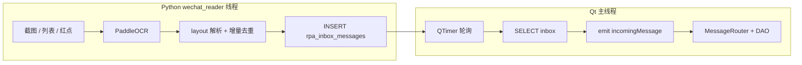

# 微信 RPA 链路耗时分析与优化方向

本文梳理 **微信 PC 端 RPA** 从「界面上的消息」到 **Qt 聚合客户端展示** 的链路节拍与耗时来源，并给出可落地的优化方向与优先级建议。实现细节以仓库当前代码为准：`python/rpa/readers/wechat_reader.py`、`src/services/platforms/wechatrp_adapter.cpp`、`src/core/messagerouter.cpp` 等。

---

## 1. 端到端路径（入站）

Python **Reader** 与 Qt **客户端**共用 SQLite 数据库（默认 `database/app.db`），入站关键表为 **`rpa_inbox_messages`**（`platform = 'wechat'`，`consume_status = 0` 表示未消费）。Qt 侧 **`WechatRPAAdapter`** 定时轮询该表，消费后更新 `consume_status`，再经 **`MessageRouter`** 写入业务消息表并通知界面。

**出站（简要）**：`python/rpa/writers/wechat_writer.py` 轮询待发消息（`sync_status = 10`），与 Reader **共享微信窗口锁**（`wechat_config.json` 中 `window_lock`），可能与入站链路在资源上相互让路。

---

## 2. 进程与线程关系

- **拉起方式**：主程序 `MainWindow::startRpaPlatforms` 使用 `QProcess` 执行  
  `python -m rpa.main --platform wechat`，工作目录为仓库下的 `python/`（见 `src/ui/mainwindow.cpp`）。
- **Python 侧**：`rpa/main.py` 中 WeChat **Reader** 与 **Writer** 各为一个 **daemon 线程**；主线程仅心跳保活。
- **平台标识**：C++ 适配器 `platformName()` 为 **`wechat`**，与 Reader 写入 DB 的 `PLATFORM` 一致。

---

## 3. 固定节拍（延迟下界与抖动来源）

| 环节 | 位置 | 典型配置 | 含义 |
|------|------|----------|------|
| Reader 主循环休眠 | `wechat_reader.run_reader` 末尾 `time.sleep(poll_interval)` | `wechat_config.json` 中 **`poll_interval_sec`**（默认代码内 3s，配置常设为 2s） | **每一轮扫描结束**都会休眠一整格；一轮内可能包含「发现未读」「处理队列中一个会话」或「扫当前会话」，然后再 sleep。 |
| C++ inbox 轮询 | `WechatRPAAdapter`：`QTimer` **动态间隔** | **有入站行：150 ms**；**空闲：600 ms**（见 `wechatrp_adapter.cpp` 内常量） | 刚消费到行时缩短间隔以便连续 drain（含单批 `LIMIT 50` 后的下一批）；无新行时略拉长以降低主线程 SQL 频率。 |
| 未读同会话冷却 | `unread_detection.cooldown_sec` | 默认与 `poll_interval` 取 `max(1.2, poll_interval)`；可显式配置（如 2s） | 同一联系人被红点再次入队前的最短间隔，抑制刷屏，也会拉长多轮未读的间隔。 |
| 列表 OCR 全量刷新 | `reader_ocr.list_full_refresh_sec` / `list_full_refresh_scans` | 例如 12s 或按扫描次数触发 | 中间轮次多用「缓存 + 红点」；**全量列表 OCR** 的轮次 CPU 与耗时会明显上升。 |
| 标题 OCR 降频 | `reader_ocr.current_chat_header_refresh_sec` / `current_chat_header_refresh_scans` | 例如 8s / 每 4 次扫描 | 当前会话路径下标题不必每轮 OCR，但**聊天区通常仍每轮 OCR**（见 `_process_current_chat`）。 |
| Reader / Writer 互斥 | `window_lock` | 如 `timeout_sec: 15`、`retry_interval_sec: 0.15` | 一侧持锁截图或切换时，另一侧可能等待，极端情况下拉长可见延迟。 |

---

## 4. 单轮内的可变耗时（通常占大头）

单次 `while True` 迭代大致顺序：

1. **`_discover_unread_targets`**（在窗口锁内）：红点扫描、必要时刷新列表 OCR 缓存、`reader_ocr` 中的 settle（如 `red_dot_header_click_settle_sec`）。
2. **若未读队列非空**：`_process_target` — 列表后台切换（`list_switch_settle_sec`、`list_switch_max_retry`）；失败则 `ensure_in_target_chat_background`（搜索框路径，内含多段百毫秒级 `sleep`，**长尾可达数秒**）。
3. **否则且 `scan_current_chat`**：读当前联系人（标题 OCR 可能因降频跳过）+ `_process_target` / `_process_current_chat`。
4. **`_process_current_chat`**：**截图聊天区 → Paddle OCR → layout 解析 → 增量去重 → `write_inbox_batch` + `commit`**。

**经验量级（仅供分析，以本机实测为准）**：

- **聊天区 OCR**：常为数百毫秒～数秒（与分辨率、`ocr.max_side`、CPU/GPU、负载相关）。
- **截图与解析**：一般小于 OCR；若开启 **`debug.save_screenshots`**，I/O 会显著放大耗时。
- **DB**：单次写入多为毫秒级；与 Qt 同写 `app.db` 时，偶发等待锁，接近 `PRAGMA busy_timeout`（Python `db_helper.open_db` 中为 3000ms）上限。

开启 **`debug.log_phase_timing`** 后，Reader 会打印「发现未读 / 处理队列 / 处理当前会话」及聊天区 **capture / ocr / parse / db** 的毫秒拆分，便于定位主导阶段。

---

## 5. 排队与逻辑延迟

- **未读队列 `_pending_targets`**：每轮通常只 **`_pop_pending_target()` 一个**；多个红点会话需跨多轮处理，轮与轮之间必有 **`time.sleep(poll_interval)`**。  
  **第 N 个会话的入站延迟** ≈ 前序 (N−1) 轮 ×（每轮工作耗时 + `poll_interval`）。
- **`NameStabilizer`**：联系人名变更需连续多次一致 OCR 才接受，名称抖动时可能多轮才稳定到同一 `platform_conversation_id`，表现为会话合并或展示滞后。
- **增量去重**：依赖「首次被 OCR 稳定识别」的那一帧，与业务上的「用户已发出」时刻可能不同步。

---

## 6. Qt 侧消费与界面

- `pollInboxOnce` 通过 `QTimer` 触发；适配器一般位于**主线程**，则 **SELECT、`emit incomingMessage`、后续 DAO** 多在主线程**同步**执行。
- `MessageRouter::onIncomingMessage` 中含 `existsByPlatformMsgId`、`create`、`updateLastMessage`、`incrementUnread` 等多次 DB 访问，通常为毫秒级；库锁竞争时同样可能拉长。

---

## 7. 如何测量（优化前建议先做）

1. 在 `wechat_config.json` 中开启 **`debug.log_phase_timing`**，统计各阶段 P50 / P95。
2. **端到端**：在 `write_inbox_batch` 成功写入处打时间戳，在 Qt `messageReceived` 处再打时间戳，对比差值，避免只优化局部而整体未改善。
3. 对比 **`poll_interval_sec`** 与「单轮总耗时」：若间隔小于单轮耗时，会形成事实上的积压，单纯缩短间隔收益有限。

---

## 8. 优化方向（按优先级与成本归纳）

### 8.1 Reader 节拍与排队（通常收益最大）

- **调整 `poll_interval_sec`**：在掌握单轮耗时分布后再缩短；过短会导致 CPU 与对微信窗口的读取频率过高。
- **多未读会话**：考虑在同一轮内**连续处理多个队列项**（设上限避免单轮过长），或对「有队列积压」时使用**更短的间歇休眠**，空闲时恢复较长间隔。
- **`unread_detection.cooldown_sec`**：略降可更快重复扫同一会话，需与增量去重及误触发率一并评估。

### 8.2 OCR 与截图

- 下调 **`ocr.max_side`**、收紧 **`chat_region` ROI**，减少像素与推理量。
- 避免过于频繁的**全量列表 OCR**（合理使用 `list_full_refresh_sec` / `list_full_refresh_scans`）。
- 在稳定场景可进一步放宽**标题 OCR**降频参数。
- 生产环境使用 **`production_mode`**，关闭 **`save_screenshots`** 与冗长解析日志。
- 部署层：GPU、更轻量模型配置等需单独评测。

### 8.3 会话切换长尾

- 在稳定环境下略降 **`list_switch_settle_sec`**、**`red_dot_header_click_settle_sec`**，以实测切换失败率为准。
- 提高**列表点击命中率**（校准、行高、重试），减少落入**搜索框回退**路径。

### 8.4 C++ 轮询

- **已实现（微信）**：`WechatRPAAdapter` 采用 **空闲 600 ms / 有流量 150 ms** 的动态 `QTimer` 间隔；可按机器表现微调 `kInboxPollIdleMs` / `kInboxPollActiveMs`。
- 若仍不足：可叠加「写入信号唤醒」或更短的 `kInboxPollActiveMs`（注意主线程 SQL 与 UI 流畅度）。

### 8.5 SQLite 与写入路径

- 评估 Reader 侧 **长连接 / 批量提交** 与当前「每批 `open` + `commit`」的差异（注意与 Writer、Qt 的并发与一致性）。
- 审视 **`existsByPlatformMsgId`** 等查询是否可与约束及插入策略协同，减少热点（需与去重语义一致）。

### 8.6 架构级（投入大、上限高）

- **事件驱动**：Python 在写入 inbox 后通过本地 socket、文件通知等唤醒 Qt **立即拉取**，定时器仅作兜底。
- **队列化**：内存队列或专用通道再批量落库，降低 SQLite 单点争用（一致性与故障恢复成本上升）。
- **进程拆分**：Reader 与 Writer 分进程，减轻 GIL、双套 Paddle 与锁的相互影响。

---

## 9. 推荐落地顺序

1. **配置与 ROI**：`max_side`、`chat_region`、`production_mode`、关闭调试截图。  
2. **节拍对齐**：用 `log_phase_timing` 确认单轮耗时后，再调 `poll_interval_sec`；必要时做**队列批处理或自适应 sleep**。  
3. **C++ 轮询**：适度缩短间隔或增加事件触发。  
4. 再考虑 **DB 连接策略、异步拉取、分进程** 等结构性改造。

---

## 10. 相关文件索引

| 说明 | 路径 |
|------|------|
| Reader 主循环与休眠 | `python/rpa/readers/wechat_reader.py` |
| 微信默认配置 | `python/rpa/config/wechat_config.json` |
| inbox 写入 | `python/rpa/common/db_helper.py` |
| RPA 进程入口 | `python/rpa/main.py` |
| Qt 拉起 Python | `src/ui/mainwindow.cpp`（`startRpaPlatforms`） |
| 微信 inbox 轮询 | `src/services/platforms/wechatrp_adapter.cpp` |
| 消息入库与转发 | `src/core/messagerouter.cpp` |
| Writer 轮询与发送 | `python/rpa/writers/wechat_writer.py` |

---

*文档与仓库实现同步维护；若接口或配置项变更，请同步更新本节与 `微信RPA实现方案.md` 等文档。*
