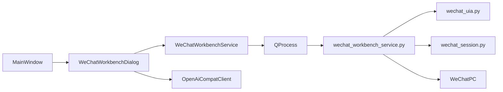

# 微信独立工作台方案设计与实现

本文用于记录在当前仓库中，为微信平台新增一条**不并入现有聚合客服主链路**的独立落地路线：在 Qt 客户端中提供一个“微信 RPA 工作台”，通过 Python UIA 脚本读取当前微信可见会话与消息、生成 AI 建议回复、并支持人工确认后发送。

本文与下列文档配套阅读：

- [微信RPA实现方案](./微信RPA实现方案.md)
- [微信RPA优化方案设计](./微信RPA优化方案设计.md)
- [微信RPA改造方案设计与实现](./微信RPA改造方案设计与实现.md)
- [各平台消息链路](./各平台消息链路.md)

---

## 1. 背景：为什么要单独做一条微信工作台路线

在当前仓库中，微信若严格并入现有聚合客服主链路，会面临几类现实约束：

- 聚合聊天 UI 强依赖 `ConversationManager`、`MessageDao`、`MessageSendEventDao`
- 微信正式适配链路仍围绕 `rpa_inbox_messages` / `messages` 等 SQLite 表
- Reader / Writer 已经引入 `window_lock`、回执校验、OCR/ROI 兜底等复杂运行时约束
- 消息“方向判定”在当前机器上仍未完全稳定

这意味着，若继续坚持“微信必须先和千牛、拼多多一样进入统一聚合会话模型”，就会把本该先验证的人机协同能力，拖进更重的持久化、适配器、自动发送与状态同步复杂度中。

因此，当前更合适的路线不是“立刻并入主链路”，而是：

- 先把微信做成一个**独立工作台**
- 不做消息 / 会话持久化入库
- 直接复用 Python 侧现成的 UIA 能力
- Qt 只承担“可视化、AI 建议、人工发送”的轻量职责

这条路线的定位不是临时 Demo，而是可以长期保留的**微信平台独立模式**。

---

## 2. 目标与边界

### 2.1 第一阶段目标

第一阶段只做四件事：

- 可视化展示当前可见微信会话
- 可视化展示当前选中会话的可见消息
- 基于当前消息生成 AI 建议回复
- 用户确认后，手动发送到微信

### 2.2 第一阶段明确不做

为了避免方案失控，第一阶段不做：

- 微信消息 / 会话 SQLite 持久化
- 并入聚合接待主界面
- 自动回复直接发送
- 微信平台统一会话模型抽象
- 对消息方向判定的强依赖
- 与 `rpa_inbox_messages` 主链路打通

### 2.3 当前产品定位

从用户体验上看，微信工作台更像：

- 一个嵌入到现有 Qt 客户端中的“微信专用操作台”
- 允许用户在当前软件里查看会话、看消息、获取 AI 建议、手动回微信
- 但并不替代微信客户端本身作为历史消息与持久化来源

---

## 3. 当前架构

设计原则：

- Qt 负责 UI、交互状态、AI 建议回复
- Python 负责微信 UIA 读取、切会话、发送
- Qt 与 Python 之间使用轻量 JSON 行协议
- 运行时不写微信消息 DB

---

## 4. 已完成的实现

### 4.1 Qt 主入口已接入

已在以下位置接入“微信工作台”入口：

- `src/ui/mainwindow.h`
- `src/ui/mainwindow.cpp`
- `src/ui/rpamanagedialog.h`
- `src/ui/rpamanagedialog.cpp`

当前入口包括两处：

- 主窗口 ready page 快捷卡片中新增“微信RPA 工作台”按钮
- `RpaManageDialog` 的微信行新增“打开微信工作台”按钮

这样用户既可以从首页直接进入，也可以从 RPA 管理入口进入。

### 4.2 已新增独立工作台对话框

已新增：

- `src/ui/wechatworkbenchdialog.h`
- `src/ui/wechatworkbenchdialog.cpp`

当前 UI 已包含：

- 左侧会话列表
- 右侧当前可见消息列表
- AI 建议回复区域
- 人工发送输入框
- “刷新会话 / 刷新消息 / 生成建议回复 / 填入发送框 / 发送到微信”按钮
- Python 服务日志区域

同时该对话框已支持跟随主窗口主题切换：

- `applyTheme(...)`

### 4.3 已新增 Qt 服务层

已新增：

- `src/services/wechat/wechatworkbenchservice.h`
- `src/services/wechat/wechatworkbenchservice.cpp`

该服务层承担的职责包括：

- 启动 / 维持 Python 工作台服务子进程
- 通过 JSON 行协议向 Python 发送命令
- 解析 Python 返回的结构化结果
- 将进程日志转发到 UI
- 使用现有 `OpenAiCompatClient` 请求 AI 建议回复

当前已实现的核心命令接口为：

- `probeStatus()`
- `listSessions()`
- `switchSession(...)`
- `readCurrentMessages(...)`
- `sendText(...)`
- `requestAiSuggestion(...)`

### 4.4 Qt 与 Python 已打通最小 IPC

当前 Qt 与 Python 采用：

- `QProcess`
- stdin/stdout JSON 行协议

协议风格为：

- 请求：`{"id":1,"cmd":"list_sessions","args":{}}`
- 响应：`{"id":1,"cmd":"list_sessions","ok":true,"data":{...}}`

该协议已在：

- `src/services/wechat/wechatworkbenchservice.cpp`
- `python/rpa/tools/wechat_workbench_service.py`

两侧对接完成。

当前 Python 服务脚本输出策略为：

- `stdout` 只输出协议 JSON
- `stderr` 输出底层日志与调试信息

这可以避免协议流被底层 `print(...)` 污染。

### 4.5 已新增 Python 工作台服务脚本

已新增：

- `python/rpa/tools/wechat_workbench_service.py`

它与现有 `python/rpa/main.py` 分开，避免误接入正式 Reader / Writer 主循环。

当前已支持的命令集合：

- `probe_status`
- `list_sessions`
- `switch_session`
- `read_current_messages`
- `send_text`

### 4.6 Python 底层已复用现有 UIA 能力

工作台服务脚本当前复用的基础能力包括：

- `python/rpa/common/wechat_uia.py`
- `python/rpa/common/wechat_session.py`
- `python/rpa/readers/wechat_reader_uia.py`

其中：

- `list_sessions` 通过 UIA 读取当前可见会话列表
- `switch_session` 复用现有切会话策略
- `read_current_messages` 复用当前 UIA Reader 的文本消息读取能力
- `send_text` 复用 UIA 输入框定位与发送按钮点击能力

### 4.7 已补充会话列表采样能力

为支持工作台会话列表展示，已在：

- `python/rpa/common/wechat_uia.py`

增加：

- `WechatUiaSessionSample`
- `collect_visible_session_samples(...)`

当前策略不是深递归整棵 UIA 树，而是优先扫描：

- `session_list` 的直接子项
- 直接子项的一层子节点

只有在未找到会话项时，才回退到通用遍历。

这样做的目的，是降低会话读取延迟，更符合工作台交互场景。

### 4.8 AI 建议回复已接入现有模型客户端

当前 AI 建议回复没有复用聚合聊天的 DAO / 会话持久化逻辑，而是只复用：

- `src/services/ai/openaicompatclient.h`
- `src/services/ai/openaicompatclient.cpp`

工作方式为：

1. 从当前工作台中的可见消息构造上下文
2. 根据当前模型预设读取 `baseUrl/model/apiKey`
3. 在 Qt 侧组装 prompt
4. 流式请求模型生成建议回复
5. 回填到工作台输入框，等待人工确认发送

当前已支持的模型预设沿用现有系统里的配置方式，例如：

- `deepseek:deepseek-chat`
- `doubao:ark`

### 4.9 当前验证结果

当前已完成的验证包括：

- 新增 C++ / Python 文件已通过 lints 检查
- `python -m py_compile` 已通过
- `wechat_workbench_service.py` 的 `probe_status`、`list_sessions`、`read_current_messages` 协议已在本机执行通过

当前尚未做的验证包括：

- 完整 Qt 工程编译验证
- 工作台内真实发送链路的人工端到端回归

其中完整编译验证受当前环境缺少 `Qt6Config.cmake` 影响，尚无法在本轮命令行环境中完成。

---

## 5. 当前边界与已知问题

### 5.1 消息方向仍可能为 `unknown`

当前消息读取已优先尝试：

- 头像-气泡配对
- hit-test 头像补偿

但在当前机器上，头像控件仍未稳定暴露，因此工作台消息方向目前仍可能大量为：

- `unknown`

这不会阻塞工作台第一阶段落地，因为第一阶段并不依赖方向做自动回复发送或持久化建模。

### 5.2 当前读取的是“当前可见消息”

当前工作台不做历史分页与持久化，因此读取范围是：

- 当前会话聊天区里当前可见的消息

这与产品定位一致，但也意味着：

- 关闭工作台或滚动后，上下文范围会变化

### 5.3 仍依赖 UIA 环境前提

当前工作台依赖与微信 UIA 改造路线相同的前提：

- 先开讲述人
- 再启动微信

因此工作台中已保留环境探测与提示能力，不把这一前置条件隐藏掉。

---

## 6. 与现有微信 RPA 改造路线的关系

当前仓库中，微信实际上已经形成两条互补路线：

### 6.1 路线 A：并入正式 RPA 主链路

对应文档：

- [微信RPA改造方案设计与实现](./微信RPA改造方案设计与实现.md)

特点：

- UIA 主路径 + OCR 兜底
- 面向正式 Reader / Writer / Session 链路
- 更偏向未来统一平台主架构

### 6.2 路线 B：微信独立工作台

对应本文。

特点：

- 不接 SQLite 消息持久化
- 不并入聚合接待主链路
- 更偏向先解决“可视化查看 + AI 建议 + 人工发送”

这两条路线不是互斥关系，而是：

- 路线 A 面向统一平台能力建设
- 路线 B 面向当前阶段更容易交付、风险更低的微信专用体验

---

## 7. 下一阶段建议

基于当前已实现内容，建议下一阶段按以下顺序推进：

1. 优化工作台消息列表显示，例如气泡化、颜色标签化
2. 增加自动刷新与新消息提示
3. 补充真实发送路径的人工回归验证
4. 评估“独立聊天窗口监听”是否适合接入工作台
5. 等方向判定与稳定性提升后，再评估是否支持自动回复直发

---

## 8. 当前结论

本轮实现后，微信已经不再只有“并入聚合主链路”这一条重路径，而是新增了一条更轻、更现实、也更容易交付的正式落地路线：

- 微信独立工作台

它的价值不在于替代微信客户端，也不在于马上统一所有平台能力，而在于：

- 让现有 AI 能力尽快服务微信
- 降低用户上手门槛
- 绕开当前阶段最重的 DB / 聚合 / 自动发送复杂度
- 为后续微信自动回复与平台统一抽象保留演进空间

